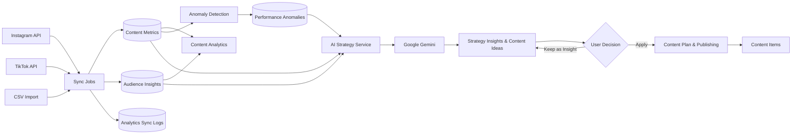

<div align="center">

# Mawaga Intel
### 523 Studio Creative Dashboard

Dashboard operasional agensi kreatif untuk mengelola klien, perencanaan konten, workflow produksi, analitik media sosial, dan rekomendasi strategi berbasis AI dalam satu sistem.


</div>

---

## Tentang Project

**Mawaga Intel** adalah sistem dashboard kreatif berbasis Laravel yang dikembangkan untuk mendukung proses kerja 523 Studio secara end-to-end. Sistem menghubungkan proses manajemen klien, content planning, production workflow, publishing, content analytics, audience insights, reporting, hingga AI Strategy Analysis.

Fokus utama sistem bukan sekadar menampilkan data, tetapi menjadikan data operasional dan performa media sosial sebagai dasar pengambilan keputusan tim kreatif.

## Fitur Utama

- **Client Management** — data klien, paket layanan, PIC, status, dan akses portal klien.
- **Content Planning** — kalender/rencana konten bulanan, content item, brief, platform, format, dan pilar konten.
- **Production Workflow** — workflow produksi, status pekerjaan, revisi, approval, publishing, dan monitoring progres.
- **Content Analytics** — overview KPI, performance table, content performance detail, filter klien/platform/periode, dan audience insights.
- **Instagram Integration** — OAuth per klien, sinkronisasi media, metrik, audience insight, sync log, dan unmatched media handling.
- **TikTok Integration** — Login Kit + OAuth 2.0/PKCE, profile & follower data, video sync, sync log, dan unmatched video handling.
- **Import Performance Data** — fallback CSV untuk memasukkan data performa secara terkontrol ketika API tidak tersedia.
- **Anomaly Detection** — mendeteksi lonjakan/penurunan performa berdasarkan baseline historis.
- **AI Strategy Analysis** — rekomendasi strategi konten berbasis Google Gemini dengan konteks performa aktual.
- **Human-in-the-Loop** — rekomendasi AI tidak diterapkan otomatis; pengguna tetap menentukan apakah insight diterapkan ke Content Plan.
- **Performance Report** — pembuatan laporan performa dalam format PDF dan Excel.
- **Team Performance & Operational Monitoring** — ringkasan pekerjaan tim, risiko keterlambatan, dan indikator operasional.
- **Role & Client Scoping** — akses modul dan data dibatasi berdasarkan role serta assignment klien.

## Alur Sistem



## Arsitektur Integrasi Media Sosial

Integrasi media sosial menggunakan pola **per client × per platform**. Credential aplikasi seperti client ID/client secret disimpan sebagai konfigurasi environment, sedangkan token akun klien disimpan pada `api_integrations` menggunakan encrypted cast.

```text
523 Studio Dashboard
        │
        ├── Client A
        │    ├── Instagram Integration
        │    └── TikTok Integration
        │
        ├── Client B
        │    ├── Instagram Integration
        │    └── TikTok Integration
        │
        └── ...
```

Pendekatan ini memungkinkan satu instalasi aplikasi melayani banyak akun klien tanpa mencampur token antar-klien.

## Tech Stack

| Layer | Teknologi |
| --- | --- |
| Backend | PHP 8.3+, Laravel 13 |
| Frontend | Blade, Tailwind CSS 4, Alpine.js |
| Build Tool | Vite 8 |
| Database | MySQL / MariaDB |
| ORM | Laravel Eloquent |
| Authentication | Google OAuth melalui Laravel Socialite |
| AI | Google Gemini API |
| Social API | Instagram API, TikTok Display API v2 |
| Queue | Laravel Database Queue |
| Scheduler | Laravel Scheduler |
| Reports | DomPDF, Laravel Excel |
| Testing | PHPUnit / Laravel Feature Tests |

## Requirements

Pastikan environment memiliki:

- PHP **8.3+**
- Composer
- Node.js + npm
- MySQL/MariaDB
- ekstensi PHP yang dibutuhkan Laravel

## Instalasi Lokal

Clone repository:

```bash
git clone https://github.com/ahdarin/digital-dashboard-mawaga.git
cd digital-dashboard-mawaga
```

Install dependency:

```bash
composer install
npm install
```

Buat file environment dan application key:

```bash
cp .env.example .env
php artisan key:generate
```

> Windows PowerShell dapat menggunakan `Copy-Item .env.example .env`.

Atur koneksi database pada `.env`, lalu jalankan migration:

```bash
php artisan migrate
```

Build asset frontend:

```bash
npm run build
```

Jalankan aplikasi:

```bash
php artisan serve
```

Aplikasi lokal secara default dapat diakses melalui URL yang ditampilkan oleh Laravel, misalnya `http://127.0.0.1:8000`.

## Menjalankan Development Stack

Repository menyediakan Composer script untuk menjalankan server Laravel, queue listener, scheduler, log viewer, dan Vite secara bersamaan:

```bash
composer run dev
```

Atau jalankan secara terpisah:

```bash
php artisan serve
php artisan queue:work
php artisan schedule:work
npm run dev
```

## Environment Variables

Selain konfigurasi Laravel standar, beberapa fitur membutuhkan credential pihak ketiga.

```env
# Google Sign-In
GOOGLE_CLIENT_ID=
GOOGLE_CLIENT_SECRET=
GOOGLE_REDIRECT_URI=

# Google Gemini
GEMINI_API_KEY=

# Instagram
INSTAGRAM_CLIENT_ID=
INSTAGRAM_CLIENT_SECRET=
INSTAGRAM_API_VERSION=
INSTAGRAM_REDIRECT_URI=

# TikTok
TIKTOK_CLIENT_KEY=
TIKTOK_CLIENT_SECRET=
TIKTOK_REDIRECT_URI=
```

> Jangan pernah commit credential, access token, refresh token, API key, atau client secret ke repository.

## Instagram Setup

Instagram menggunakan OAuth per klien melalui Meta/Instagram Business Login.

Flow utama:

```text
Connect Instagram
→ Meta Authorization
→ OAuth Callback
→ Token Exchange
→ Encrypted ApiIntegration
→ Analytics/Audience Sync
→ Content Metrics & Audience Insights
```

Untuk final OAuth onboarding, gunakan **public HTTPS redirect URI** yang terdaftar pada Meta Developer Dashboard dan nilainya harus sama persis dengan `INSTAGRAM_REDIRECT_URI`.

## TikTok Setup

TikTok menggunakan Login Kit + Display API v2 dengan OAuth 2.0 dan PKCE.

Scope yang digunakan pada integrasi saat ini mencakup kebutuhan profile/statistik akun dan daftar video. Sinkronisasi berjalan secara asynchronous melalui queue.

Dokumentasi tambahan tersedia di:

- [`docs/TIKTOK_INTEGRATION.md`](docs/TIKTOK_INTEGRATION.md)

Jika akun yang dihubungkan belum memiliki video, sinkronisasi profile/follower tetap dapat berjalan, sedangkan proses video matching secara natural menghasilkan nol video sampai konten tersedia.

## Queue & Scheduler

Sinkronisasi media sosial dan proses berat tidak dijalankan langsung di request web. Pastikan queue worker aktif:

```bash
php artisan queue:work
```

Untuk development:

```bash
php artisan schedule:work
```

Untuk production, Laravel scheduler perlu dipanggil setiap menit melalui cron:

```cron
* * * * * cd /path/to/project && php artisan schedule:run >> /dev/null 2>&1
```

Production juga membutuhkan persistent queue worker, misalnya menggunakan **Supervisor**, systemd, atau process manager yang sesuai dengan platform hosting.

## Testing

Jalankan seluruh test suite:

```bash
php artisan test
```

Atau melalui Composer:

```bash
composer test
```

Test project mencakup berbagai alur utama seperti authentication/authorization, client scoping, client & user management, content workflow, analytics, import, report generation, serta integrasi sosial.

## Data & Metrics

`content_metrics` digunakan sebagai sumber utama performa konten. Beberapa metrik bersifat opsional karena tidak semua platform menyediakan data yang sama.

Nilai **`null` tidak diperlakukan sama dengan `0`**. Jika sebuah platform memang tidak menyediakan metrik tertentu, sistem menyimpannya sebagai `null` agar agregasi tidak menafsirkan "data tidak tersedia" sebagai "performa bernilai nol".

Contoh metrik yang ditangani sistem:

- views
- engagement rate
- reach
- impressions
- likes
- comments
- shares
- saves
- watch time average
- completion rate
- profile visit

## AI Strategy Analysis

AI Strategy tidak melatih model baru. Sistem mengagregasikan data performa, audiens, dan anomaly context pada sisi aplikasi lalu mengirimkan ringkasan tersebut ke Google Gemini.

```text
Historical Performance
        ↓
Application-side Aggregation
        ↓
Grounded Performance Context
        ↓
Google Gemini
        ↓
Structured Strategy Recommendation
        ↓
Human Review
        ↓
Optional Apply to Content Plan
```

Model diarahkan untuk menghasilkan insight dan rekomendasi berdasarkan konteks yang diberikan sistem. Keputusan akhir tetap berada pada pengguna.

## Deployment Checklist

Sebelum production:

1. set `APP_ENV=production` dan `APP_DEBUG=false`;
2. gunakan database production yang ter-backup;
3. konfigurasi Google, Gemini, Instagram, dan TikTok credential;
4. gunakan HTTPS dan daftarkan OAuth redirect URI production;
5. jalankan migration secara terkontrol;
6. build asset dengan `npm run build`;
7. aktifkan persistent queue worker;
8. aktifkan scheduler/cron;
9. jalankan `php artisan test` sebelum release;
10. jangan menjalankan destructive migration command terhadap database operasional tanpa backup dan review.

## Project Status

Status implementasi saat dokumentasi ini ditulis:

- Core dashboard & workflow: **ready**
- Content analytics: **ready**
- AI Strategy Analysis: **ready**
- Instagram integration implementation: **ready**, final onboarding membutuhkan public HTTPS redirect URI
- TikTok core OAuth/API/profile/queue flow: **ready**
- Production queue worker & cron: dikonfigurasi saat deployment

Secara keseluruhan project berada pada status **release-ready with deployment limitations**.

## Privacy & Terms

Repository menyediakan halaman publik yang digunakan untuk kebutuhan integrasi platform:

- [Privacy Policy](privacy-policy.html)
- [Terms of Service](terms-of-service.html)

## Tim Pengembang

Project dikembangkan secara kolaboratif dengan pembagian domain:

- **Ghazi Fadhlullah — Client & Content Planning**
- **Ahda Rindang Al-Amin — Production Workflow & Operasional**
- **Surya Andika — Content Analytics & AI Strategy**

---

<div align="center">

**523 Studio Creative Dashboard — turning creative operations into measurable decisions.**

</div>
