# SPESIFIKASI KEBUTUHAN PERANGKAT LUNAK
## 523 Studio Platform

Versi 3.0 — FINAL / AS-BUILT. Tanggal: 5 September 2026. Baseline: `b4165ef142f4731adb11bcda0c0d96bc24edd2b0`. Alias akademik: Dashboard Digital Mawaga. Pengesahan produk: **NEEDS_CLARIFICATION** untuk Q-01–Q-12, tanpa menghalangi dokumentasi perilaku yang sudah ditemukan.

## Document Revision History

| Tahap | Tanggal | Keterangan |
|---|---|---|
| Dokumen awal | Juli 2026; SRS menyebut 13 Juli 2026 | Baseline rancangan PRD v2 dan SKPL awal. |
| Requirement revision | Agustus–September 2026 | Perubahan role, slot kuota, workflow, cohort analytics, integrasi dan KPI tercermin di kode/dokumentasi; bukan dokumen persetujuan baru yang diasumsikan ada. |
| Final as-built reconstruction | 5 September 2026 | SRS dibangun ulang berdasarkan HEAD; dokumen DOCX lama tetap utuh. |

## 1. Pendahuluan

### 1.1 Tujuan

Menetapkan spesifikasi yang dapat ditelusuri dan diuji untuk perilaku aplikasi pada HEAD. Pernyataan “Sistem harus” merekam kontrak yang diimplementasikan, bukan otorisasi perubahan kode. Penyimpangan yang mungkin merupakan defect dinyatakan sebagai batas/temuan, bukan otomatis disahkan sebagai aturan produk yang diinginkan.

### 1.2 Ruang Lingkup

Operasi konten klien, paket, tim, rencana, brief, workflow, review, publikasi, analytics, portal, intelligence, KPI, absensi, laporan, notifikasi, pencarian, master dan integrasi sosial. Direct social posting, CRM penjualan, Ads, payroll, inbox dan undangan email otomatis berada di luar cakupan.

### 1.3 Definisi & Akronim

| Istilah | Definisi |
|---|---|
| Rencana / slot | Rencana klien-bulan-tahun dan item awal berdasarkan snapshot kuota paket. |
| PIC | Penanggung jawab pekerjaan; tidak sama dengan kepemilikan domain akademik. |
| Roster | Penugasan pengguna ke klien untuk cakupan dan kandidat PIC. |
| Content Type | Kategori pekerjaan, misalnya Video/Desain, dipakai alokasi kuota. |
| Content Format | Bentuk materi Single Post/Carousel/Video; referensi format berbeda dari Content Type. |
| Review klien | Catatan Setuju/Minta Revisi melalui token portal; bukan approve internal. |
| Cohort tayang | Unit data yang dipilih menurut tanggal publikasi sumber API; CSV memakai tanggal record. |
| Current total | Nilai metrik terkini milik anggota cohort, bukan otomatis nilai pada penutupan bulan. |
| Period gain / daily gain | Selisih observasi valid pada periode/hari, dengan aturan baseline dan coverage. |
| Data-through | Tanggal observasi genuine terakhir yang relevan, bukan sekadar tanggal sync dimulai. |
| D+7 | Observasi sekitar tujuh hari setelah publikasi; KPI menerima jendela D+7–D+10. |
| KPI | Nilai kontribusi pegawai bulanan; bukan akurasi model Delay Risk. |
| OAuth / PKCE | Protokol otorisasi provider dan bukti verifier untuk jalur TikTok. |
| RBAC / scope | Hak tindakan dari role dan batas klien yang dapat diakses. |

### 1.4 Target Audience

Pemilik produk, manajemen 523 Studio, pengembang, QA, pengelola deployment dan pembimbing/penguji Kerja Praktik.

### 1.5 Referensi

[PRD final](PRD_523_STUDIO_FINAL.md), [Reconciliation Report](PRD_SRS_RECONCILIATION_REPORT.md), [Traceability Matrix](REQUIREMENT_TRACEABILITY_MATRIX.md), [PermissionSeeder](../database/seeders/PermissionSeeder.php), [WorkflowTransitions](../app/Support/WorkflowTransitions.php), [routes web](../routes/web.php), [routes console](../routes/console.php), [migrations](../database/migrations), [KPI domain note](KPI_TEAM_PERFORMANCE.md), dan dua DOCX historis yang diidentifikasi dalam laporan.

Urutan keputusan: implementasi HEAD → test aktual → schema/migration → route/middleware/permission → dokumentasi terbaru → dokumen lama. Adendum bagian 0 manual mengalahkan bagian historis manual, tetapi tetap di bawah kode. Test terdaftar tidak berarti semua subklaim sudah diuji.

### 1.6 Ikhtisar Dokumen

§2–3 konteks/antarmuka; §4 kebutuhan fungsional; §5 state machine; §6 otorisasi; §7 model data; §8 proses latar belakang; §9 NFR; §10 diagram; §11 batas verifikasi dan keputusan terbuka; §12 mapping kebutuhan lama.

## 2. Deskripsi Umum

### 2.1 Perspektif Produk

Monolit web Laravel dengan Blade, layanan domain, Eloquent/MySQL dan proses antrean/scheduler. Portal klien memakai token entitas Client, bukan akun User internal. Layanan AI teks menggunakan Gemini melalui HTTP; inferensi Delay Risk menjalankan Python lokal dan model tersimpan.

### 2.2 Fungsi Utama

Alur utama: klien/paket/roster → rencana dan slot draft → brief → keputusan rencana → tenggat dan release batch → produksi/revisi/review → jadwal dan publikasi → analytics/strategi/KPI/laporan. Jobdesk Tambahan dan Apply massal lama adalah jalur pembuatan alternatif yang nyata, dengan batas berbeda.

### 2.3 Kelas Pengguna

CEO, Manager, SMO, Copywriter, Content Creator, Graphic Designer, Admin; satu aktor eksternal Klien pemegang token. Worker/scheduler dan provider merupakan aktor pendukung mesin. Multi-role menggabungkan izin; CEO/Manager/Admin memiliki scope global klien. Lihat matriks §6.

### 2.4 Lingkungan Operasi

Composer menyatakan PHP `^8.3`, Laravel `^13.8`, Socialite, Dompdf dan Laravel Excel; pengujian memakai PHPUnit 12. Frontend memakai Blade, Alpine, Tailwind 4 dan Vite 8 sesuai sumber proyek. MySQL diperlukan oleh migration SQL native; dukungan PostgreSQL/SQLite setara tidak terbukti. Docker menyatukan PHP/Node/Python dan dapat menjalankan peran all/web/worker/scheduler. Tidak ada minimum CPU/RAM/SSD atau kapasitas pengguna yang telah dibenchmark.

### 2.5 Batasan Desain dan Implementasi

Tidak semua guard bisnis adalah unique constraint database. ContentItem memakai soft delete, banyak entitas lain hard delete/restrict/cascade. OAuth eksternal dan AI memerlukan kredensial; tidak diuji melalui consent pengguna nyata. Jadwal terdaftar belum membuktikan scheduler produksi berjalan. Tidak ada baseline beban atau sertifikasi aksesibilitas.

### 2.6 Asumsi dan Ketergantungan

Waktu aplikasi default Asia/Jakarta; scheduler auto-sync memakai timezone aplikasi eksplisit. Worker, penyimpanan file persisten, konfigurasi callback, token/encryption key dan model ML harus tersedia pada lingkungan target. Seeder/dataset demonstrasi bukan ukuran populasi bisnis nyata dan tidak dijalankan audit ini pada database kerja.

## 3. Kebutuhan Antarmuka Eksternal

### 3.1 User Interface

| Menu utama | Route | Gate utama |
|---|---|---|
| Beranda | profile.me | auth + internal; sidebar memakai workflow:view |
| Dashboard | dashboard | dashboard:view |
| Performa | analytics | analytics:view |
| Rencana Konten | content-plan.index | content_plan:view |
| Produksi | production-workflow.index | workflow:view |
| Performa Tim | team-performance.index | team_performance:view |
| Kelola Pengguna | user-management.index | user_management:view |
| Kelola Klien | client-management.index | client:view + guard daftar global/pengelola |
| Laporan | report.index | report:view |
| Pengaturan | settings | settings:view |

Detail konten/brief/profil, post belum tertaut, notifikasi dan pencarian tidak menjadi seluruh menu utama tersendiri. `revision-log.index` dan `publishing-tracker.index` adalah redirect kompatibilitas. AI Strategy dan Audiens berada dalam Performa; AI Brief dalam konteks konten. Portal mempunyai Dashboard, Kalender, Riwayat, Analytics dan halaman review. Screenshot SRS lama bukan kontrak layout final.

### 3.2 Software Interface

MySQL menyimpan data operasional/observasi; Laravel queue dapat memakai database; public disk menyimpan logo/laporan. Export laporan memakai PDF/Excel, import performa/audiens UI hanya CSV/TXT. Link Referensi, Link Konten (Draft) dan URL publikasi adalah tautan, bukan repository berkas produksi dalam aplikasi. Python membaca model Delay Risk; Gemini menggunakan request HTTP JSON.

### 3.3 Communication Interface

Web berbasis sesi dan middleware Laravel, form/JSON request internal, OAuth redirect/callback, HTTP API sosial/Gemini serta webhook Instagram. Endpoint browser memakai proteksi web/CSRF sesuai konfigurasi, webhook memakai verifikasi khusus. HTTPS produksi adalah target operasional yang belum diverifikasi live. Tidak ada alur Fonnte/WhatsApp, SMTP laporan/undangan atau scraping yang ditemukan pada fitur ini.

### 3.4 External Services

| Layanan | Kontrak implementasi | Batas verifikasi |
|---|---|---|
| Google | Identitas email pengguna terdaftar melalui Socialite | Redirect/callback dengan fake diuji; consent akun produksi tidak diuji. |
| Gemini | AI Brief dan AI Strategy; model alias pada service `gemini-flash-lite-latest` | Ketersediaan model, kuota, kualitas dan latensi live belum diuji; alias kode bukan jaminan provider masa depan. |
| Instagram | OAuth bisnis, Graph API untuk media/insights/audiens, refresh token, webhook | Hak akun/metric/App Review bersifat eksternal; field opsional boleh tidak tersedia. |
| TikTok | Login Kit + Display API v2, state/PKCE, profil/video dan refresh token | Bukan TikTok Ads/API for Business. Grant live dan penerimaan callback/PKCE belum diuji. |

## 4. Kebutuhan Fungsional

Setiap record berikut memuat kontrak, alur dan contoh acceptance. Daftar test adalah bukti terkait, bukan klaim bahwa semua acceptance telah dijalankan atau bahwa semua method dalam file lulus. Status `NEEDS_VERIFICATION` dipakai bila bukti executable khusus belum ditemukan; status eksternal membedakan implementasi dari layanan live. Rute lengkap dan permission tersedia pada matriks keterlacakan.

### AUTH-001 — Login Google untuk pengguna terdaftar

**Modul PRD:** 7.1. **Status bukti:** IMPLEMENTED_WITH_EXTERNAL_DEPENDENCY.

**Aktor:** Pengguna internal.

**Prasyarat:** Email sudah terdaftar; status active/invited; login_enabled=true; Google dikonfigurasi.

**Pemicu:** Login melalui Google.

**Deskripsi / requirement:** Sistem harus memverifikasi identitas Google, mencari email yang sudah ada, mengikat google_id bila kosong, memperbarui avatar, mengaktifkan akun invited, membuat sesi dan meregenerasi session ID.

**Alur utama:**

1. Aktor/pemicu memenuhi prasyarat dan otorisasi record ini.
2. Sistem menjalankan validasi serta pemrosesan yang dinyatakan pada requirement.
3. Sistem memberikan hasil: Sesi internal tersedia dan pengguna diarahkan ke tujuan tersimpan/Beranda.

**Alur alternatif / error:** Email tidak terdaftar, status lain, atau akses login dimatikan: tolak dan catat kegagalan; kegagalan provider tidak membentuk akun baru.

**Postcondition:** Sesi internal tersedia dan pengguna diarahkan ke tujuan tersimpan/Beranda.

**Authorization:** Publik pada redirect/callback; validasi akun pada callback.

**Business rules:** Tidak ada pendaftaran mandiri, password login, atau pengiriman undangan email pada alur ini.

**Acceptance criteria:** Given email tidak terdaftar, When callback diterima, Then login ditolak dan jumlah users tidak bertambah.

**Evidence:** [GoogleAuthController.php](../app/Http/Controllers/Auth/GoogleAuthController.php). Route: `auth.google`.

**Automated test terkait:** [GoogleAuthTest.php](../tests/Feature/GoogleAuthTest.php).

### AUTH-002 — Sesi, logout dan pembatasan akses

**Modul PRD:** 7.1. **Status bukti:** IMPLEMENTED.

**Aktor:** Semua pengguna internal.

**Prasyarat:** Sesi login tersedia.

**Pemicu:** Membuka endpoint terlindungi atau logout.

**Deskripsi / requirement:** Sistem harus memeriksa autentikasi, permission gabungan semua role, dan cakupan klien pada endpoint yang memerlukannya; logout mengakhiri autentikasi, menginvalidasi sesi dan meregenerasi token CSRF.

**Alur utama:**

1. Aktor/pemicu memenuhi prasyarat dan otorisasi record ini.
2. Sistem menjalankan validasi serta pemrosesan yang dinyatakan pada requirement.
3. Sistem memberikan hasil: Akses sesuai matriks §6; sesi tidak berlaku setelah logout eksplisit.

**Alur alternatif / error:** Tanpa autentikasi arahkan login; permission/scope tidak sesuai ditolak; middleware internal tidak memeriksa ulang status/login_enabled setiap request.

**Postcondition:** Akses sesuai matriks §6; sesi tidak berlaku setelah logout eksplisit.

**Authorization:** auth; internal; permission dan scope sesuai endpoint.

**Business rules:** CEO/Manager/Admin mempunyai cakupan semua klien; role lain memakai roster. Menonaktifkan akun bukan bukti pencabutan sesi aktif (Q-05).

**Acceptance criteria:** Given pengguna hanya ditugaskan ke A, When meminta detail konten B, Then akses ditolak.

**Evidence:** [web.php](../routes/web.php); [EnsureInternalUser.php](../app/Http/Middleware/EnsureInternalUser.php); [EnsurePermission.php](../app/Http/Middleware/EnsurePermission.php); [EnsureClientScope.php](../app/Http/Middleware/EnsureClientScope.php); [User.php](../app/Models/User.php). Route: `logout`, `profile.me`.

**Automated test terkait:** [GoogleAuthTest.php](../tests/Feature/GoogleAuthTest.php); [RoleAccessMatrixTest.php](../tests/Feature/RoleAccessMatrixTest.php); [CrossClientIdorTest.php](../tests/Feature/CrossClientIdorTest.php).

### AUTH-003 — Beranda pribadi dan Dashboard operasional

**Modul PRD:** 7.1. **Status bukti:** IMPLEMENTED.

**Aktor:** Semua internal untuk Beranda; CEO, Manager, SMO, Admin untuk Dashboard.

**Prasyarat:** Pengguna terautentikasi.

**Pemicu:** Buka Beranda atau Dashboard.

**Deskripsi / requirement:** Sistem harus menyediakan pekerjaan pribadi, tindak lanjut dan kehadiran pada Beranda, serta ringkasan klien/konten/overdue/tayang dan metrik pada Dashboard dengan cakupan pengguna.

**Alur utama:**

1. Aktor/pemicu memenuhi prasyarat dan otorisasi record ini.
2. Sistem menjalankan validasi serta pemrosesan yang dinyatakan pada requirement.
3. Sistem memberikan hasil: Ringkasan operasional tersedia tanpa menyamakan dua halaman tersebut.

**Alur alternatif / error:** Pengguna tanpa dashboard:view tidak dapat membuka Dashboard; keadaan tanpa data tetap ditampilkan.

**Postcondition:** Ringkasan operasional tersedia tanpa menyamakan dua halaman tersebut.

**Authorization:** auth + internal untuk Beranda; dashboard:view untuk Dashboard.

**Business rules:** Dashboard bukan agregat penjualan/ROI; sumber metrik mengikuti cohort implementasi dan tidak menjamin roster identik dengan post unmatched pada Performa.

**Acceptance criteria:** Given SMO hanya menangani A, When Dashboard dibuka, Then ringkasan tidak memasukkan konten B.

**Evidence:** [HomeController.php](../app/Http/Controllers/HomeController.php); [DashboardController.php](../app/Http/Controllers/DashboardController.php); [UserWorkSummaryService.php](../app/Services/UserWorkSummaryService.php); [NextStepsService.php](../app/Services/NextStepsService.php). Route: `profile.me`, `dashboard`.

**Automated test terkait:** [DashboardScopeTest.php](../tests/Feature/DashboardScopeTest.php); [GlobalCrossPageConsistencyTest.php](../tests/Feature/GlobalCrossPageConsistencyTest.php).

### USR-001 — Tambah pengguna dan multi-role

**Modul PRD:** 7.3. **Status bukti:** IMPLEMENTED.

**Aktor:** CEO, Manager.

**Prasyarat:** Pengelola login; daftar role tersedia.

**Pemicu:** Tambah Pengguna atau Edit Role.

**Deskripsi / requirement:** Sistem harus menerima nama, email unik dan minimal satu role valid; membuat pengguna active dengan login_enabled=true; mengganti himpunan role melalui sinkronisasi relasi.

**Alur utama:**

1. Aktor/pemicu memenuhi prasyarat dan otorisasi record ini.
2. Sistem menjalankan validasi serta pemrosesan yang dinyatakan pada requirement.
3. Sistem memberikan hasil: Pengguna dan role tersimpan; daftar Aktif memuat active dan invited, Nonaktif memuat inactive.

**Alur alternatif / error:** Email duplikat, role kosong/tidak valid ditolak; Admin tanpa role tambahan tidak berhak mengubah.

**Postcondition:** Pengguna dan role tersimpan; daftar Aktif memuat active dan invited, Nonaktif memuat inactive.

**Authorization:** user_management:manage.

**Business rules:** Permission multi-role adalah union, tanpa deny override dari Admin.

**Acceptance criteria:** Given role kosong, When menyimpan pengguna, Then validasi gagal dan pengguna tidak dibuat.

**Evidence:** [UserManagementController.php](../app/Http/Controllers/UserManagementController.php); [PermissionSeeder.php](../database/seeders/PermissionSeeder.php). Route: `user-management.store`, `user-management.role.update`, `user-management.index`.

**Automated test terkait:** [UserManagementTest.php](../tests/Feature/UserManagementTest.php); [FinalQaEffectivePermissionMatrixTest.php](../tests/Feature/FinalQaEffectivePermissionMatrixTest.php).

### USR-002 — Akses login dan siklus aktif/nonaktif

**Modul PRD:** 7.3. **Status bukti:** IMPLEMENTED.

**Aktor:** CEO, Manager.

**Prasyarat:** Pengguna target tersedia; pengganti aktif diperlukan jika ada pekerjaan aktif.

**Pemicu:** Toggle Akses Login, Nonaktifkan, atau Aktifkan Kembali.

**Deskripsi / requirement:** Sistem harus mengubah login_enabled secara terpisah dari status; menonaktifkan pengguna setelah memindahkan pekerjaan aktif yang dipersyaratkan; mengaktifkan kembali status pengguna.

**Alur utama:**

1. Aktor/pemicu memenuhi prasyarat dan otorisasi record ini.
2. Sistem menjalankan validasi serta pemrosesan yang dinyatakan pada requirement.
3. Sistem memberikan hasil: Status/akses login dan penugasan berubah; riwayat pengguna dipertahankan.

**Alur alternatif / error:** Nonaktifkan diri sendiri ditolak; pengganti tidak valid/tidak disediakan ketika diperlukan ditolak.

**Postcondition:** Status/akses login dan penugasan berubah; riwayat pengguna dipertahankan.

**Authorization:** user_management:manage.

**Business rules:** Pekerjaan aktif mengecualikan draft/uploaded/cancelled; aktivasi tidak otomatis menjamin login_enabled; sesi yang sudah terbentuk tidak direvoke otomatis.

**Acceptance criteria:** Given target mempunyai pekerjaan aktif, When dinonaktifkan tanpa pengganti, Then permintaan ditolak.

**Evidence:** [UserManagementController.php](../app/Http/Controllers/UserManagementController.php); [PicReassignmentService.php](../app/Services/PicReassignmentService.php). Route: `user-management.toggle-login-access`, `user-management.destroy`, `user-management.activate`.

**Automated test terkait:** [UserManagementTest.php](../tests/Feature/UserManagementTest.php); [PostFreezeAuditRegressionTest.php](../tests/Feature/PostFreezeAuditRegressionTest.php).

### USR-003 — Roster klien dan pengalihan penanggung jawab

**Modul PRD:** 7.3. **Status bukti:** IMPLEMENTED.

**Aktor:** CEO, Manager.

**Prasyarat:** Klien dan pengguna tersedia; pengganti valid bila pekerjaan aktif terdampak.

**Pemicu:** Assign Klien atau keluarkan PIC dari klien.

**Deskripsi / requirement:** Sistem harus menyinkronkan roster dan mengalihkan current_pic_id serta assignment primary untuk pekerjaan aktif saat pengalihan dibutuhkan.

**Alur utama:**

1. Aktor/pemicu memenuhi prasyarat dan otorisasi record ini.
2. Sistem menjalankan validasi serta pemrosesan yang dinyatakan pada requirement.
3. Sistem memberikan hasil: Roster baru menentukan cakupan klien; pekerjaan aktif memiliki penanggung jawab pengganti.

**Alur alternatif / error:** ID di luar validasi atau pelepasan roster dengan pekerjaan tanpa pengganti ditolak.

**Postcondition:** Roster baru menentukan cakupan klien; pekerjaan aktif memiliki penanggung jawab pengganti.

**Authorization:** user_management:manage.

**Business rules:** Roster klien berbeda dari assignment konten; perpindahan tidak mengganti aktor pada log historis.

**Acceptance criteria:** Given PIC dikeluarkan dari roster dengan pengganti valid, When proses selesai, Then current PIC pekerjaan aktif berpindah.

**Evidence:** [UserManagementController.php](../app/Http/Controllers/UserManagementController.php); [UserClientAssignmentController.php](../app/Http/Controllers/UserClientAssignmentController.php); [PicReassignmentService.php](../app/Services/PicReassignmentService.php). Route: `user-management.clients.update`, `client-management.pic.update`, `client-management.pic.remove`.

**Automated test terkait:** [UserManagementTest.php](../tests/Feature/UserManagementTest.php); [PostFreezeAuditRegressionTest.php](../tests/Feature/PostFreezeAuditRegressionTest.php).

### CLI-001 — Data dan cakupan klien

**Modul PRD:** 7.2. **Status bukti:** IMPLEMENTED.

**Aktor:** CEO, Manager mengelola; role lain melihat sesuai cakupan.

**Prasyarat:** Kategori tersedia; pengelola login.

**Pemicu:** Buat/Edit/Lihat Klien.

**Deskripsi / requirement:** Sistem harus menyimpan Nama Klien dan kategori wajib, logo gambar opsional maksimal 2048 KB, asset_link URL opsional maksimal 255 karakter; edit juga menerima status active/past_due/paused dan penghapusan logo.

**Alur utama:**

1. Aktor/pemicu memenuhi prasyarat dan otorisasi record ini.
2. Sistem menjalankan validasi serta pemrosesan yang dinyatakan pada requirement.
3. Sistem memberikan hasil: Identitas klien tersedia dengan token portal yang dibuat sistem.

**Alur alternatif / error:** Validasi field gagal menolak penyimpanan; daftar kelola hanya untuk peran global/pengelola, detail tetap menggunakan scope.

**Postcondition:** Identitas klien tersedia dengan token portal yang dibuat sistem.

**Authorization:** client:manage untuk tulis; client:view untuk baca.

**Business rules:** Tidak ada field terpisah Brand Name, kontak WhatsApp, email kontak, industri bebas atau harga paket pada form final.

**Acceptance criteria:** Given staf hanya menangani klien A, When membuka detail B, Then ditolak.

**Evidence:** [ClientManagementController.php](../app/Http/Controllers/ClientManagementController.php); [Client.php](../app/Models/Client.php). Route: `client-management.index`, `client-management.show`, `client-management.store`, `client-management.update`.

**Automated test terkait:** [DashboardScopeTest.php](../tests/Feature/DashboardScopeTest.php); [CrossClientIdorTest.php](../tests/Feature/CrossClientIdorTest.php); [FinalQaEffectivePermissionMatrixTest.php](../tests/Feature/FinalQaEffectivePermissionMatrixTest.php).

### CLI-002 — Paket aktif dan riwayat paket

**Modul PRD:** 7.2. **Status bukti:** IMPLEMENTED.

**Aktor:** CEO, Manager.

**Prasyarat:** Klien dan template paket valid.

**Pemicu:** Pilih/Ubah Paket.

**Deskripsi / requirement:** Sistem harus mengakhiri paket aktif lama dan menyimpan paket baru dengan snapshot nama, kuota konten, kuota desain dan tanggal mulai.

**Alur utama:**

1. Aktor/pemicu memenuhi prasyarat dan otorisasi record ini.
2. Sistem menjalankan validasi serta pemrosesan yang dinyatakan pada requirement.
3. Sistem memberikan hasil: Paket baru aktif; riwayat paket lama tetap ada.

**Alur alternatif / error:** Template tidak valid ditolak; pembuatan rencana biasa tanpa paket aktif ditolak.

**Postcondition:** Paket baru aktif; riwayat paket lama tetap ada.

**Authorization:** client:manage.

**Business rules:** Paket aktif dipilih berdasarkan status dan start_date terbaru, bukan kedaluwarsa otomatis; perubahan template tidak mengubah snapshot paket/rencana lama.

**Acceptance criteria:** Given klien berganti paket, When riwayat dibaca, Then paket lama ended dan kuota snapshot lamanya tetap.

**Evidence:** [ClientManagementController.php](../app/Http/Controllers/ClientManagementController.php); [ClientPackage.php](../app/Models/ClientPackage.php). Route: `client-management.package.update`, `client-management.store`.

**Automated test terkait:** [ContentPlanTest.php](../tests/Feature/ContentPlanTest.php).

### CLI-003 — Hapus atau jeda klien berdasarkan histori

**Modul PRD:** 7.2. **Status bukti:** IMPLEMENTED.

**Aktor:** CEO, Manager.

**Prasyarat:** Klien target tersedia.

**Pemicu:** Hapus Klien.

**Deskripsi / requirement:** Sistem harus menjeda klien yang mempunyai konten/rencana atau jejak analytics/integrasi; hanya menghapus klien tanpa histori yang diperiksa beserta paket/logo yang ditangani controller.

**Alur utama:**

1. Aktor/pemicu memenuhi prasyarat dan otorisasi record ini.
2. Sistem menjalankan validasi serta pemrosesan yang dinyatakan pada requirement.
3. Sistem memberikan hasil: Klien berhistori menjadi paused, histori tidak sengaja dibuang.

**Alur alternatif / error:** Referensi database lain tetap dapat menahan hard delete; tidak ada janji semua entity soft delete.

**Postcondition:** Klien berhistori menjadi paused, histori tidak sengaja dibuang.

**Authorization:** client:manage.

**Business rules:** Paused tidak otomatis menonaktifkan portal; portal_access_enabled adalah kontrol terpisah (Q-06).

**Acceptance criteria:** Given klien memiliki rencana, When Hapus Klien dipilih, Then klien menjadi paused dan rencana tetap ada.

**Evidence:** [ClientManagementController.php](../app/Http/Controllers/ClientManagementController.php). Route: `client-management.destroy`.

**Automated test terkait:** [PostFreezeAuditRegressionTest.php](../tests/Feature/PostFreezeAuditRegressionTest.php).

### PLAN-001 — Membuat rencana dan slot kuota

**Modul PRD:** 7.4. **Status bukti:** IMPLEMENTED.

**Aktor:** CEO, Manager, Copywriter.

**Prasyarat:** Klien dalam scope dan mempunyai paket aktif; bulan/tahun valid.

**Pemicu:** Buat Rencana.

**Deskripsi / requirement:** Sistem harus memeriksa duplikasi klien/bulan/tahun, membuat rencana draft dan slot Video C1..Cn serta Desain D1..Dn sesuai kuota paket, dengan workflow draft dan tanpa PIC awal.

**Alur utama:**

1. Aktor/pemicu memenuhi prasyarat dan otorisasi record ini.
2. Sistem menjalankan validasi serta pemrosesan yang dinyatakan pada requirement.
3. Sistem memberikan hasil: Rencana dengan slot kuota tersedia untuk dilengkapi.

**Alur alternatif / error:** Paket tidak aktif atau duplikasi yang ditemukan controller ditolak.

**Postcondition:** Rencana dengan slot kuota tersedia untuk dilengkapi.

**Authorization:** content_plan:create + cakupan klien.

**Business rules:** Satu rencana per klien/bulan/tahun adalah guard aplikasi, belum unique index DB. Deadline awal slot adalah placeholder akhir bulan. Seluruh pembuatan belum satu transaksi; risiko konkurensi Q-04.

**Acceptance criteria:** Given paket 2 Video dan 1 Desain, When rencana dibuat, Then terdapat C1,C2,D1 berstatus draft.

**Evidence:** [ContentPlanController.php](../app/Http/Controllers/ContentPlanController.php); [ContentPlanItemGeneratorService.php](../app/Services/ContentPlanItemGeneratorService.php). Route: `content-plan.store`.

**Automated test terkait:** [ContentPlanTest.php](../tests/Feature/ContentPlanTest.php); [PostFreezeAuditRegressionTest.php](../tests/Feature/PostFreezeAuditRegressionTest.php).

### PLAN-002 — Kelengkapan brief dan pengajuan

**Modul PRD:** 7.4. **Status bukti:** IMPLEMENTED.

**Aktor:** CEO, Manager, Copywriter.

**Prasyarat:** Rencana draft; slot telah dilengkapi.

**Pemicu:** Ajukan Rencana.

**Deskripsi / requirement:** Sistem harus memeriksa setiap slot: brief tersedia, judul bukan kode placeholder, ringkasan brief dan pilar terisi, platform scalar/pivot tersedia, serta scenes atau copywriting_script terisi; mengubah rencana menjadi pending dan mencatat log.

**Alur utama:**

1. Aktor/pemicu memenuhi prasyarat dan otorisasi record ini.
2. Sistem menjalankan validasi serta pemrosesan yang dinyatakan pada requirement.
3. Sistem memberikan hasil: Pending dengan riwayat dan notifikasi pengajuan.

**Alur alternatif / error:** Rencana bukan draft atau slot belum lengkap ditolak.

**Postcondition:** Pending dengan riwayat dan notifikasi pengajuan.

**Authorization:** content_plan:create + scope.

**Business rules:** PIC, talent dan properti tidak menjadi syarat kelengkapan pengajuan; notifikasi approver tidak disaring roster klien (Q-07).

**Acceptance criteria:** Given satu slot tanpa pilar, When Ajukan Rencana, Then pengajuan ditolak.

**Evidence:** [ContentPlanController.php](../app/Http/Controllers/ContentPlanController.php); [ContentItem.php](../app/Models/ContentItem.php). Route: `content-plan.submit`.

**Automated test terkait:** [ContentPlanTest.php](../tests/Feature/ContentPlanTest.php).

### PLAN-003 — Keputusan rencana dan buka kembali

**Modul PRD:** 7.4. **Status bukti:** IMPLEMENTED.

**Aktor:** CEO, Manager, SMO memutuskan; CEO, Manager, Copywriter membuka kembali.

**Prasyarat:** Pending untuk approve/reject; rejected untuk reopen.

**Pemicu:** Setujui, Tolak atau Kembalikan ke Draf.

**Deskripsi / requirement:** Sistem harus mencatat keputusan serta aktor, menyimpan catatan penolakan sesuai validasi, dan mengizinkan rejected kembali draft dengan log baru.

**Alur utama:**

1. Aktor/pemicu memenuhi prasyarat dan otorisasi record ini.
2. Sistem menjalankan validasi serta pemrosesan yang dinyatakan pada requirement.
3. Sistem memberikan hasil: Rencana approved/rejected/draft; log keputusan sebelumnya dipertahankan.

**Alur alternatif / error:** Transisi dari status yang tidak sesuai ditolak.

**Postcondition:** Rencana approved/rejected/draft; log keputusan sebelumnya dipertahankan.

**Authorization:** content_plan:approve / content_plan:create + scope.

**Business rules:** Setujui Rencana belum melepas slot ke Produksi; approved_by historis tidak menjadi bukti persetujuan paling akhir setelah reopen.

**Acceptance criteria:** Given rejected, When dibuka dan diajukan ulang, Then ID rencana tetap dan riwayat keputusan tidak hilang.

**Evidence:** [ContentPlanController.php](../app/Http/Controllers/ContentPlanController.php). Route: `content-plan.approve`, `content-plan.reject`, `content-plan.reopen`.

**Automated test terkait:** [ContentPlanTest.php](../tests/Feature/ContentPlanTest.php); [GoldenPathTest.php](../tests/Feature/GoldenPathTest.php).

### PLAN-004 — Deadline dan pengiriman batch ke Produksi

**Modul PRD:** 7.4. **Status bukti:** IMPLEMENTED.

**Aktor:** CEO, Manager, SMO.

**Prasyarat:** Rencana approved; masih ada item draft.

**Pemicu:** Simpan Deadline kemudian Kirim ke Produksi.

**Deskripsi / requirement:** Sistem harus menyimpan upload_deadline_at manual dan deadline kerja dua hari sebelumnya; ketika semua item draft memiliki tenggat upload, melepas semua draft ke brief_ready, mencatat log, memfinalisasi brief yang belum terkunci dan mengirim notifikasi penugasan.

**Alur utama:**

1. Aktor/pemicu memenuhi prasyarat dan otorisasi record ini.
2. Sistem menjalankan validasi serta pemrosesan yang dinyatakan pada requirement.
3. Sistem memberikan hasil: Slot yang dilepas muncul di Produksi.

**Alur alternatif / error:** Deadline draft belum lengkap atau tidak ada draft untuk dilepas ditolak.

**Postcondition:** Slot yang dilepas muncul di Produksi.

**Authorization:** content_plan:approve + scope.

**Business rules:** Update deadline memvalidasi keanggotaan item pada rencana tetapi tidak membatasi ulang hanya item draft; kelengkapan brief tidak diperiksa ulang di release. Koreksi status adalah pengecualian terpisah.

**Acceptance criteria:** Given satu draft tanpa tenggat upload, When Kirim ke Produksi, Then batch tidak dilepas.

**Evidence:** [ContentPlanController.php](../app/Http/Controllers/ContentPlanController.php); [WorkflowStatusService.php](../app/Services/WorkflowStatusService.php). Route: `content-plan.deadlines.update`, `content-plan.send-to-production`.

**Automated test terkait:** [ContentPlanTest.php](../tests/Feature/ContentPlanTest.php); [ContentWorkflowTransitionTest.php](../tests/Feature/ContentWorkflowTransitionTest.php); [PostFreezeAuditRegressionTest.php](../tests/Feature/PostFreezeAuditRegressionTest.php).

### PLAN-005 — Kalender dan Jobdesk Tambahan

**Modul PRD:** 7.4. **Status bukti:** IMPLEMENTED.

**Aktor:** Pembaca rencana; CEO, Manager, Copywriter membuat jobdesk.

**Prasyarat:** Baca sesuai scope; judul dan deadline wajib pada jobdesk.

**Pemicu:** Pilih bulan/filter atau tambah Jobdesk Tambahan.

**Deskripsi / requirement:** Sistem harus menampilkan kalender menurut bulan deadline kerja untuk tipe Video/Desain selain draft; membuat jobdesk urgent langsung brief_ready dalam rencana bulan berjalan yang ditemukan/dibuat.

**Alur utama:**

1. Aktor/pemicu memenuhi prasyarat dan otorisasi record ini.
2. Sistem menjalankan validasi serta pemrosesan yang dinyatakan pada requirement.
3. Sistem memberikan hasil: Jobdesk dapat masuk Produksi tanpa persetujuan batch.

**Alur alternatif / error:** PIC opsional harus aktif dan ditugaskan ke klien bila diisi; input wajib yang kosong ditolak.

**Postcondition:** Jobdesk dapat masuk Produksi tanpa persetujuan batch.

**Authorization:** content_plan:view / content_plan:create + scope.

**Business rules:** Jobdesk tidak mensyaratkan paket aktif dan merupakan pengecualian kuota; cancelled dapat masuk filter belum selesai, sesuai logika overdue/uploaded aktual.

**Acceptance criteria:** Given klien tanpa paket, When jobdesk valid dibuat, Then item urgent brief_ready dapat dibuat.

**Evidence:** [ContentPlanController.php](../app/Http/Controllers/ContentPlanController.php). Route: `content-plan.index`, `content-items.quick-urgent`.

**Automated test terkait:** [ContentPlanTest.php](../tests/Feature/ContentPlanTest.php); [PostFreezeAuditRegressionTest.php](../tests/Feature/PostFreezeAuditRegressionTest.php).

### CNT-001 — Informasi konten dan klasifikasi

**Modul PRD:** 7.4. **Status bukti:** IMPLEMENTED.

**Aktor:** CEO, Manager, Copywriter mengisi; pengguna workflow membaca.

**Prasyarat:** Item tersedia dalam scope; update informasi hanya draft.

**Pemicu:** Isi informasi slot atau buka detail.

**Deskripsi / requirement:** Sistem harus menyimpan judul, brief, pilar, beberapa platform, PIC valid dan Link Referensi; menyediakan caption draft melalui aksi tersendiri; membedakan Content Type Video/Desain dari Content Format Single Post/Carousel/Video.

**Alur utama:**

1. Aktor/pemicu memenuhi prasyarat dan otorisasi record ini.
2. Sistem menjalankan validasi serta pemrosesan yang dinyatakan pada requirement.
3. Sistem memberikan hasil: Informasi konten dan platform tersimpan; detail memperlihatkan workflow, brief, revisi dan publikasi.

**Alur alternatif / error:** Update info bukan draft ditolak; ID platform/PIC dan URL tidak valid ditolak.

**Postcondition:** Informasi konten dan platform tersimpan; detail memperlihatkan workflow, brief, revisi dan publikasi.

**Authorization:** content_plan:create / workflow:view + scope.

**Business rules:** Endpoint update info tidak menawarkan penggantian type/format; field platform utama lama tetap ada untuk kompatibilitas bersama pivot.

**Acceptance criteria:** Given dua platform dipilih, When disimpan, Then hubungan kedua platform tersedia tanpa memaksa hanya satu.

**Evidence:** [ContentItemController.php](../app/Http/Controllers/ContentItemController.php); [ContentFormatResolver.php](../app/Services/ContentFormatResolver.php). Route: `content-items.update-info`, `content-items.show`, `content-items.caption`.

**Automated test terkait:** [ContentClassificationTest.php](../tests/Feature/ContentClassificationTest.php); [ContentItemDetailTest.php](../tests/Feature/ContentItemDetailTest.php).

### CNT-002 — Hasil produksi, footage dan pengalihan PIC

**Modul PRD:** 7.6. **Status bukti:** IMPLEMENTED.

**Aktor:** CEO, Manager, SMO, Content Creator, Graphic Designer.

**Prasyarat:** Item dalam cakupan; PIC pengganti aktif dalam roster.

**Pemicu:** Simpan Link Konten (Draft), tandai footage, atau Ganti Penanggung Jawab.

**Deskripsi / requirement:** Sistem harus menerima tautan hasil konten, mencatat/membatalkan tanda footage, dan menyelaraskan current PIC dengan assignment saat reassignment.

**Alur utama:**

1. Aktor/pemicu memenuhi prasyarat dan otorisasi record ini.
2. Sistem menjalankan validasi serta pemrosesan yang dinyatakan pada requirement.
3. Sistem memberikan hasil: Link/tanda/PIC terlihat pada detail.

**Alur alternatif / error:** Tautan/PIC tidak valid ditolak; bukan sistem unggah dan penyimpanan berkas produksi langsung.

**Postcondition:** Link/tanda/PIC terlihat pada detail.

**Authorization:** workflow:update + scope.

**Business rules:** Link Referensi, Link Konten (Draft), caption draft dan URL publikasi memiliki fungsi berbeda; link hasil bukan prasyarat transisi waiting_review di HEAD.

**Acceptance criteria:** Given tautan hasil valid disimpan, When detail dibuka lagi, Then tautan tersebut tersedia.

**Evidence:** [ContentItemController.php](../app/Http/Controllers/ContentItemController.php); [PicResolver.php](../app/Services/PicResolver.php). Route: `content-items.content-link`, `content-items.footage-captured`, `content-items.footage-captured.unmark`, `content-items.reassign`.

**Automated test terkait:** [ContentItemDetailTest.php](../tests/Feature/ContentItemDetailTest.php); [PostFreezeAuditRegressionTest.php](../tests/Feature/PostFreezeAuditRegressionTest.php).

### CNT-003 — Pin pekerjaan pribadi

**Modul PRD:** 7.1. **Status bukti:** IMPLEMENTED.

**Aktor:** Semua internal termasuk Admin.

**Prasyarat:** Item dalam scope dan bukan uploaded/cancelled untuk pin baru.

**Pemicu:** Sematkan atau Lepaskan Pin.

**Deskripsi / requirement:** Sistem harus menyimpan pin relatif ke pengguna yang sedang login dengan batas delapan; melepas pin saat publikasi lewat workflow.

**Alur utama:**

1. Aktor/pemicu memenuhi prasyarat dan otorisasi record ini.
2. Sistem menjalankan validasi serta pemrosesan yang dinyatakan pada requirement.
3. Sistem memberikan hasil: Urutan pekerjaan pribadi dapat ditandai.

**Alur alternatif / error:** Melewati batas atau menambah pin pada item terminal ditolak.

**Postcondition:** Urutan pekerjaan pribadi dapat ditandai.

**Authorization:** workflow:view + scope.

**Business rules:** Pin adalah mutasi pribadi yang diizinkan untuk Admin; pembatalan tidak dijanjikan menghapus semua pin yang sudah ada.

**Acceptance criteria:** Given delapan pin aktif, When pin kesembilan diminta, Then ditolak.

**Evidence:** [PinService.php](../app/Services/PinService.php); [ContentItemController.php](../app/Http/Controllers/ContentItemController.php). Route: `content-items.pin`, `content-items.pin.unmark`.

**Automated test terkait:** [PostFreezeAuditRegressionTest.php](../tests/Feature/PostFreezeAuditRegressionTest.php).

### BRF-001 — Brief manual dan generasi AI

**Modul PRD:** 7.5. **Status bukti:** IMPLEMENTED_WITH_EXTERNAL_DEPENDENCY.

**Aktor:** CEO, Manager, Copywriter.

**Prasyarat:** Konten dalam scope; kunci Gemini diperlukan untuk generasi AI.

**Pemicu:** Buat manual, Generate AI Brief, atau bantuan per field.

**Deskripsi / requirement:** Sistem harus menyediakan brief manual dan generasi hook, naskah/scenes, talent/properti serta estimasi kompleksitas; bantuan field memberi usulan yang belum tersimpan.

**Alur utama:**

1. Aktor/pemicu memenuhi prasyarat dan otorisasi record ini.
2. Sistem menjalankan validasi serta pemrosesan yang dinyatakan pada requirement.
3. Sistem memberikan hasil: Brief/usulan tersedia untuk diperiksa manusia.

**Alur alternatif / error:** Brief yang sudah ada diarahkan ke brief tersebut; API tanpa kunci/non-sukses menggunakan penanganan fallback yang ada; transport error tidak dijanjikan selalu pulih.

**Postcondition:** Brief/usulan tersedia untuk diperiksa manusia.

**Authorization:** content_plan:create + scope.

**Business rules:** AI tidak menentukan tanggal kerja/upload; kolom tanggal lama bukan hasil AI yang boleh diterapkan.

**Acceptance criteria:** Given respons AI memuat tanggal, When proposal diterapkan, Then tanggal produksi/upload tidak diambil dari proposal.

**Evidence:** [ContentBriefController.php](../app/Http/Controllers/ContentBriefController.php); [BriefGenerationService.php](../app/Services/BriefGenerationService.php). Route: `content-brief.generate`, `content-brief.store-manual`, `content-brief.assist-field`.

**Automated test terkait:** [BriefGenerationDateTest.php](../tests/Feature/BriefGenerationDateTest.php); [ContentBriefApplyChangesTest.php](../tests/Feature/ContentBriefApplyChangesTest.php).

### BRF-002 — Edit, diskusi, apply dan revert brief

**Modul PRD:** 7.5. **Status bukti:** IMPLEMENTED_WITH_EXTERNAL_DEPENDENCY.

**Aktor:** CEO, Manager, Copywriter.

**Prasyarat:** Brief tersedia dan dapat diedit sesuai status.

**Pemicu:** Edit, diskusi, Terapkan Perubahan atau Revert.

**Deskripsi / requirement:** Sistem harus menyimpan field yang diizinkan, mempertahankan riwayat diskusi terbatas, menerapkan hanya allowlist proposal dan menyediakan previous_snapshot untuk pembatalan perubahan terakhir.

**Alur utama:**

1. Aktor/pemicu memenuhi prasyarat dan otorisasi record ini.
2. Sistem menjalankan validasi serta pemrosesan yang dinyatakan pada requirement.
3. Sistem memberikan hasil: Brief dan atribut kompleksitas terkait diperbarui.

**Alur alternatif / error:** Proposal field tidak diizinkan tidak diterapkan; snapshot yang tidak tersedia tidak dapat dipulihkan.

**Postcondition:** Brief dan atribut kompleksitas terkait diperbarui.

**Authorization:** content_plan:create + scope.

**Business rules:** Riwayat percakapan brief dibatasi 20 pesan; revert satu snapshot bukan version control tanpa batas.

**Acceptance criteria:** Given proposal memuat field asing dan scenes, When Apply, Then hanya field yang diizinkan diterapkan.

**Evidence:** [ContentBriefController.php](../app/Http/Controllers/ContentBriefController.php); [BriefGenerationService.php](../app/Services/BriefGenerationService.php). Route: `content-brief.update`, `content-brief.discuss`, `content-brief.apply`, `content-brief.regenerate`, `content-brief.revert`.

**Automated test terkait:** [ContentBriefApplyChangesTest.php](../tests/Feature/ContentBriefApplyChangesTest.php); [BriefGenerationDateTest.php](../tests/Feature/BriefGenerationDateTest.php).

### BRF-003 — Finalisasi, buka brief dan kelayakan

**Modul PRD:** 7.5. **Status bukti:** IMPLEMENTED.

**Aktor:** CEO, Manager, Copywriter.

**Prasyarat:** Brief tersedia; tanggal manual valid untuk aksi tanggal.

**Pemicu:** Finalisasi, Buka Kembali atau simpan tanggal manual.

**Deskripsi / requirement:** Sistem harus mengunci brief finalized dan mengirim notifikasi PIC; membuka kembali menjadi discussing; menyajikan feasibility ok/warning/critical dari penilaian AI ketika dihasilkan.

**Alur utama:**

1. Aktor/pemicu memenuhi prasyarat dan otorisasi record ini.
2. Sistem menjalankan validasi serta pemrosesan yang dinyatakan pada requirement.
3. Sistem memberikan hasil: Status brief terpisah dari status workflow.

**Alur alternatif / error:** Finalisasi bukan validasi kelengkapan pengajuan rencana; keluaran kelayakan tidak menjamin jadwal dapat tercapai.

**Postcondition:** Status brief terpisah dari status workflow.

**Authorization:** content_plan:create + scope.

**Business rules:** Tanggal post_date manual pada brief tidak memperbarui deadline workflow; withdraw tidak mengembalikan status konten; kompleksitas bukan tanggal otomatis.

**Acceptance criteria:** Given brief finalized dibuka kembali, When withdraw, Then brief discussing dan workflow tidak otomatis mundur.

**Evidence:** [ContentBriefController.php](../app/Http/Controllers/ContentBriefController.php); [BriefGenerationService.php](../app/Services/BriefGenerationService.php). Route: `content-brief.finalize`, `content-brief.withdraw`, `content-brief.set-upload-date`.

**Automated test terkait:** [ContentBriefApplyChangesTest.php](../tests/Feature/ContentBriefApplyChangesTest.php); [BriefGenerationDateTest.php](../tests/Feature/BriefGenerationDateTest.php).

### WF-001 — Papan Produksi dan transisi normal

**Modul PRD:** 7.6. **Status bukti:** IMPLEMENTED.

**Aktor:** CEO, Manager, SMO, Content Creator, Graphic Designer melakukan transisi; pembaca workflow melihat.

**Prasyarat:** Item dalam scope; transisi termasuk tabel §5.

**Pemicu:** Tombol status atau perpindahan Kanban.

**Deskripsi / requirement:** Sistem harus menegakkan graph sembilan status, mencatat aktor/waktu/from/to dan efek transisi dalam transaksi workflow.

**Alur utama:**

1. Aktor/pemicu memenuhi prasyarat dan otorisasi record ini.
2. Sistem menjalankan validasi serta pemrosesan yang dinyatakan pada requirement.
3. Sistem memberikan hasil: Status dan histori konsisten dengan jalur yang dijalankan.

**Alur alternatif / error:** Transisi diri sendiri, lompatan tidak diizinkan, dan draft melalui transisi normal ditolak; payload khusus tetap wajib.

**Postcondition:** Status dan histori konsisten dengan jalur yang dijalankan.

**Authorization:** workflow:view / workflow:update + scope.

**Business rules:** uploaded/cancelled terminal normal; approval memerlukan permission tambahan. PIC dan Link Konten (Draft) tidak wajib untuk waiting_review.

**Acceptance criteria:** Given in_progress, When menuju waiting_review tanpa link hasil, Then transisi dapat diterima jika permission/scope valid.

**Evidence:** [WorkflowTransitions.php](../app/Support/WorkflowTransitions.php); [WorkflowStatusService.php](../app/Services/WorkflowStatusService.php); [ProductionWorkflowController.php](../app/Http/Controllers/ProductionWorkflowController.php); [ContentItemController.php](../app/Http/Controllers/ContentItemController.php). Route: `production-workflow.index`, `production-workflow.update-status`, `content-items.transition`.

**Automated test terkait:** [ContentWorkflowTransitionTest.php](../tests/Feature/ContentWorkflowTransitionTest.php); [ProductionWorkflowScopeTest.php](../tests/Feature/ProductionWorkflowScopeTest.php); [GoldenPathTest.php](../tests/Feature/GoldenPathTest.php).

### WF-002 — Koreksi status oleh manajemen

**Modul PRD:** 7.6. **Status bukti:** IMPLEMENTED.

**Aktor:** CEO, Manager.

**Prasyarat:** Item dan status tujuan valid, berbeda dari sekarang; alasan wajib.

**Pemicu:** Koreksi Status.

**Deskripsi / requirement:** Sistem harus mengganti status ke salah satu sembilan status dengan log approval_type=correction dan alasan.

**Alur utama:**

1. Aktor/pemicu memenuhi prasyarat dan otorisasi record ini.
2. Sistem menjalankan validasi serta pemrosesan yang dinyatakan pada requirement.
3. Sistem memberikan hasil: Status terkoreksi dengan jejak aktor.

**Alur alternatif / error:** SMO walaupun mempunyai workflow:approve tetap ditolak; tujuan sama/tidak dikenal ditolak.

**Postcondition:** Status terkoreksi dengan jejak aktor.

**Authorization:** workflow:approve + pemeriksaan role CEO/Manager + scope.

**Business rules:** Endpoint dapat mengoreksi dari/ke terminal atau draft walaupun UI membatasi; tidak menyelaraskan ulang publication, is_posted atau revisi. Ini pengecualian audit, bukan transisi normal.

**Acceptance criteria:** Given SMO meminta koreksi, When endpoint dipanggil, Then ditolak.

**Evidence:** [ContentItemController.php](../app/Http/Controllers/ContentItemController.php); [WorkflowStatusService.php](../app/Services/WorkflowStatusService.php). Route: `content-items.correct-status`.

**Automated test terkait:** [ContentWorkflowTransitionTest.php](../tests/Feature/ContentWorkflowTransitionTest.php).

### WF-003 — Penanda keterlambatan operasional

**Modul PRD:** 7.6. **Status bukti:** IMPLEMENTED.

**Aktor:** Scheduler; pembaca workflow.

**Prasyarat:** Deadline tersimpan; scheduler berjalan.

**Pemicu:** Pembaruan overdue setiap jam.

**Deskripsi / requirement:** Sistem harus menandai pekerjaan aktif yang melewati deadline; mengecualikan draft, uploaded dan cancelled dari pekerjaan aktif.

**Alur utama:**

1. Aktor/pemicu memenuhi prasyarat dan otorisasi record ini.
2. Sistem menjalankan validasi serta pemrosesan yang dinyatakan pada requirement.
3. Sistem memberikan hasil: Flag overdue tersedia pada papan dan ringkasan.

**Alur alternatif / error:** Scheduler mati membuat flag dapat tertinggal; koreksi status bukan rekonstruksi seluruh fakta turunan.

**Postcondition:** Flag overdue tersedia pada papan dan ringkasan.

**Authorization:** Command terjadwal; workflow:view untuk tampilan.

**Business rules:** Overdue, probabilitas Delay Risk, dan ketepatan KPI adalah ukuran berbeda.

**Acceptance criteria:** Given draft dengan tanggal lama, When pembaruan overdue berjalan, Then draft tidak dianggap pekerjaan aktif terlambat.

**Evidence:** [UpdateOverdueContentItems.php](../app/Console/Commands/UpdateOverdueContentItems.php); [ContentWorkflow.php](../app/Models/ContentWorkflow.php). Route: `production-workflow.index`.

**Automated test terkait:** [PostFreezeAuditRegressionTest.php](../tests/Feature/PostFreezeAuditRegressionTest.php).

### REV-001 — Permintaan dan pengerjaan revisi

**Modul PRD:** 7.7. **Status bukti:** IMPLEMENTED.

**Aktor:** Pelaksana workflow internal; klien melalui requirement PORTAL-003.

**Prasyarat:** waiting_review/revision untuk menambah catatan internal; catatan wajib.

**Pemicu:** Minta Revisi atau Kerjakan Revisi.

**Deskripsi / requirement:** Sistem harus membuat catatan open dengan round berikutnya; permintaan pertama memindahkan waiting_review ke revision; tambahan saat revision membuat catatan tanpa transisi; revision ke in_progress memulai semua open; pengiriman ulang ke waiting_review menyelesaikan semua in_progress.

**Alur utama:**

1. Aktor/pemicu memenuhi prasyarat dan otorisasi record ini.
2. Sistem menjalankan validasi serta pemrosesan yang dinyatakan pada requirement.
3. Sistem memberikan hasil: Siklus open → in_progress → resolved tersimpan.

**Alur alternatif / error:** Catatan pada status lain ditolak; ID revisi bukan milik konten ditolak; tidak ada unique index round per konten.

**Postcondition:** Siklus open → in_progress → resolved tersimpan.

**Authorization:** workflow:update + scope; portal token untuk jalur klien.

**Business rules:** Sumber requested_by_user_id berbeda dari requested_by_client_id dan berdampak pada KPI kualitas.

**Acceptance criteria:** Given dua catatan open, When Kerjakan Revisi, Then keduanya menjadi in_progress.

**Evidence:** [ContentRevisionController.php](../app/Http/Controllers/ContentRevisionController.php); [WorkflowStatusService.php](../app/Services/WorkflowStatusService.php). Route: `content-revision.store`, `content-revision.start-work`.

**Automated test terkait:** [ContentWorkflowTransitionTest.php](../tests/Feature/ContentWorkflowTransitionTest.php); [GoldenPathTest.php](../tests/Feature/GoldenPathTest.php).

### APR-001 — Persetujuan internal konten

**Modul PRD:** 7.7. **Status bukti:** IMPLEMENTED.

**Aktor:** CEO, Manager, SMO.

**Prasyarat:** waiting_review dan tidak ada revisi open/in_progress.

**Pemicu:** Approve konten internal.

**Deskripsi / requirement:** Sistem harus mengubah konten ke approved setelah pemeriksaan permission approval dan revisi yang belum selesai.

**Alur utama:**

1. Aktor/pemicu memenuhi prasyarat dan otorisasi record ini.
2. Sistem menjalankan validasi serta pemrosesan yang dinyatakan pada requirement.
3. Sistem memberikan hasil: Konten approved dan keputusan tercatat.

**Alur alternatif / error:** Pelaksana tanpa workflow:approve atau revisi belum selesai ditolak.

**Postcondition:** Konten approved dan keputusan tercatat.

**Authorization:** workflow:update + workflow:approve + scope.

**Business rules:** Persetujuan klien bukan guard wajib bagi persetujuan internal pada HEAD.

**Acceptance criteria:** Given klien belum menekan Setuju dan tidak ada revisi terbuka, When approver internal valid menyetujui, Then konten dapat approved.

**Evidence:** [WorkflowStatusService.php](../app/Services/WorkflowStatusService.php). Route: `content-items.transition`, `production-workflow.update-status`.

**Automated test terkait:** [ContentWorkflowTransitionTest.php](../tests/Feature/ContentWorkflowTransitionTest.php); [ClientPortalTest.php](../tests/Feature/ClientPortalTest.php); [GoldenPathTest.php](../tests/Feature/GoldenPathTest.php).

### PUB-001 — Penjadwalan tayang

**Modul PRD:** 7.9. **Status bukti:** IMPLEMENTED.

**Aktor:** CEO, Manager, SMO, Content Creator, Graphic Designer.

**Prasyarat:** Konten approved; tanggal/jam jadwal valid.

**Pemicu:** Pindah ke Terjadwal Tayang.

**Deskripsi / requirement:** Sistem harus menyimpan scheduled_upload_at manual dan mengubah status approved menjadi scheduled.

**Alur utama:**

1. Aktor/pemicu memenuhi prasyarat dan otorisasi record ini.
2. Sistem menjalankan validasi serta pemrosesan yang dinyatakan pada requirement.
3. Sistem memberikan hasil: Jadwal tersedia untuk pencatatan, matching dan KPI.

**Alur alternatif / error:** Tanpa jadwal valid atau dari status tidak sesuai ditolak.

**Postcondition:** Jadwal tersedia untuk pencatatan, matching dan KPI.

**Authorization:** workflow:update + scope.

**Business rules:** Jadwal tayang berbeda dari deadline kerja dan upload_deadline; tidak menjalankan direct social posting.

**Acceptance criteria:** Given approved tanpa jadwal, When transisi scheduled, Then ditolak.

**Evidence:** [WorkflowStatusService.php](../app/Services/WorkflowStatusService.php). Route: `content-items.transition`, `production-workflow.update-status`.

**Automated test terkait:** [ContentWorkflowTransitionTest.php](../tests/Feature/ContentWorkflowTransitionTest.php).

### PUB-002 — Mencatat publikasi multi-platform

**Modul PRD:** 7.9. **Status bukti:** IMPLEMENTED.

**Aktor:** CEO/SMO melalui formulir publikasi; pelaksana workflow melalui endpoint Kanban.

**Prasyarat:** Konten scheduled; minimal satu publikasi dengan platform dan waktu tayang.

**Pemicu:** Catat Publikasi atau payload uploaded pada Kanban.

**Deskripsi / requirement:** Sistem harus mencatat satu/lebih publikasi, caption final dan URL opsional; mengubah status uploaded, is_posted=true dan melepas pin.

**Alur utama:**

1. Aktor/pemicu memenuhi prasyarat dan otorisasi record ini.
2. Sistem menjalankan validasi serta pemrosesan yang dinyatakan pada requirement.
3. Sistem memberikan hasil: Riwayat tayang per platform tercatat.

**Alur alternatif / error:** Platform/waktu tidak valid atau tidak ada publikasi ditolak; URL bukan field wajib di HEAD.

**Postcondition:** Riwayat tayang per platform tercatat.

**Authorization:** publishing:manage pada formulir; workflow:update pada Kanban; scope.

**Business rules:** Hak endpoint Kanban lebih luas daripada formulir (Q-02). published_by mencatat aktor; aplikasi tidak mengunggah media ke akun sosial.

**Acceptance criteria:** Given payload publikasi valid tanpa URL, When jalur yang diizinkan dijalankan, Then publikasi dapat disimpan.

**Evidence:** [ContentPublicationController.php](../app/Http/Controllers/ContentPublicationController.php); [ProductionWorkflowController.php](../app/Http/Controllers/ProductionWorkflowController.php); [WorkflowStatusService.php](../app/Services/WorkflowStatusService.php). Route: `content-publication.store`, `production-workflow.update-status`.

**Automated test terkait:** [ContentWorkflowTransitionTest.php](../tests/Feature/ContentWorkflowTransitionTest.php); [GoldenPathTest.php](../tests/Feature/GoldenPathTest.php); [PublishingTrackerPlatformRoutingTest.php](../tests/Feature/PublishingTrackerPlatformRoutingTest.php).

### PORTAL-001 — Akses portal berbasis tautan

**Modul PRD:** 7.8. **Status bukti:** IMPLEMENTED.

**Aktor:** Klien pemegang token; CEO/Manager mengelola tautan.

**Prasyarat:** Token klien valid dan portal_access_enabled=true.

**Pemicu:** Buka tautan atau ubah kontrol akses.

**Deskripsi / requirement:** Sistem harus memecahkan token acak unik 64 karakter menjadi satu klien; memungkinkan pengelola memutar token atau mengaktifkan/menonaktifkan akses.

**Alur utama:**

1. Aktor/pemicu memenuhi prasyarat dan otorisasi record ini.
2. Sistem menjalankan validasi serta pemrosesan yang dinyatakan pada requirement.
3. Sistem memberikan hasil: Portal terbatas pada klien token tersebut.

**Alur alternatif / error:** Token tidak valid atau portal disabled menghasilkan 404; token lama tidak berlaku setelah rotasi.

**Postcondition:** Portal terbatas pada klien token tersebut.

**Authorization:** client.portal; client:manage untuk kontrol token.

**Business rules:** Klien bukan users internal, tidak memilih role/login Google. Token tidak mempunyai expiry; paused tidak otomatis mencabut akses.

**Acceptance criteria:** Given token diputar, When tautan lama dibuka, Then 404.

**Evidence:** [ResolveClientPortal.php](../app/Http/Middleware/ResolveClientPortal.php); [ClientManagementController.php](../app/Http/Controllers/ClientManagementController.php); [Client.php](../app/Models/Client.php). Route: `client.portal.dashboard`, `client-management.portal.regenerate`, `client-management.portal.enable`, `client-management.portal.disable`.

**Automated test terkait:** [ClientPortalTest.php](../tests/Feature/ClientPortalTest.php).

### PORTAL-002 — Dashboard, kalender, riwayat dan analytics klien

**Modul PRD:** 7.8. **Status bukti:** IMPLEMENTED.

**Aktor:** Klien pemegang tautan.

**Prasyarat:** Portal aktif dan token valid.

**Pemicu:** Pilih halaman portal atau detail persetujuan.

**Deskripsi / requirement:** Sistem harus menampilkan ringkasan, jadwal, riwayat tayang, performa dan detail milik klien token.

**Alur utama:**

1. Aktor/pemicu memenuhi prasyarat dan otorisasi record ini.
2. Sistem menjalankan validasi serta pemrosesan yang dinyatakan pada requirement.
3. Sistem memberikan hasil: Klien memperoleh visibilitas pekerjaan miliknya.

**Alur alternatif / error:** Konten klien lain ditolak; kekosongan data ditampilkan sebagai keadaan kosong.

**Postcondition:** Klien memperoleh visibilitas pekerjaan miliknya.

**Authorization:** client.portal + pemeriksaan kepemilikan konten.

**Business rules:** Tidak ada pembuatan proyek, edit deadline, profil login klien atau pengelolaan pengguna; halaman preview sendiri tidak menegakkan waiting_review seperti aksi approval.

**Acceptance criteria:** Given token A dan ID konten B, When halaman persetujuan diminta, Then konten B tidak diberikan.

**Evidence:** [DashboardController.php](../app/Http/Controllers/Client/DashboardController.php); [CalendarController.php](../app/Http/Controllers/Client/CalendarController.php); [HistoryController.php](../app/Http/Controllers/Client/HistoryController.php); [AnalyticsController.php](../app/Http/Controllers/Client/AnalyticsController.php); [ApprovalController.php](../app/Http/Controllers/Client/ApprovalController.php). Route: `client.portal.dashboard`, `client.portal.calendar`, `client.portal.history`, `client.portal.analytics`, `client.portal.approval.show`.

**Automated test terkait:** [ClientPortalTest.php](../tests/Feature/ClientPortalTest.php); [CrossClientIdorTest.php](../tests/Feature/CrossClientIdorTest.php).

### PORTAL-003 — Setuju atau minta revisi dari klien

**Modul PRD:** 7.8. **Status bukti:** IMPLEMENTED.

**Aktor:** Klien pemegang token.

**Prasyarat:** waiting_review; Setuju juga mensyaratkan client_reviewed_at kosong; catatan wajib untuk revisi.

**Pemicu:** Setuju atau Minta Revisi.

**Deskripsi / requirement:** Sistem harus merekam cap waktu/klien/hasil approved tanpa mengubah waiting_review ketika Setuju; membuat revisi bersumber klien dan memindahkan konten ke revision ketika Minta Revisi.

**Alur utama:**

1. Aktor/pemicu memenuhi prasyarat dan otorisasi record ini.
2. Sistem menjalankan validasi serta pemrosesan yang dinyatakan pada requirement.
3. Sistem memberikan hasil: Review klien terpisah dari persetujuan internal; notifikasi dikirim kepada penerima yang diimplementasikan.

**Alur alternatif / error:** Setuju berulang ditolak; permintaan revisi memeriksa waiting_review tetapi tidak mengharuskan cap review kosong.

**Postcondition:** Review klien terpisah dari persetujuan internal; notifikasi dikirim kepada penerima yang diimplementasikan.

**Authorization:** client.portal + kepemilikan konten.

**Business rules:** Cap persetujuan lama tidak otomatis dibersihkan dalam revision loop; keputusan review ulang Q-06. Notifikasi Setuju kepada Manager/SMO aktif tidak disaring roster.

**Acceptance criteria:** Given waiting_review, When klien Setuju, Then status tetap waiting_review dan client_reviewed_at terisi.

**Evidence:** [ApprovalController.php](../app/Http/Controllers/Client/ApprovalController.php). Route: `client.portal.approval.approve`, `client.portal.approval.request-revision`.

**Automated test terkait:** [ClientPortalTest.php](../tests/Feature/ClientPortalTest.php); [GoldenPathTest.php](../tests/Feature/GoldenPathTest.php).

### ANL-001 — Pemilihan klien, platform dan periode

**Modul PRD:** 7.10. **Status bukti:** IMPLEMENTED.

**Aktor:** CEO, Manager, SMO, Admin.

**Prasyarat:** Pengguna dapat melihat Performa.

**Pemicu:** Pilih klien, platform, Bulan atau Rentang.

**Deskripsi / requirement:** Sistem harus mensyaratkan satu klien untuk hasil Performa; menerapkan filter global ke ringkasan, tabel dan audiens; membatasi rentang khusus maksimal 366 hari inklusif serta effective end sampai hari ini.

**Alur utama:**

1. Aktor/pemicu memenuhi prasyarat dan otorisasi record ini.
2. Sistem menjalankan validasi serta pemrosesan yang dinyatakan pada requirement.
3. Sistem memberikan hasil: Periode dan konteks pembanding ditampilkan konsisten.

**Alur alternatif / error:** Tanpa klien tampil pilih klien, bukan agregat semua; parameter GET tidak valid memakai periode default dengan pesan; ekspor menolak periode tidak valid.

**Postcondition:** Periode dan konteks pembanding ditampilkan konsisten.

**Authorization:** analytics:view + scope.

**Business rules:** Bulan berjalan dibanding MTD bulan sebelumnya; bulan penuh dibanding bulan penuh; rentang khusus dibanding rentang sebelumnya sepanjang periode diminta.

**Acceptance criteria:** Given bulan berjalan sampai tanggal 5, When dibandingkan, Then periode sebelumnya memakai tanggal 1–5 atau batas bulan.

**Evidence:** [AnalyticsController.php](../app/Http/Controllers/AnalyticsController.php); [AnalyticsPeriodResolver.php](../app/Services/AnalyticsPeriodResolver.php). Route: `analytics`.

**Automated test terkait:** [AnalyticsGlobalFilterTest.php](../tests/Feature/AnalyticsGlobalFilterTest.php); [AiStrategyMonthSelectionTest.php](../tests/Feature/AiStrategyMonthSelectionTest.php); [AnalyticsPageSmokeTest.php](../tests/Feature/AnalyticsPageSmokeTest.php).

### ANL-002 — Cohort tayang dan nilai metrik terkini

**Modul PRD:** 7.10. **Status bukti:** IMPLEMENTED.

**Aktor:** Pembaca Performa.

**Prasyarat:** Klien/periode dipilih dan observasi tersedia.

**Pemicu:** Lihat ringkasan/tabel/detail.

**Deskripsi / requirement:** Sistem harus memilih data API menurut published_at sumber dalam periode lalu menampilkan nilai metrik terkini; memilih CSV tanpa snapshot menurut metric_date; menyertakan post API belum tertaut pada Performa bila memiliki identitas klien.

**Alur utama:**

1. Aktor/pemicu memenuhi prasyarat dan otorisasi record ini.
2. Sistem menjalankan validasi serta pemrosesan yang dinyatakan pada requirement.
3. Sistem memberikan hasil: Jumlah baris cohort, total metrik dan rata-rata ER tersedia dengan konteks sumber.

**Alur alternatif / error:** Data yang tidak tersedia tidak dianggap histori harian buatan; konsumen Dashboard/Laporan/Portal dapat membutuhkan hubungan konten internal.

**Postcondition:** Jumlah baris cohort, total metrik dan rata-rata ER tersedia dengan konteks sumber.

**Authorization:** analytics:view + scope.

**Business rules:** Jumlah konten adalah jumlah baris cohort, bukan selalu distinct item internal; ER ringkasan rata-rata nilai non-null, tidak berbobot; nilai terkini bukan snapshot penutupan bulan.

**Acceptance criteria:** Given post Januari diperbarui metriknya September, When cohort Januari dibuka, Then nilai terkini dapat tampil.

**Evidence:** [ContentCohortService.php](../app/Services/ContentCohortService.php); [AnalyticsSummaryService.php](../app/Services/AnalyticsSummaryService.php); [AnalyticsController.php](../app/Http/Controllers/AnalyticsController.php). Route: `analytics`, `analytics.show`.

**Automated test terkait:** [PublishCohortSemanticsTest.php](../tests/Feature/PublishCohortSemanticsTest.php); [CurrentTotalVsPeriodGainTest.php](../tests/Feature/CurrentTotalVsPeriodGainTest.php); [CrossConsumerDataAgreementTest.php](../tests/Feature/CrossConsumerDataAgreementTest.php).

### ANL-003 — Pertumbuhan periode, harian dan coverage

**Modul PRD:** 7.10. **Status bukti:** IMPLEMENTED.

**Aktor:** Pembaca analytics dan konsumen period service.

**Prasyarat:** Tersedia snapshot observasi nyata.

**Pemicu:** Hitung pertumbuhan periode atau grafik harian.

**Deskripsi / requirement:** Sistem harus mengambil observasi sampai akhir efektif dan baseline sebelum awal; memperbolehkan baseline nol untuk konten benar-benar baru tayang dalam periode; menandai full/partial/unavailable dan data-through dari observasi.

**Alur utama:**

1. Aktor/pemicu memenuhi prasyarat dan otorisasi record ini.
2. Sistem menjalankan validasi serta pemrosesan yang dinyatakan pada requirement.
3. Sistem memberikan hasil: Angka pertumbuhan disertai tingkat cakupan.

**Alur alternatif / error:** Konten lama tanpa baseline memerlukan minimal dua observasi untuk estimasi partial; satu/tanpa observasi unavailable; penurunan penghitung tidak dijadikan pertumbuhan negatif/zero buatan.

**Postcondition:** Angka pertumbuhan disertai tingkat cakupan.

**Authorization:** analytics:view + scope.

**Business rules:** Grafik harian API hanya beda observasi hari berurutan non-negatif; gap tidak diinterpolasi. CSV nilai record, bukan backfill snapshot. Total terkini tidak harus sama dengan jumlah gain harian.

**Acceptance criteria:** Given dua observasi terpisah tiga hari, When grafik harian dihitung, Then tidak dibuat titik kenaikan untuk hari kosong.

**Evidence:** [PeriodPerformanceService.php](../app/Services/PeriodPerformanceService.php); [ContentPeriodResult.php](../app/Services/ContentPeriodResult.php); [FreshnessPresenter.php](../app/Services/FreshnessPresenter.php). Route: `analytics`, `analytics.show`.

**Automated test terkait:** [PeriodPerformanceServiceTest.php](../tests/Feature/PeriodPerformanceServiceTest.php); [AnalyticsPeriodEngineV2Test.php](../tests/Feature/AnalyticsPeriodEngineV2Test.php); [CurrentTotalVsPeriodGainTest.php](../tests/Feature/CurrentTotalVsPeriodGainTest.php).

### ANL-004 — Import dan export CSV performa

**Modul PRD:** 7.10. **Status bukti:** IMPLEMENTED.

**Aktor:** CEO, Manager, SMO import; ditambah Admin export.

**Prasyarat:** Import memilih klien yang dapat diakses dan CSV/TXT ≤5120 KB.

**Pemicu:** Import CSV atau Ekspor CSV.

**Deskripsi / requirement:** Sistem harus mewajibkan header content_title,platform,metric_date,views,engagement_rate; mencocokkan judul ter-normalisasi dalam klien dan platform terdaftar; upsert item/platform/tanggal dan mencatat hasil; ekspor memakai filter Performa.

**Alur utama:**

1. Aktor/pemicu memenuhi prasyarat dan otorisasi record ini.
2. Sistem menjalankan validasi serta pemrosesan yang dinyatakan pada requirement.
3. Sistem memberikan hasil: Metrik manual dan log import atau file CSV hasil ekspor tersedia.

**Alur alternatif / error:** Header hilang ditolak; baris tidak cocok/platform asing/tanggal tidak terbaca dilewati; angka dicast tanpa validasi numerik ketat.

**Postcondition:** Metrik manual dan log import atau file CSV hasil ekspor tersedia.

**Authorization:** settings:manage untuk import; analytics:view untuk export; scope.

**Business rules:** Judul ganda memilih kecocokan pertama; CSV tidak membuat snapshot API sehingga tidak menyediakan Bonus Performa D+7.

**Acceptance criteria:** Given CSV untuk klien B dikirim staf A, When import diminta, Then validasi cakupan menolak.

**Evidence:** [SettingsController.php](../app/Http/Controllers/SettingsController.php); [AnalyticsController.php](../app/Http/Controllers/AnalyticsController.php). Route: `settings.import-performance`, `analytics.export`.

**Automated test terkait:** [ImportPerformanceScopeTest.php](../tests/Feature/ImportPerformanceScopeTest.php); [AnalyticsGlobalFilterTest.php](../tests/Feature/AnalyticsGlobalFilterTest.php).

### ANL-005 — Status sinkronisasi progresif dan retry

**Modul PRD:** 7.10. **Status bukti:** IMPLEMENTED_WITH_EXTERNAL_DEPENDENCY.

**Aktor:** CEO, Manager, SMO memicu; Admin membaca.

**Prasyarat:** Integrasi aktif/token tersedia; antrean dan worker dikonfigurasi.

**Pemicu:** Perbarui Data, polling status, Coba Lagi Task/Item.

**Deskripsi / requirement:** Sistem harus membentuk run dan task terpisah per subjob, menampilkan progres/discovery/berhasil/gagal/unavailable, membatasi dispatch duplikat dan mengulang lingkup gagal yang relevan.

**Alur utama:**

1. Aktor/pemicu memenuhi prasyarat dan otorisasi record ini.
2. Sistem menjalankan validasi serta pemrosesan yang dinyatakan pada requirement.
3. Sistem memberikan hasil: Status run/task dan histori observasi dapat dipantau.

**Alur alternatif / error:** Stale/orphan dibedakan dari task hidup; auth/scope memerlukan reconnect; kegagalan dapat dicatat per item tanpa meniadakan hasil yang berhasil.

**Postcondition:** Status run/task dan histori observasi dapat dipantau.

**Authorization:** settings:manage untuk sync/retry; analytics:view untuk status; scope.

**Business rules:** Antrean sync dalam konfigurasi test dapat mengeksekusi provider secara langsung; hasil suite dan keterbatasan lihat laporan, bukan klaim semua retry terverifikasi live.

**Acceptance criteria:** Given task TikTok gagal, When retry task, Then task pengganti adalah subjob TikTok yang sama.

**Evidence:** [AnalyticsController.php](../app/Http/Controllers/AnalyticsController.php); [AnalyticsSyncOrchestrator.php](../app/Services/AnalyticsSyncOrchestrator.php). Route: `analytics.sync`, `analytics.sync-status`, `analytics.sync.retry-task`, `analytics.sync.retry-failed-items`.

**Automated test terkait:** [ProgressiveSyncEngineTest.php](../tests/Feature/ProgressiveSyncEngineTest.php); [AnalyticsUxV2Test.php](../tests/Feature/AnalyticsUxV2Test.php); [AnalyticsSyncOrchestratorTest.php](../tests/Feature/AnalyticsSyncOrchestratorTest.php).

### ANL-006 — Post belum tertaut dan manual matching

**Modul PRD:** 7.9. **Status bukti:** IMPLEMENTED.

**Aktor:** CEO, SMO.

**Prasyarat:** Snapshot provider tersedia dan belum tertaut; konten target klien yang sama.

**Pemicu:** Buka post belum tertaut atau tautkan manual.

**Deskripsi / requirement:** Sistem harus mencoba pencocokan ID dan URL ternormalisasi, lalu kandidat jadwal ±120 menit dan bukti caption; menampilkan post ambigu untuk pilihan manusia; tautan manual menyelaraskan publikasi, metrik dan snapshot hari ini.

**Alur utama:**

1. Aktor/pemicu memenuhi prasyarat dan otorisasi record ini.
2. Sistem menjalankan validasi serta pemrosesan yang dinyatakan pada requirement.
3. Sistem memberikan hasil: Post terhubung ke konten yang dipilih.

**Alur alternatif / error:** ID eksternal yang sudah tertaut ke item lain/target klien lain ditolak; kandidat ambigu tidak dipaksa.

**Postcondition:** Post terhubung ke konten yang dipilih.

**Authorization:** publishing:manage + scope integrasi/konten.

**Business rules:** Matching jadwal tidak memfilter ulang platform item dalam query; snapshot historis lama tidak semuanya diubah saat manual link. Saran Excel historis hanya Instagram.

**Acceptance criteria:** Given post klien A dan item B, When ditautkan, Then permintaan ditolak.

**Evidence:** [ContentPublicationController.php](../app/Http/Controllers/ContentPublicationController.php); [ContentPublicationMatcher.php](../app/Services/ContentPublicationMatcher.php); [HistoricalContentMatcher.php](../app/Services/HistoricalContentMatcher.php). Route: `publishing-tracker.instagram.unmatched`, `publishing-tracker.instagram.link`, `publishing-tracker.tiktok.unmatched`, `publishing-tracker.tiktok.link`.

**Automated test terkait:** [PublishingTrackerPlatformRoutingTest.php](../tests/Feature/PublishingTrackerPlatformRoutingTest.php); [PublishingTrackerReturnToTest.php](../tests/Feature/PublishingTrackerReturnToTest.php); [CrossClientIdorTest.php](../tests/Feature/CrossClientIdorTest.php).

### AUD-001 — Audiens per platform dan sumber

**Modul PRD:** 7.11. **Status bukti:** IMPLEMENTED_WITH_EXTERNAL_DEPENDENCY.

**Aktor:** Pembaca Performa; klien pada portal miliknya.

**Prasyarat:** Klien/platform/periode dipilih.

**Pemicu:** Buka tab Audiens.

**Deskripsi / requirement:** Sistem harus menyajikan followers, reach dan breakdown yang tersedia berdasarkan sumber dan jenis demografi; memisahkan data API dan CSV.

**Alur utama:**

1. Aktor/pemicu memenuhi prasyarat dan otorisasi record ini.
2. Sistem menjalankan validasi serta pemrosesan yang dinyatakan pada requirement.
3. Sistem memberikan hasil: Audiens dapat dibaca dengan konteks sumber/periode.

**Alur alternatif / error:** Data TikTok yang tidak tersedia tidak dipalsukan menjadi demografi/jam aktif; izin provider atau observasi yang kurang ditampilkan sebagai keterbatasan.

**Postcondition:** Audiens dapat dibaca dengan konteks sumber/periode.

**Authorization:** analytics:view + scope; client.portal pada portal.

**Business rules:** Tidak ada menu Audiens terpisah; followers bukan penjumlahan semua snapshot.

**Acceptance criteria:** Given TikTok hanya mengirim followers, When Audiens dibuka, Then gender/usia tidak dikarang.

**Evidence:** [AnalyticsController.php](../app/Http/Controllers/AnalyticsController.php); [InstagramAudienceInsightsService.php](../app/Services/InstagramAudienceInsightsService.php); [TikTokAnalyticsSyncService.php](../app/Services/TikTokAnalyticsSyncService.php). Route: `analytics`, `client.portal.analytics`.

**Automated test terkait:** [AudienceSourceTest.php](../tests/Feature/AudienceSourceTest.php); [InstagramAudienceInsightsServiceTest.php](../tests/Feature/InstagramAudienceInsightsServiceTest.php).

### AUD-002 — Import audiens manual

**Modul PRD:** 7.11. **Status bukti:** IMPLEMENTED.

**Aktor:** CEO, Manager, SMO.

**Prasyarat:** CSV/TXT ≤5120 KB; klien dalam scope.

**Pemicu:** Import Audience CSV.

**Deskripsi / requirement:** Sistem harus menerima platform,snapshot_date,follower_count wajib dan breakdown opsional; upsert source=csv_import, demographic_type=generic; mempertahankan breakdown lama bila tidak diberikan.

**Alur utama:**

1. Aktor/pemicu memenuhi prasyarat dan otorisasi record ini.
2. Sistem menjalankan validasi serta pemrosesan yang dinyatakan pada requirement.
3. Sistem memberikan hasil: Baris CSV terpisah dari data API pada tanggal sama.

**Alur alternatif / error:** Platform asing/tanggal tak terbaca dilewati; header hilang ditolak; persentase tidak diperiksa harus berjumlah 100.

**Postcondition:** Baris CSV terpisah dari data API pada tanggal sama.

**Authorization:** analytics:manage + AssignedClient.

**Business rules:** gender female dihitung 100 dikurangi male bila male diisi; active_hours tidak diimport dari CSV.

**Acceptance criteria:** Given baris API pada hari yang sama, When CSV diimport, Then baris API tidak ditimpa.

**Evidence:** [AudienceController.php](../app/Http/Controllers/AudienceController.php). Route: `audience.import`.

**Automated test terkait:** [AudienceSourceTest.php](../tests/Feature/AudienceSourceTest.php); [PhaseLAuthorizationLeaksTest.php](../tests/Feature/PhaseLAuthorizationLeaksTest.php).

### AISTRAT-001 — Analisis, riwayat dan refinement strategi

**Modul PRD:** 7.12. **Status bukti:** IMPLEMENTED_WITH_EXTERNAL_DEPENDENCY.

**Aktor:** CEO, Manager, SMO membuat; Admin membaca.

**Prasyarat:** Klien dan bulan analisis non-future dipilih; Gemini dikonfigurasi.

**Pemicu:** Generate, Diskusi, Perbarui Analisis atau Regenerate Ide.

**Deskripsi / requirement:** Sistem harus menggunakan bulan analisis yang dipilih dan platform global, membentuk summary/action items/split/pilar/ide, menyimpan percakapan dan riwayat analisis.

**Alur utama:**

1. Aktor/pemicu memenuhi prasyarat dan otorisasi record ini.
2. Sistem menjalankan validasi serta pemrosesan yang dinyatakan pada requirement.
3. Sistem memberikan hasil: Riwayat strategi per klien/bulan/platform tersedia.

**Alur alternatif / error:** Bulan mendatang ditolak; bulan berjalan hanya sampai hari ini; kegagalan AI dicatat sebagai hasil gagal sesuai service.

**Postcondition:** Riwayat strategi per klien/bulan/platform tersedia.

**Authorization:** analytics:manage untuk mutasi; analytics:view untuk history; scope.

**Business rules:** Bulan analisis terpisah dari filter periode Performa; skor Potensi/confidence persentase ide tidak menjadi keluaran final yang dijanjikan.

**Acceptance criteria:** Given analisis Juli ada dan Agustus dipilih, When history dimuat, Then tidak diam-diam memilih analisis Juli.

**Evidence:** [AnalyticsController.php](../app/Http/Controllers/AnalyticsController.php); [AiStrategyService.php](../app/Services/AiStrategyService.php). Route: `analytics.ai-strategy`, `analytics.ai-strategy.history`, `analytics.ai-strategy.chat`, `analytics.ai-strategy.refine`, `analytics.ai-strategy.ideas.regenerate`.

**Automated test terkait:** [AiStrategyMonthSelectionTest.php](../tests/Feature/AiStrategyMonthSelectionTest.php); [AiStrategyCorrectnessTest.php](../tests/Feature/AiStrategyCorrectnessTest.php); [AiStrategyLifecycleTest.php](../tests/Feature/AiStrategyLifecycleTest.php).

### AISTRAT-002 — Terapkan satu ide ke slot draft

**Modul PRD:** 7.12. **Status bukti:** IMPLEMENTED.

**Aktor:** CEO, Manager, SMO.

**Prasyarat:** Insight completed; indeks ide valid belum diterapkan; target item klien yang sama berstatus draft.

**Pemicu:** Terapkan ide dan pilih slot.

**Deskripsi / requirement:** Sistem harus mengisi item yang sudah ada dengan judul/brief/klasifikasi/platform ide, menyimpan provenance insight dan indeks yang diterapkan.

**Alur utama:**

1. Aktor/pemicu memenuhi prasyarat dan otorisasi record ini.
2. Sistem menjalankan validasi serta pemrosesan yang dinyatakan pada requirement.
3. Sistem memberikan hasil: Jumlah item tidak bertambah pada jalur ini.

**Alur alternatif / error:** Ide sudah diterapkan, indeks salah, target berbeda klien atau bukan draft ditolak.

**Postcondition:** Jumlah item tidak bertambah pada jalur ini.

**Authorization:** analytics:manage + scope insight dan target.

**Business rules:** Target tidak harus slot kosong, bulan yang sama atau tipe kuota yang sama; belum ada undo snapshot dan tidak mengisi applied_at untuk revert lama (Q-03).

**Acceptance criteria:** Given slot draft valid, When ide diterapkan, Then ID/jumlah item tetap dan applied_idea_indexes bertambah.

**Evidence:** [AnalyticsController.php](../app/Http/Controllers/AnalyticsController.php). Route: `analytics.ai-strategy.ideas.apply`.

**Automated test terkait:** [AiStrategyLifecycleTest.php](../tests/Feature/AiStrategyLifecycleTest.php); [AiStrategyCorrectnessTest.php](../tests/Feature/AiStrategyCorrectnessTest.php).

### AISTRAT-003 — Endpoint Apply massal dan Revert yang masih aktif

**Modul PRD:** 7.12. **Status bukti:** IMPLEMENTED.

**Aktor:** CEO, Manager, SMO.

**Prasyarat:** Apply: insight completed dan belum applied_at; Revert: applied_at tersedia serta seluruh hasil memenuhi guard.

**Pemicu:** Memanggil endpoint bulk Apply/Revert yang masih terdaftar.

**Deskripsi / requirement:** Sistem harus mempertahankan perilaku endpoint legacy: bulk membuat item brief_ready baru pada rencana bulan berjalan dari suggested split/kuota dan memilih PIC roster; revert menghapus hasil yang belum mempunyai publikasi/metrik/revisi atau progres terlarang.

**Alur utama:**

1. Aktor/pemicu memenuhi prasyarat dan otorisasi record ini.
2. Sistem menjalankan validasi serta pemrosesan yang dinyatakan pada requirement.
3. Sistem memberikan hasil: Bulk menambah item dan menandai applied_at/by; revert menghapus workflow dan soft-delete item hasil.

**Alur alternatif / error:** Revert ditolak bila hasil sudah diproses atau hanya apply satu ide tanpa applied_at; pembulatan split dapat berbeda dari kuota total.

**Postcondition:** Bulk menambah item dan menandai applied_at/by; revert menghapus workflow dan soft-delete item hasil.

**Authorization:** analytics:manage + scope.

**Business rules:** Ini temuan kompatibilitas aktif, bukan alur produk yang direkomendasikan. Dapat menambah di luar slot; guard revert masih mengenal literal planned selain brief_ready. Tidak memulihkan edit slot jalur baru (Q-03).

**Acceptance criteria:** Given per-idea Apply saja, When Revert legacy diminta, Then guard applied_at menolaknya.

**Evidence:** [AnalyticsController.php](../app/Http/Controllers/AnalyticsController.php); [PicAssignmentService.php](../app/Services/PicAssignmentService.php). Route: `analytics.ai-strategy.apply`, `analytics.ai-strategy.revert`.

**Automated test terkait:** [AiStrategyLifecycleTest.php](../tests/Feature/AiStrategyLifecycleTest.php).

### RISK-001 — Prediksi risiko keterlambatan ML

**Modul PRD:** 7.13. **Status bukti:** NEEDS_VERIFICATION.

**Aktor:** Proses otomatis; pengguna operasional membaca.

**Prasyarat:** Python, dependensi ML, script dan model tersedia.

**Pemicu:** Konten memasuki brief_ready pada observer, penggantian PIC individual, atau jadwal hitung ulang.

**Deskripsi / requirement:** Sistem harus menyusun tujuh fitur, menjalankan model probabilitas tersimpan, menyimpan risk_score, risk_level, top_factor dan features_snapshot; mengelompokkan high ≥70, medium ≥40, selainnya low.

**Alur utama:**

1. Aktor/pemicu memenuhi prasyarat dan otorisasi record ini.
2. Sistem menjalankan validasi serta pemrosesan yang dinyatakan pada requirement.
3. Sistem memberikan hasil: Prediksi dan konteks input historis tersedia bila berhasil.

**Alur alternatif / error:** Model tidak ada/proses gagal ditangani log dan skip; tidak dibuat angka prediksi palsu. Penanganan ini bukan bukti semua exception lingkungan tertangani.

**Postcondition:** Prediksi dan konteks input historis tersedia bila berhasil.

**Authorization:** Akses tampilan mengikuti workflow/team; proses server.

**Business rules:** Fitur: kategori klien, pilar, kompleksitas, workload_pic_same_week, status, jumlah revisi, days_in_status. Workload aktual menghitung semua assignment aktif, bukan terbatas minggu; top_factor heuristic, bukan SHAP.

**Acceptance criteria:** Given model tidak tersedia, When prediksi diminta, Then tidak disimpan probabilitas buatan.

**Evidence:** [DelayRiskPredictionService.php](../app/Services/DelayRiskPredictionService.php); [ContentWorkflowObserver.php](../app/Observers/ContentWorkflowObserver.php); [RecomputeDelayRiskScores.php](../app/Console/Commands/RecomputeDelayRiskScores.php); [predict_batch.py](../storage/ai/delay_risk/predict_batch.py). Route: `production-workflow.index`, `team-performance.index`.

**Automated test terkait:** Tidak ditemukan test khusus; inspeksi statis saja..

### RISK-002 — Evaluasi model berbeda dari KPI pegawai

**Modul PRD:** 7.13. **Status bukti:** NEEDS_VERIFICATION.

**Aktor:** CEO, Manager, Admin.

**Prasyarat:** Ada histori prediksi sebelum log uploaded pertama dan tenggat.

**Pemicu:** Lihat panel evaluasi Delay Risk.

**Deskripsi / requirement:** Sistem harus membandingkan prediksi terakhir sebelum tayang dengan keterlambatan aktual dan menampilkan precision/recall pada sampel yang tersedia.

**Alur utama:**

1. Aktor/pemicu memenuhi prasyarat dan otorisasi record ini.
2. Sistem menjalankan validasi serta pemrosesan yang dinyatakan pada requirement.
3. Sistem memberikan hasil: Evaluasi model ditampilkan terpisah dari Nilai KPI.

**Alur alternatif / error:** Tanpa sampel tampil tidak tersedia; ukuran sampel kecil tidak menjadi jaminan akurasi.

**Postcondition:** Evaluasi model ditampilkan terpisah dari Nilai KPI.

**Authorization:** team_performance:view.

**Business rules:** Tanggal tayang evaluasi memakai log uploaded pertama, tenggat upload atau deadline kerja; tidak memakai toleransi 24 jam KPI; histori bukan filter bulan KPI.

**Acceptance criteria:** Given tidak ada prediksi sebelum tayang, When panel dihitung, Then konten tidak menjadi evaluasi prediksi valid.

**Evidence:** [DelayRiskAccuracyService.php](../app/Services/DelayRiskAccuracyService.php). Route: `team-performance.index`.

**Automated test terkait:** Tidak ditemukan test khusus; inspeksi statis saja..

### TEAM-001 — Performa Tim, perbandingan dan profil

**Modul PRD:** 7.14. **Status bukti:** IMPLEMENTED.

**Aktor:** CEO, Manager, Admin; pengguna melihat KPI sendiri.

**Prasyarat:** Pengguna login; periode bulan dipilih.

**Pemicu:** Buka Performa Tim atau profil.

**Deskripsi / requirement:** Sistem harus menyajikan KPI bulanan, ukuran sampel, perbandingan anggota, tren enam bulan berakhir pada bulan pilihan, ringkasan kerja dan KPI profil bulan berjalan.

**Alur utama:**

1. Aktor/pemicu memenuhi prasyarat dan otorisasi record ini.
2. Sistem menjalankan validasi serta pemrosesan yang dinyatakan pada requirement.
3. Sistem memberikan hasil: Kinerja dapat ditinjau per anggota/periode.

**Alur alternatif / error:** KPI profil orang lain memerlukan team_performance:view; profil pekerjaan sendiri/anggota memakai controller yang tidak memfilter ulang roster penonton (Q-07).

**Postcondition:** Kinerja dapat ditinjau per anggota/periode.

**Authorization:** team_performance:view; own profile untuk KPI sendiri.

**Business rules:** Daftar anggota dan attendance mengecualikan pengguna ber-role Admin; query tren memakai hasil KPI tersimpan dan tidak menjamin filter anggota identik.

**Acceptance criteria:** Given staf tanpa team permission membuka profil orang lain, When halaman tampil, Then KPI orang itu tidak disertakan.

**Evidence:** [TeamPerformanceController.php](../app/Http/Controllers/TeamPerformanceController.php); [ProfileController.php](../app/Http/Controllers/ProfileController.php); [HomeController.php](../app/Http/Controllers/HomeController.php). Route: `team-performance.index`, `profile.show`, `profile.me`.

**Automated test terkait:** [TeamPerformanceKpiOperationsTest.php](../tests/Feature/TeamPerformanceKpiOperationsTest.php).

### KPI-001 — Cohort dan atribusi KPI bulanan

**Modul PRD:** 7.14. **Status bukti:** IMPLEMENTED.

**Aktor:** Proses KPI; pembaca Performa Tim/profil sendiri.

**Prasyarat:** Tersedia publikasi dengan tanggal tayang pertama dalam bulan.

**Pemicu:** Hitung KPI bulanan.

**Deskripsi / requirement:** Sistem harus mengatribusikan item dari union assignment, pembuat brief, dan aktor log scheduled/uploaded; menduplikasi antaranggota yang berkontribusi tetapi satu item dihitung sekali per pengguna.

**Alur utama:**

1. Aktor/pemicu memenuhi prasyarat dan otorisasi record ini.
2. Sistem menjalankan validasi serta pemrosesan yang dinyatakan pada requirement.
3. Sistem memberikan hasil: Ukuran sampel dan daftar kontribusi bulanan terbentuk.

**Alur alternatif / error:** Konten tanpa publikasi pertama dalam bulan tidak masuk; approval saja/published_by saja tidak otomatis menjadi kontribusi.

**Postcondition:** Ukuran sampel dan daftar kontribusi bulanan terbentuk.

**Authorization:** team_performance:view / own profile.

**Business rules:** Cohort memakai MIN published_at seluruh platform dan tidak mensyaratkan status workflow sekarang uploaded.

**Acceptance criteria:** Given dua PIC pada satu item, When KPI dihitung, Then masing-masing mendapat satu kontribusi.

**Evidence:** [TeamPerformanceKpiCalculator.php](../app/Services/TeamPerformanceKpiCalculator.php). Route: `team-performance.index`, `profile.show`.

**Automated test terkait:** [TeamPerformanceKpiCalculatorTest.php](../tests/Feature/TeamPerformanceKpiCalculatorTest.php).

### KPI-002 — Nilai KPI, ketepatan dan kualitas

**Modul PRD:** 7.14. **Status bukti:** IMPLEMENTED.

**Aktor:** Proses KPI; pembaca yang berhak.

**Prasyarat:** Cohort/atribusi KPI tersedia.

**Pemicu:** Kalkulasi periode.

**Deskripsi / requirement:** Sistem harus menghitung ketepatan dari publikasi pertama ≤jadwal+24 jam bila jadwal ada, atau log pertama in_progress→waiting_review ≤deadline kerja bila jadwal tidak ada; menghitung kualitas dari proporsi item tanpa revisi internal; nilai=min(100,0.6×ketepatan+0.4×kualitas+bonus).

**Alur utama:**

1. Aktor/pemicu memenuhi prasyarat dan otorisasi record ini.
2. Sistem menjalankan validasi serta pemrosesan yang dinyatakan pada requirement.
3. Sistem memberikan hasil: Skor dua desimal, komponen dan status sampel tersimpan.

**Alur alternatif / error:** Data ketepatan hilang dikeluarkan denominator; bila seluruhnya hilang bobot dasar dialihkan ke kualitas; KPI kosong tidak diberi nilai nol.

**Postcondition:** Skor dua desimal, komponen dan status sampel tersimpan.

**Authorization:** team_performance:view / own profile.

**Business rules:** Revisi klien tidak menurunkan kualitas; banyak revisi internal pada item sama satu penalti item. Sampel 1–2/ketepatan valid <3 berlabel sementara, tidak selalu menyembunyikan skor; batas kategori 80/70/60.

**Acceptance criteria:** Given hanya revisi klien pada seluruh item, When kualitas dihitung, Then kualitas tidak dipenalti oleh revisi itu.

**Evidence:** [TeamPerformanceKpiCalculator.php](../app/Services/TeamPerformanceKpiCalculator.php). Route: `team-performance.index`, `profile.show`.

**Automated test terkait:** [TeamPerformanceKpiCalculatorTest.php](../tests/Feature/TeamPerformanceKpiCalculatorTest.php).

### KPI-003 — Bonus Performa berbasis observasi D+7

**Modul PRD:** 7.14. **Status bukti:** IMPLEMENTED.

**Aktor:** Proses KPI.

**Prasyarat:** Observasi D+7 s.d. D+10 tersedia dan minimal tiga baseline sejenis sebelum publikasi.

**Pemicu:** Hitung Bonus Performa.

**Deskripsi / requirement:** Sistem harus membandingkan views (reach fallback) dan ER dengan baseline klien/platform/format sejenis; mengubah rasio peningkatan menjadi bonus 0–10 secara linear, merata-ratakan indikator/item tersedia.

**Alur utama:**

1. Aktor/pemicu memenuhi prasyarat dan otorisasi record ini.
2. Sistem menjalankan validasi serta pemrosesan yang dinyatakan pada requirement.
3. Sistem memberikan hasil: analytics_available dan bonus membedakan data hilang dari bonus nol.

**Alur alternatif / error:** Tidak ada baseline/snapshot: bonus tidak tersedia, bukan bukti performa buruk; CSV saja tidak cukup.

**Postcondition:** analytics_available dan bonus membedakan data hilang dari bonus nol.

**Authorization:** team_performance:view / own profile.

**Business rules:** 25% peningkatan memberi 5 poin, ≥50% memberi 10; fungsi pengambil snapshot memfilter item dan tanggal tetapi tidak platform (Q-08), sehingga isolasi lintas platform belum menjadi jaminan.

**Acceptance criteria:** Given hanya CSV tanpa snapshot D+7, When KPI dihitung, Then Bonus Performa tidak tersedia.

**Evidence:** [TeamPerformanceKpiCalculator.php](../app/Services/TeamPerformanceKpiCalculator.php). Route: `team-performance.index`.

**Automated test terkait:** [TeamPerformanceKpiCalculatorTest.php](../tests/Feature/TeamPerformanceKpiCalculatorTest.php).

### KPI-004 — Penyimpanan dan hitung ulang KPI

**Modul PRD:** 7.14. **Status bukti:** IMPLEMENTED.

**Aktor:** Scheduler dan halaman yang memerlukan hasil.

**Prasyarat:** Queue worker berjalan jika memakai database queue.

**Pemicu:** Jadwal 02:00 atau akses hasil bulan yang belum ada/basi.

**Deskripsi / requirement:** Sistem harus menjalankan job unik per bulan, upsert hasil per pengguna/periode, dan memicu hitung ulang bila calculated_at belum hari ini.

**Alur utama:**

1. Aktor/pemicu memenuhi prasyarat dan otorisasi record ini.
2. Sistem menjalankan validasi serta pemrosesan yang dinyatakan pada requirement.
3. Sistem memberikan hasil: Hasil tersimpan dapat dipakai lintas halaman.

**Alur alternatif / error:** Job tertunda berarti hasil belum langsung terbaru; kalkulasi tanpa kontribusi tidak menghapus otomatis hasil lama (Q-08).

**Postcondition:** Hasil tersimpan dapat dipakai lintas halaman.

**Authorization:** Job internal; tampilan sesuai TEAM-001.

**Business rules:** Pemicu halaman berlaku pada bulan yang diminta termasuk bulan historis; bukan selalu bulan berjalan. Jadwal otomatis bulan berjalan.

**Acceptance criteria:** Given hasil bulan pilihan basi, When halaman dibuka, Then job untuk bulan pilihan dapat didispatch.

**Evidence:** [RecalculateMonthlyKpi.php](../app/Jobs/RecalculateMonthlyKpi.php); [TeamPerformanceKpiCalculator.php](../app/Services/TeamPerformanceKpiCalculator.php); [console.php](../routes/console.php). Route: `team-performance.index`, `profile.show`.

**Automated test terkait:** [TeamPerformanceKpiOperationsTest.php](../tests/Feature/TeamPerformanceKpiOperationsTest.php).

### ATT-001 — Check-in dan check-out pribadi

**Modul PRD:** 7.15. **Status bukti:** NEEDS_VERIFICATION.

**Aktor:** Semua internal yang terautentikasi.

**Prasyarat:** Hari kerja Senin–Jumat; login tersedia.

**Pemicu:** Check-in atau Check-out.

**Deskripsi / requirement:** Sistem harus mencatat kehadiran unik pengguna/tanggal; menggunakan jam kerja 11:00–17:00 dengan toleransi 15 menit; menandai terlambat setelah 11:15, pulang awal sebelum 16:45 dan lembur setelah 17:15.

**Alur utama:**

1. Aktor/pemicu memenuhi prasyarat dan otorisasi record ini.
2. Sistem menjalankan validasi serta pemrosesan yang dinyatakan pada requirement.
3. Sistem memberikan hasil: Timestamp aktual dan status kehadiran tersimpan.

**Alur alternatif / error:** Aksi berulang/tanpa prasyarat check-in ditangani oleh service; tidak ada kalender hari libur nasional.

**Postcondition:** Timestamp aktual dan status kehadiran tersimpan.

**Authorization:** auth + internal.

**Business rules:** Endpoint tidak mengecualikan Admin walaupun Admin tidak tampil pada daftar anggota; tidak mengestimasi jam checkout yang hilang.

**Acceptance criteria:** Given check-in 11:16 pada hari kerja, When tersimpan, Then status terlambat.

**Evidence:** [AttendanceController.php](../app/Http/Controllers/AttendanceController.php); [AttendanceService.php](../app/Services/AttendanceService.php). Route: `attendance.check-in`, `attendance.check-out`.

**Automated test terkait:** Tidak ditemukan test khusus; inspeksi statis saja..

### ATT-002 — Rekap kehadiran dan lupa checkout

**Modul PRD:** 7.15. **Status bukti:** IMPLEMENTED.

**Aktor:** CEO, Manager, Admin; pengguna melihat ringkasan sendiri.

**Prasyarat:** Ada/tidak ada record kehadiran pada periode.

**Pemicu:** Buka harian atau rekap bulanan.

**Deskripsi / requirement:** Sistem harus menampilkan waktu/status kehadiran dan menghitung ringkasan tanpa membuat checkout buatan.

**Alur utama:**

1. Aktor/pemicu memenuhi prasyarat dan otorisasi record ini.
2. Sistem menjalankan validasi serta pemrosesan yang dinyatakan pada requirement.
3. Sistem memberikan hasil: Rekap mempertahankan ketidaklengkapan data.

**Alur alternatif / error:** Checkout kosong tetap null; label lupa pada harian untuk tanggal lampau, hitungan bulanan dapat mencakup hari ini yang belum checkout.

**Postcondition:** Rekap mempertahankan ketidaklengkapan data.

**Authorization:** team_performance:view; own Beranda.

**Business rules:** Kehadiran tidak menjadi komponen formula Nilai KPI 60/40.

**Acceptance criteria:** Given check-in kemarin tanpa checkout, When rekap dibaca, Then waktu checkout tetap kosong.

**Evidence:** [TeamPerformanceController.php](../app/Http/Controllers/TeamPerformanceController.php); [AttendanceService.php](../app/Services/AttendanceService.php). Route: `team-performance.index`, `profile.me`.

**Automated test terkait:** [TeamPerformanceKpiOperationsTest.php](../tests/Feature/TeamPerformanceKpiOperationsTest.php).

### REP-001 — Laporan Progres Operasional

**Modul PRD:** 7.16. **Status bukti:** IMPLEMENTED.

**Aktor:** CEO, Manager, SMO, Admin.

**Prasyarat:** Tanggal valid; klien wajib bagi pengguna non-global, opsional bagi global.

**Pemicu:** Buat Laporan Progres PDF/Excel.

**Deskripsi / requirement:** Sistem harus mengambil konten menurut deadline kerja dalam periode inklusif, merangkum status uploaded, overdue dan revisi lalu membuat file PDF atau Excel beserta record pembuat.

**Alur utama:**

1. Aktor/pemicu memenuhi prasyarat dan otorisasi record ini.
2. Sistem menjalankan validasi serta pemrosesan yang dinyatakan pada requirement.
3. Sistem memberikan hasil: File dan riwayat laporan tersedia.

**Alur alternatif / error:** Input periode/klien/format tidak valid ditolak.

**Postcondition:** File dan riwayat laporan tersedia.

**Authorization:** report:view + scope.

**Business rules:** Cohort progres dapat mencakup draft; bukan cohort tanggal publikasi. Admin boleh menghasilkan file karena endpoint memakai report:view.

**Acceptance criteria:** Given konten deadline dalam periode tetapi publikasi di luar, When progres dibuat, Then konten tetap dapat masuk.

**Evidence:** [ReportController.php](../app/Http/Controllers/ReportController.php). Route: `report.generate`, `report.index`.

**Automated test terkait:** [ReportGenerationTest.php](../tests/Feature/ReportGenerationTest.php); [GoldenPathTest.php](../tests/Feature/GoldenPathTest.php).

### REP-002 — Laporan Performa Konten dan histori pribadi

**Modul PRD:** 7.16. **Status bukti:** IMPLEMENTED.

**Aktor:** CEO, Manager, SMO, Admin.

**Prasyarat:** Satu klien dan periode valid ≤366 hari inklusif.

**Pemicu:** Buat Laporan Performa PDF/Excel atau buka riwayat.

**Deskripsi / requirement:** Sistem harus menggunakan cohort API berdasarkan tanggal tayang dan CSV metric_date untuk konten internal terkait, menampilkan metrik terkini/top konten; membatasi riwayat ke generated_by pengguna login.

**Alur utama:**

1. Aktor/pemicu memenuhi prasyarat dan otorisasi record ini.
2. Sistem menjalankan validasi serta pemrosesan yang dinyatakan pada requirement.
3. Sistem memberikan hasil: File laporan dan histori pribadi tersedia.

**Alur alternatif / error:** Tanggal/klien salah ditolak; data tidak tertaut belum tentu muncul seperti di Performa.

**Postcondition:** File laporan dan histori pribadi tersedia.

**Authorization:** report:view + scope.

**Business rules:** Tidak ada filter platform pada form laporan ini. File disimpan public disk dan URL storage; histori privat bukan jaminan file privat (Q-09).

**Acceptance criteria:** Given dua pembuat laporan, When A membuka riwayat, Then hanya record generated_by A yang tampil.

**Evidence:** [ReportController.php](../app/Http/Controllers/ReportController.php). Route: `report.generate-performance`, `report.index`.

**Automated test terkait:** [ReportGenerationTest.php](../tests/Feature/ReportGenerationTest.php); [PublishCohortSemanticsTest.php](../tests/Feature/PublishCohortSemanticsTest.php); [CrossConsumerDataAgreementTest.php](../tests/Feature/CrossConsumerDataAgreementTest.php).

### NOTIF-001 — Notifikasi peristiwa yang benar-benar tersedia

**Modul PRD:** 7.17. **Status bukti:** IMPLEMENTED.

**Aktor:** Penerima internal sesuai peristiwa; scheduler.

**Prasyarat:** Peristiwa atau jadwal pemicu terjadi.

**Pemicu:** Pengajuan rencana, finalisasi/penugasan brief, review klien, deadline, overdue, risiko tinggi, anomali atau kegagalan sync.

**Deskripsi / requirement:** Sistem harus menyimpan notifikasi dalam aplikasi kepada penerima aktual dan memungkinkan pemilik menandai satu/semua sudah dibaca.

**Alur utama:**

1. Aktor/pemicu memenuhi prasyarat dan otorisasi record ini.
2. Sistem menjalankan validasi serta pemrosesan yang dinyatakan pada requirement.
3. Sistem memberikan hasil: Notifikasi dan status baca tersimpan.

**Alur alternatif / error:** Notifikasi pengguna lain tidak boleh ditandai; tidak ada pengiriman WhatsApp/email otomatis pada jalur ini.

**Postcondition:** Notifikasi dan status baca tersimpan.

**Authorization:** auth + internal untuk baca milik sendiri.

**Business rules:** Pengajuan rencana/persetujuan klien memakai penerima lintas roster; deadline H-7/5/3/1 dan overdue/risk dedupe per hari; tidak ada janji setiap approval internal/publikasi selalu memberi notifikasi.

**Acceptance criteria:** Given notifikasi B, When pengguna A menandainya dibaca, Then akses ditolak.

**Evidence:** [NotificationService.php](../app/Services/NotificationService.php); [SendDelayRiskNotifications.php](../app/Console/Commands/SendDelayRiskNotifications.php); [DetectPerformanceAnomalies.php](../app/Console/Commands/DetectPerformanceAnomalies.php); [NotificationController.php](../app/Http/Controllers/NotificationController.php). Route: `notifications.read`, `notifications.mark-all-read`.

**Automated test terkait:** [GoldenPathTest.php](../tests/Feature/GoldenPathTest.php); [ClientPortalTest.php](../tests/Feature/ClientPortalTest.php).

### SEARCH-001 — Pencarian global dengan cakupan kategori

**Modul PRD:** 7.17. **Status bukti:** IMPLEMENTED.

**Aktor:** Semua internal.

**Prasyarat:** Sesi tersedia.

**Pemicu:** Ketik pencarian minimal dua karakter setelah trim.

**Deskripsi / requirement:** Sistem harus mengembalikan maksimal lima hasil per kategori klien, pengguna dan konten; membatasi klien/konten menurut scope.

**Alur utama:**

1. Aktor/pemicu memenuhi prasyarat dan otorisasi record ini.
2. Sistem menjalankan validasi serta pemrosesan yang dinyatakan pada requirement.
3. Sistem memberikan hasil: Hasil pencarian menautkan entitas yang relevan.

**Alur alternatif / error:** Query pendek tidak memberi hasil; hasil pengguna aktif bersifat global.

**Postcondition:** Hasil pencarian menautkan entitas yang relevan.

**Authorization:** auth + internal.

**Business rules:** Pencarian pengguna bukan roster klien; detail hasil tetap memerlukan otorisasi endpoint tujuan.

**Acceptance criteria:** Given staf A mencari judul konten B, When B di luar scope, Then konten B tidak ada pada hasil.

**Evidence:** [SearchController.php](../app/Http/Controllers/SearchController.php). Route: `search`.

**Automated test terkait:** [CrossClientIdorTest.php](../tests/Feature/CrossClientIdorTest.php).

### SET-001 — Pengaturan dan data pilihan

**Modul PRD:** 7.18. **Status bukti:** IMPLEMENTED.

**Aktor:** CEO, Manager, SMO mengelola; Admin melihat.

**Prasyarat:** Jenis master termasuk allowlist.

**Pemicu:** Tambah/Hapus Data Pilihan.

**Deskripsi / requirement:** Sistem harus menyediakan tambah/hapus Content Pillar, Content Type, Platform dan Client Category dengan guard pemakaian.

**Alur utama:**

1. Aktor/pemicu memenuhi prasyarat dan otorisasi record ini.
2. Sistem menjalankan validasi serta pemrosesan yang dinyatakan pada requirement.
3. Sistem memberikan hasil: Master yang sah tersedia untuk pilihan form.

**Alur alternatif / error:** Jenis tidak dikenal atau data sedang dipakai ditolak; tidak ada edit umum/active flag pada empat master ini.

**Postcondition:** Master yang sah tersedia untuk pilihan form.

**Authorization:** settings:view / master_data:manage.

**Business rules:** Content Format adalah referensi seeded Single Post/Carousel/Video dan normalisasi, bukan CRUD tab yang tersedia; bukan semua model otomatis menu.

**Acceptance criteria:** Given master dipakai konten, When dihapus, Then penghapusan ditahan.

**Evidence:** [SettingsController.php](../app/Http/Controllers/SettingsController.php); [MasterDataController.php](../app/Http/Controllers/MasterDataController.php). Route: `settings`, `master-data.store`, `master-data.destroy`.

**Automated test terkait:** [ContentClassificationTest.php](../tests/Feature/ContentClassificationTest.php); [FinalQaEffectivePermissionMatrixTest.php](../tests/Feature/FinalQaEffectivePermissionMatrixTest.php).

### SET-002 — Template paket dan preferensi tampilan

**Modul PRD:** 7.18. **Status bukti:** IMPLEMENTED.

**Aktor:** CEO, Manager, SMO mengelola paket; semua internal mengubah preferensi sendiri.

**Prasyarat:** Template/tema valid.

**Pemicu:** Simpan/Hapus Paket atau ubah tema.

**Deskripsi / requirement:** Sistem harus menyimpan nama, kuota konten/desain dan is_active template; menahan hapus template yang telah direferensikan; menyimpan tema dalam preferensi pengguna sendiri.

**Alur utama:**

1. Aktor/pemicu memenuhi prasyarat dan otorisasi record ini.
2. Sistem menjalankan validasi serta pemrosesan yang dinyatakan pada requirement.
3. Sistem memberikan hasil: Template dan preferensi tersimpan.

**Alur alternatif / error:** Input tidak valid ditolak; template yang dipakai bukan penghapusan bebas.

**Postcondition:** Template dan preferensi tersimpan.

**Authorization:** master_data:manage; auth untuk tema sendiri.

**Business rules:** Perubahan template tidak mengubah snapshot paket klien; perubahan tema adalah pengecualian mutasi pribadi Admin.

**Acceptance criteria:** Given paket sudah dipakai klien, When template dihapus, Then ditolak.

**Evidence:** [PackageTemplateController.php](../app/Http/Controllers/PackageTemplateController.php); [PreferencesController.php](../app/Http/Controllers/PreferencesController.php). Route: `package-templates.store`, `package-templates.update`, `package-templates.destroy`, `preferences.theme`.

**Automated test terkait:** [FinalQaEffectivePermissionMatrixTest.php](../tests/Feature/FinalQaEffectivePermissionMatrixTest.php).

### INT-001 — OAuth Instagram per klien

**Modul PRD:** 7.19. **Status bukti:** IMPLEMENTED_WITH_EXTERNAL_DEPENDENCY.

**Aktor:** CEO, Manager.

**Prasyarat:** Konfigurasi aplikasi Meta/redirect dan akun yang diizinkan provider tersedia.

**Pemicu:** Hubungkan Instagram.

**Deskripsi / requirement:** Sistem harus membuat state sesi, menukar authorization code dan token, menyimpan identitas akun/scopes/token terenkripsi per klien.

**Alur utama:**

1. Aktor/pemicu memenuhi prasyarat dan otorisasi record ini.
2. Sistem menjalankan validasi serta pemrosesan yang dinyatakan pada requirement.
3. Sistem memberikan hasil: Integrasi dapat digunakan pipeline sync bila aktif.

**Alur alternatif / error:** State salah, consent ditolak atau pertukaran gagal ditangani sebagai gagal; live grant tidak dibuktikan audit ini.

**Postcondition:** Integrasi dapat digunakan pipeline sync bila aktif.

**Authorization:** client:manage untuk connect; callback sesi tervalidasi.

**Business rules:** Scope kode instagram_business_basic dan instagram_business_manage_insights; tidak ada PKCE pada jalur Instagram. Upsert aplikasi bukan unique index integrasi klien/platform.

**Acceptance criteria:** Given state callback salah, When callback diterima, Then integrasi tidak dibentuk.

**Evidence:** [InstagramIntegrationController.php](../app/Http/Controllers/InstagramIntegrationController.php); [ApiIntegration.php](../app/Models/ApiIntegration.php). Route: `client-management.instagram.connect`, `client-management.instagram.callback`.

**Automated test terkait:** [SocialIntegrationOAuthTest.php](../tests/Feature/SocialIntegrationOAuthTest.php).

### INT-002 — OAuth TikTok dengan PKCE

**Modul PRD:** 7.19. **Status bukti:** IMPLEMENTED_WITH_EXTERNAL_DEPENDENCY.

**Aktor:** CEO, Manager.

**Prasyarat:** Konfigurasi TikTok Login Kit/Display API dan redirect tersedia.

**Pemicu:** Hubungkan TikTok.

**Deskripsi / requirement:** Sistem harus menyimpan state, client_id dan verifier pada sesi; mengirim challenge SHA-256 bentuk hex dengan method S256; menukar code bersama verifier dan menyimpan access/refresh token, expiry serta scope grant.

**Alur utama:**

1. Aktor/pemicu memenuhi prasyarat dan otorisasi record ini.
2. Sistem menjalankan validasi serta pemrosesan yang dinyatakan pada requirement.
3. Sistem memberikan hasil: Identitas akun dan token terenkripsi tersedia.

**Alur alternatif / error:** State salah/consent ditolak/token exchange gagal tidak membentuk koneksi sukses.

**Postcondition:** Identitas akun dan token terenkripsi tersedia.

**Authorization:** client:manage untuk connect; callback sesi tervalidasi.

**Business rules:** Endpoint /v2/oauth/token, /v2/user/info, /v2/video/list dan /v2/video/query; scope user.info.basic/profile/stats dan video.list. Dokumen lama base64url berbeda dari kode hex; penerimaan live Q-10.

**Acceptance criteria:** Given callback state mismatch, When diproses, Then ditolak.

**Evidence:** [TikTokIntegrationController.php](../app/Http/Controllers/TikTokIntegrationController.php); [ApiIntegration.php](../app/Models/ApiIntegration.php). Route: `client-management.tiktok.connect`, `client-management.tiktok.callback`.

**Automated test terkait:** [SocialIntegrationOAuthTest.php](../tests/Feature/SocialIntegrationOAuthTest.php).

### INT-003 — Observasi dan refresh konten sosial

**Modul PRD:** 7.19. **Status bukti:** IMPLEMENTED_WITH_EXTERNAL_DEPENDENCY.

**Aktor:** Worker/scheduler; pengelola memicu.

**Prasyarat:** Integrasi aktif dan worker tersedia.

**Pemicu:** Sync manual atau analytics:auto-sync.

**Deskripsi / requirement:** Sistem harus menemukan konten rolling 90 hari melalui tahap usia 0–29/30–59/60–89 hari, memproses chunk, merefresh identitas yang dikenal dengan budget dan menyimpan observasi harian idempotent serta nilai terkini.

**Alur utama:**

1. Aktor/pemicu memenuhi prasyarat dan otorisasi record ini.
2. Sistem menjalankan validasi serta pemrosesan yang dinyatakan pada requirement.
3. Sistem memberikan hasil: Snapshot genuine, metrik terkini dan progres task tersedia.

**Alur alternatif / error:** Metrik opsional gagal tidak selalu menggagalkan core; rate limit/network/auth menghasilkan status terklasifikasi; konten lama disimpan tetapi tidak terus direfresh oleh mode rolling.

**Postcondition:** Snapshot genuine, metrik terkini dan progres task tersedia.

**Authorization:** settings:manage untuk sync utama; client:manage untuk sync audiens lama.

**Business rules:** Default chunk 20, soft budget 200 detik, chunk timeout 300 detik dan retry_after 360; histori khusus berbeda dari mode default. Sync bukan rekonstruksi seluruh histori harian masa lalu.

**Acceptance criteria:** Given sync ulang identitas/tanggal sama, When tersimpan, Then tidak menambah duplikat identitas harian.

**Evidence:** [InstagramAnalyticsSyncService.php](../app/Services/InstagramAnalyticsSyncService.php); [TikTokAnalyticsSyncService.php](../app/Services/TikTokAnalyticsSyncService.php); [AnalyticsSyncOrchestrator.php](../app/Services/AnalyticsSyncOrchestrator.php); [ProcessInstagramSyncChunkJob.php](../app/Jobs/ProcessInstagramSyncChunkJob.php); [ProcessTikTokSyncChunkJob.php](../app/Jobs/ProcessTikTokSyncChunkJob.php). Route: `analytics.sync`, `settings.sync-instagram`, `settings.sync-tiktok`, `client-management.instagram.sync-audience`.

**Automated test terkait:** [ProgressiveSyncEngineTest.php](../tests/Feature/ProgressiveSyncEngineTest.php); [RollingSyncCoverageTest.php](../tests/Feature/RollingSyncCoverageTest.php); [RefreshKnownContentTest.php](../tests/Feature/RefreshKnownContentTest.php); [ContentMetricSnapshotCollectionTest.php](../tests/Feature/ContentMetricSnapshotCollectionTest.php).

### INT-004 — Refresh token dan webhook Instagram

**Modul PRD:** 7.19. **Status bukti:** IMPLEMENTED_WITH_EXTERNAL_DEPENDENCY.

**Aktor:** Scheduler dan provider.

**Prasyarat:** Kredensial/provider dan secret webhook valid.

**Pemicu:** Jadwal refresh harian atau callback webhook.

**Deskripsi / requirement:** Sistem harus memperbarui token sesuai jenis provider dan memvalidasi challenge/signature webhook sebelum pemrosesan; mempertahankan kebutuhan reconnect ketika token/izin tidak dapat dipulihkan.

**Alur utama:**

1. Aktor/pemicu memenuhi prasyarat dan otorisasi record ini.
2. Sistem menjalankan validasi serta pemrosesan yang dinyatakan pada requirement.
3. Sistem memberikan hasil: Koneksi dan event terautentikasi tersedia sesuai hasil provider.

**Alur alternatif / error:** Token dicabut/izin tidak diberikan tidak dianggap sukses; signature tidak valid ditolak.

**Postcondition:** Koneksi dan event terautentikasi tersedia sesuai hasil provider.

**Authorization:** Command server; verifikasi webhook.

**Business rules:** Umur aktual token memakai expiry provider; bukan janji token selalu hidup. App Review dan izin akun belum diverifikasi langsung.

**Acceptance criteria:** Given signature webhook tidak cocok, When POST diterima, Then payload tidak dipercaya.

**Evidence:** [RefreshInstagramTokens.php](../app/Console/Commands/RefreshInstagramTokens.php); [RefreshTikTokTokens.php](../app/Console/Commands/RefreshTikTokTokens.php); [InstagramWebhookController.php](../app/Http/Controllers/InstagramWebhookController.php). Route: `webhooks.instagram.verify`, `webhooks.instagram.handle`.

**Automated test terkait:** [InstagramWebhookTest.php](../tests/Feature/InstagramWebhookTest.php); [SocialIntegrationOAuthTest.php](../tests/Feature/SocialIntegrationOAuthTest.php).

## 5. State Machine Formal

### 5.1 Content Plan

| Dari | Ke | Pemicu | Aktor / permission | Guard / efek |
|---|---|---|---|---|
| Belum ada | draft | Buat Rencana | CEO/Manager/Copywriter; content_plan:create | Paket aktif, input valid, pemeriksaan duplikasi; slot dibuat. |
| draft | pending | Ajukan | CEO/Manager/Copywriter; content_plan:create | Semua slot memenuhi kelengkapan; log dan notifikasi. |
| pending | approved | Setujui | CEO/Manager/SMO; content_plan:approve | Keputusan tercatat; slot belum otomatis released. |
| pending | rejected | Tolak | CEO/Manager/SMO; content_plan:approve | Catatan sesuai validasi; log aktor. |
| rejected | draft | Buka kembali | CEO/Manager/Copywriter; content_plan:create | Histori keputusan lama dipertahankan. |
| approved | approved | Deadline / Kirim ke Produksi | CEO/Manager/SMO; content_plan:approve | Efek ke slot, bukan state baru rencana. |

Tidak ada transisi approved kembali draft melalui endpoint rencana. Rencana yang dibuat untuk Jobdesk Tambahan/bulk AI memiliki prasyarat berbeda dari pembuatan rencana biasa.

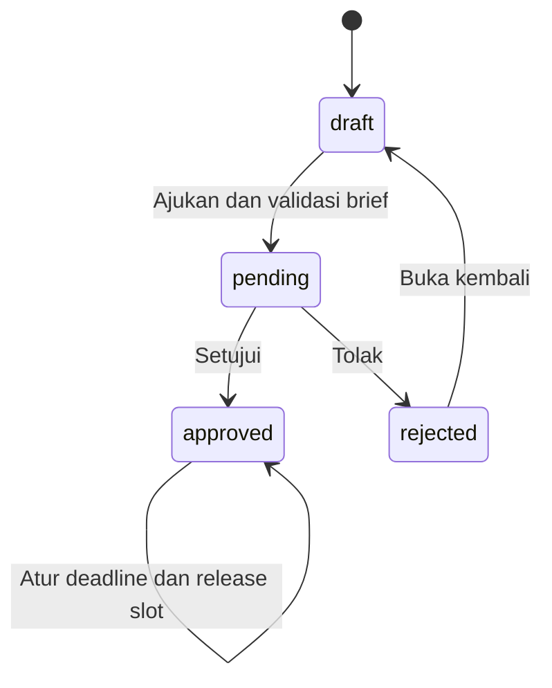

### 5.2 Content Workflow

Status final: `draft` = Draf; `brief_ready` = Brief Ready; `in_progress` = Sedang Dikerjakan; `waiting_review` = Menunggu Persetujuan; `revision` = Perlu Revisi; `approved` = Disetujui; `scheduled` = Terjadwal Tayang; `uploaded` = Sudah Tayang; `cancelled` = Dibatalkan.

Singkatan aktor tabel: **W** = CEO, Manager, SMO, Content Creator, Graphic Designer (`workflow:update`); **A** = CEO, Manager, SMO (`workflow:update` + `workflow:approve`); **P** = CEO, SMO (`publishing:manage`). Setiap endpoint konten tetap memerlukan scope. Copywriter/Admin tidak memiliki workflow:update sebagai role tunggal.

| Dari | Ke | Aktor / permission | Guard dan efek |
|---|---|---|---|
| draft | brief_ready | CEO/Manager/SMO; content_plan:approve | Hanya release batch normal; rencana approved dan semua tenggat upload draft tersedia. Generic transition menolak draft. |
| brief_ready | in_progress | W | Mulai produksi dan log. |
| brief_ready | cancelled | W | Pembatalan dan log. |
| in_progress | waiting_review | W | Menyelesaikan seluruh revisi in_progress; PIC/link hasil bukan guard wajib. |
| in_progress | cancelled | W | Pembatalan dan log. |
| waiting_review | approved | A | Tidak ada revisi open/in_progress; tidak mensyaratkan cap Setuju klien. |
| waiting_review | revision | W atau Klien pemegang token | Catatan wajib; buat revisi sesuai sumber dan log. |
| waiting_review | cancelled | W | Pembatalan dan log. |
| revision | in_progress | W | Seluruh revisi open menjadi in_progress. |
| revision | cancelled | W | Pembatalan; tidak menjanjikan semua revisi unresolved ikut ditutup. |
| approved | scheduled | W | scheduled_upload_at valid wajib. |
| approved | cancelled | W | Pembatalan dan log. |
| scheduled | uploaded | P pada form publikasi; W pada Kanban | Minimal satu publication dengan platform/waktu; URL/caption opsional; is_posted dan pin diperbarui. |
| scheduled | cancelled | W | Pembatalan dan log. |
| uploaded | — | — | Terminal normal. |
| cancelled | — | — | Terminal normal. |

**Jalur di luar graph normal:** creation slot → draft; Jobdesk Tambahan/bulk Apply lama → brief_ready; koreksi CEO/Manager dari **setiap** status ke **setiap status berbeda** pada himpunan sembilan status dengan alasan dan log correction. Koreksi tidak menegakkan guard normal, tidak menghapus publikasi atau menyelesaikan revisi, dan tidak menyamakan kembali is_posted. Jalur ini bukan 72 perpindahan normal yang tersembunyi; ia merupakan satu operasi override beralasan. UI yang menyembunyikan aksi pada terminal tidak membatasi endpoint itu.

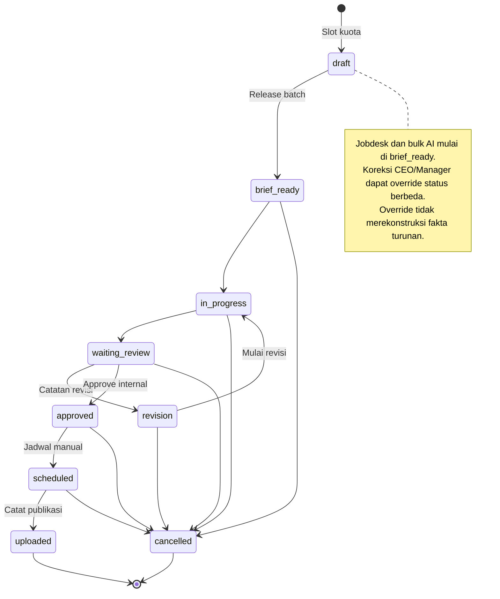

### 5.3 Revision

| Dari | Ke | Pemicu / aktor | Efek |
|---|---|---|---|
| Tidak ada | open | Catatan internal W pada waiting_review/revision; klien pada waiting_review | Round max+1; sumber requester dipisah. |
| open | in_progress | W memindahkan konten revision → in_progress | Seluruh open pada konten dimulai bersama. |
| in_progress | resolved | W memindahkan konten in_progress → waiting_review | Seluruh revisi in_progress ditandai selesai. |
| resolved | — | Tidak ada reopen revisi individual | Permintaan selanjutnya adalah record/round baru. |

Pembatalan/koreksi workflow tidak dijanjikan menyelesaikan semua revisi. State review klien `client_review_result=approved` merupakan cap terpisah, bukan revisi resolved.

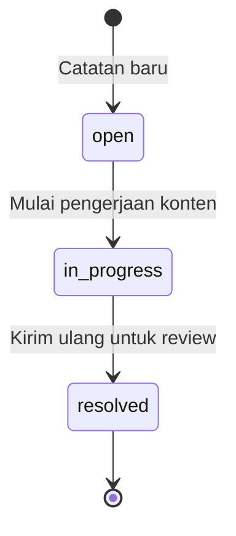

### 5.4 User

| Dari | Ke | Aktor/pemicu | Guard/efek |
|---|---|---|---|
| Belum ada | active | CEO/Manager menambah pengguna | Email unik, minimal satu role; login_enabled=true. |
| invited | active | Callback Google berhasil | Email terdaftar dan login_enabled; state kompatibilitas lama, bukan undangan email baru. |
| active/invited | inactive | CEO/Manager menonaktifkan | Tidak diri sendiri; pengalihan pekerjaan aktif jika perlu. |
| inactive | active | CEO/Manager mengaktifkan | Record/history tetap; login_enabled terpisah. |
| status tetap | status tetap | CEO/Manager toggle login_enabled | True/false terpisah; tidak menginvalidasi seluruh sesi aktif. |

Login callback menerima active/invited dan menolak inactive/login disabled. Middleware sesudah login tidak menegakkan ulang pemeriksaan status tersebut.

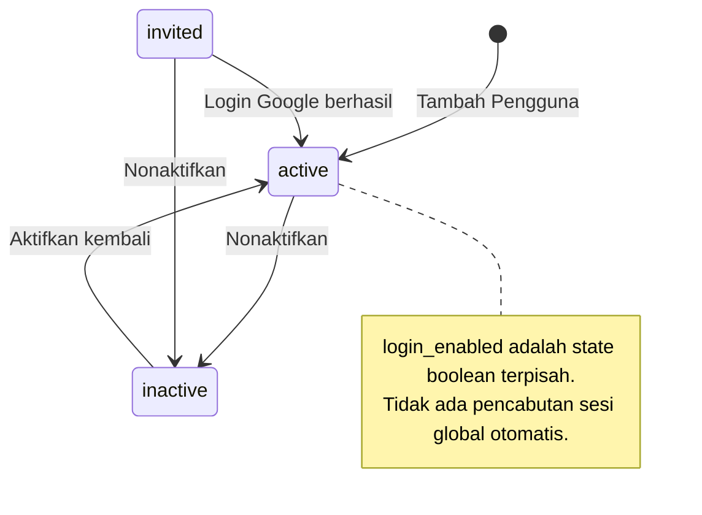

### 5.5 Client

| Dari | Ke | Aktor/pemicu | Efek |
|---|---|---|---|
| Belum ada | active | CEO/Manager membuat klien | Token portal dibuat; paket opsional pada onboarding. |
| active/past_due/paused | active/past_due/paused | CEO/Manager edit | Nilai harus dalam daftar; tidak ada transisi otomatis tagihan. |
| Status apa pun dengan histori terdeteksi | paused | Hapus Klien | Record dan histori tetap. |
| Status apa pun tanpa histori yang diperiksa | Terhapus | Hapus Klien | Paket/logo terkait ditangani; FK lain tetap dapat menolak. |
| status tetap | status tetap | Enable/Disable/Rotate Portal | portal_access_enabled/token terpisah dari status klien. |

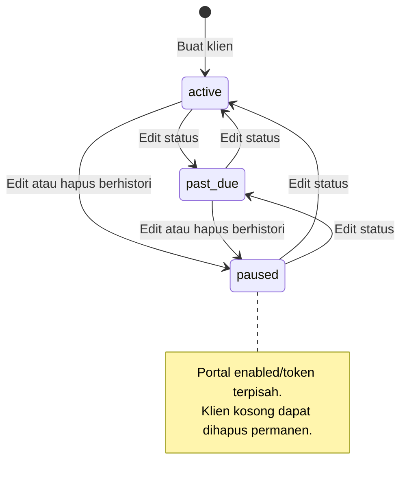

## 6. Authorization Matrix

Nilai: **G** = diizinkan dengan scope semua klien; **S** = diizinkan hanya klien roster; **Y** = diizinkan, konteks pribadi/non-klien; **T** = portal sesuai token; **T*** = tampilan portal ekuivalen, bukan akses endpoint internal; **—** = tidak diizinkan sebagai role tunggal. Semua Y/G/S tetap tunduk pada validasi status dan guard spesifik. Tabel mengaudit backend, bukan hanya menu.

| Feature / Action | CEO | Manager | SMO | Copywriter | Content Creator | Graphic Designer | Admin | Client |
| --- | --- | --- | --- | --- | --- | --- | --- | --- |
| Beranda / pekerjaan pribadi — VIEW | Y | Y | Y | Y | Y | Y | Y | — |
| Dashboard — VIEW | G | G | S | — | — | — | G | — |
| Klien detail — VIEW | G | G | S | S | S | S | G | T |
| Daftar Kelola Klien — VIEW | G | G | — | — | — | — | G | — |
| Klien/paket/token — CREATE, EDIT, DELETE/PAUSE, MANAGE | G | G | — | — | — | — | — | — |
| Pengguna — VIEW | G | G | — | — | — | — | G | — |
| Pengguna/role/roster/login — CREATE, EDIT, MANAGE | G | G | — | — | — | — | — | — |
| Rencana dan kalender — VIEW | G | G | S | S | S | S | G | T* |
| Rencana/slot/brief/caption — CREATE, EDIT, SUBMIT, REOPEN | G | G | — | S | — | — | — | — |
| Rencana — APPROVE, REJECT, DEADLINE, RELEASE | G | G | S | — | — | — | — | — |
| Produksi/detail/brief — VIEW | G | G | S | S | S | S | G | T* |
| Workflow/PIC/link/footage/revisi — EDIT, TRANSITION | G | G | S | — | S | S | — | — |
| Konten — APPROVE internal | G | G | S | — | — | — | — | — |
| Status — CORRECT override | G | G | — | — | — | — | — | — |
| Publikasi — SCHEDULE melalui workflow | G | G | S | — | S | S | — | — |
| Publikasi — PUBLISH/RECORD formulir khusus | G | — | S | — | — | — | — | — |
| Publikasi — PUBLISH/RECORD payload Kanban | G | G | S | — | S | S | — | — |
| Unmatched/link manual — VIEW, MANAGE | G | — | S | — | — | — | — | — |
| Performa/audiens/AI history — VIEW | G | G | S | — | — | — | G | T* |
| Performa — EXPORT CSV | G | G | S | — | — | — | G | — |
| Performa CSV — IMPORT | G | G | S | — | — | — | — | — |
| Audiens CSV/AI Strategy — CREATE, APPLY, REFINE, REVERT | G | G | S | — | — | — | — | — |
| Integrasi sosial — CONNECT | G | G | — | — | — | — | — | — |
| Analytics — SYNC/RETRY | G | G | S | — | — | — | — | — |
| Analytics sync — VIEW status | G | G | S | — | — | — | G | — |
| Performa Tim / KPI orang lain / rekap absensi — VIEW | G | G | — | — | — | — | G | — |
| KPI profil sendiri — VIEW | Y | Y | Y | Y | Y | Y | Y | — |
| Laporan — VIEW histori sendiri, GENERATE PDF/Excel | G | G | S | — | — | — | G | — |
| Pengaturan — VIEW | G | G | S | — | — | — | G | — |
| Master — CREATE, DELETE; paket — EDIT, MANAGE | Y | Y | Y | — | — | — | — | — |
| Tema/absensi/pin/status baca sendiri — EDIT | Y | Y | Y | Y | Y | Y | Y | — |
| Search/profil kerja — VIEW | Y | Y | Y | Y | Y | Y | Y | — |
| Review Portal — SETUJU, MINTA REVISI | — | — | — | — | — | — | — | T |

**Katalog permission:** 11 modul `dashboard`, `client`, `team_performance`, `user_management`, `analytics`, `report`, `master_data`, `settings`, `content_plan`, `workflow`, `publishing` × 5 aksi `view/create/update/approve/manage` = **55** pasangan katalog. Tidak semua pasangan dipakai route. CEO memperoleh semua; Admin memperoleh 11 view saja. Tindakan pribadi/report membuktikan bahwa view-only permission bukan jaminan zero mutation.

Semua role diberi client:view, content_plan:view dan workflow:view. Copywriter menambah content_plan:create. Content Creator/Graphic Designer menambah workflow:update. Manager dan SMO memiliki analytics:manage serta settings:manage, tetapi hanya CEO/Manager mengelola klien/pengguna. SMO mempunyai publishing:manage; Manager tidak. Rule CEO/Manager pada koreksi status mempersempit workflow:approve milik SMO.

Scope diterapkan melalui middleware `client.scope`, `AssignedClient` pada input dan guard controller sesuai endpoint. Route callback integrasi tidak memakai permission connect yang sama secara literal, tetapi memakai state/client yang disimpan sesi dan pemeriksaan callback. Profile kerja/notifikasi/pencarian pengguna tidak semuanya dibatasi roster penonton (Q-07). Tidak ada deny override multi-role. Pengguna yang memegang token portal bertindak sebagai klien token itu, terlepas dari sesi internalnya.

## 7. Data Model As-Built

Model ini dibangun dari migration/model dan schema MySQL hasil migration pada instance testing terisolasi. Nama tabel dipakai agar hubungan/constraint dapat diperiksa. `?` berarti nullable; `id`, timestamp generik dan beberapa field teknis dihilangkan dari ringkasan field. Daftar hubungan menunjukkan FK **keluar** dari entity dan aksi ketika **parent** dihapus: NO ACTION/RESTRICT menahan, CASCADE menghapus child, SET NULL mempertahankan child tanpa parent. Penghapusan entity sendiri juga dipengaruhi FK **masuk** pada entity lain di tabel ini. Soft delete tidak mengeksekusi FK cascade.

Unique yang ditulis adalah indeks database final selain primary key. “Hanya PK” berarti tidak ditemukan unique bisnis tambahan, bukan berarti data boleh diduplikasi melalui setiap form. Tabel bertimestamp menyimpan created_at/updated_at, tetapi itu bukan histori seluruh perubahan.

### Identity & Access

| Entity | Purpose | Important Fields | Relationship / delete parent | Unique DB | Delete / audit / history |
| --- | --- | --- | --- | --- | --- |
| `users` | Identitas internal, status dan preferensi; penonaktifan mempertahankan kontribusi/log. | name, email, google_id?, avatar_url?, status, login_enabled, preferences?, source?, external_reference? | Tidak ada FK keluar yang tercatat. | (email); (external_reference); (google_id) | Tidak ada soft-delete kolom. Identitas internal, status dan preferensi; penonaktifan mempertahankan kontribusi/log. |
| `roles` | Tujuh nama peran internal. | name | Tidak ada FK keluar yang tercatat. | Hanya PK | Tidak ada soft-delete kolom. Tujuh nama peran internal. |
| `permissions` | Katalog pasangan modul/tindakan. | module, action | Tidak ada FK keluar yang tercatat. | (module, action) | Tidak ada soft-delete kolom. Katalog pasangan modul/tindakan. |
| `user_roles` | Multi-role pengguna, bukan users.role_id tunggal. | user_id, role_id | role_id → roles.id [CASCADE]; user_id → users.id [CASCADE] | (user_id, role_id) | Tidak ada soft-delete kolom. Multi-role pengguna, bukan users.role_id tunggal. |
| `role_permissions` | Izin per role. | role_id, permission_id | permission_id → permissions.id [CASCADE]; role_id → roles.id [CASCADE] | (role_id, permission_id) | Tidak ada soft-delete kolom. Izin per role. |
| `user_client_assignments` | Roster/cakupan pengguna-klien. | user_id, client_id | client_id → clients.id [CASCADE]; user_id → users.id [CASCADE] | (user_id, client_id) | Tidak ada soft-delete kolom. Roster/cakupan pengguna-klien. |
| `auth_audit_logs` | Catatan login_success/login_failed; bukan audit logout atau semua edit. | user_id?, event, method | user_id → users.id [SET NULL] | Hanya PK | Tidak ada soft-delete kolom. Catatan login_success/login_failed; bukan audit logout atau semua edit. |

### Client & Package

| Entity | Purpose | Important Fields | Relationship / delete parent | Unique DB | Delete / audit / history |
| --- | --- | --- | --- | --- | --- |
| `clients` | Identitas klien dan kontrol tautan portal; history guard dapat mengubah hapus menjadi paused. | client_category_id, name, color?, logo_path?, asset_link?, status, portal_token, portal_access_enabled | client_category_id → client_categories.id [NO ACTION] | (portal_token) | Tidak ada soft-delete kolom. Identitas klien dan kontrol tautan portal; history guard dapat mengubah hapus menjadi paused. |
| `client_categories` | Master kategori klien. | name | Tidak ada FK keluar yang tercatat. | Hanya PK | Tidak ada soft-delete kolom. Master kategori klien. |
| `package_templates` | Template kuota dengan is_active; guard pemakaian sebelum hapus. | name, monthly_content_quota, monthly_design_quota, is_active | Tidak ada FK keluar yang tercatat. | Hanya PK | Tidak ada soft-delete kolom. Template kuota dengan is_active; guard pemakaian sebelum hapus. |
| `client_packages` | Snapshot nama/kuota dan histori paket klien. | client_id, package_template_id?, package_name_snapshot, monthly_content_quota, monthly_design_quota, start_date, end_date?, status | client_id → clients.id [NO ACTION]; package_template_id → package_templates.id [NO ACTION] | Hanya PK | Tidak ada soft-delete kolom. Snapshot nama/kuota dan histori paket klien. |

### Planning

| Entity | Purpose | Important Fields | Relationship / delete parent | Unique DB | Delete / audit / history |
| --- | --- | --- | --- | --- | --- |
| `content_plans` | Rencana klien/periode yang mengacu paket snapshot; keputusan disimpan terpisah. | client_id, client_package_id?, created_by, approved_by?, month, year, status | approved_by → users.id [NO ACTION]; client_id → clients.id [NO ACTION]; client_package_id → client_packages.id [NO ACTION]; created_by → users.id [NO ACTION] | Hanya PK | Tidak ada soft-delete kolom. Rencana klien/periode yang mengacu paket snapshot; keputusan disimpan terpisah. |
| `content_plan_status_logs` | Riwayat keputusan rencana dan alasan. | content_plan_id, changed_by_user_id?, from_status?, to_status, notes?, changed_at | changed_by_user_id → users.id [SET NULL]; content_plan_id → content_plans.id [CASCADE] | Hanya PK | Tidak ada soft-delete kolom. Riwayat keputusan rencana dan alasan. |

### Content

| Entity | Purpose | Important Fields | Relationship / delete parent | Unique DB | Delete / audit / history |
| --- | --- | --- | --- | --- | --- |
| `content_items` | Unit slot/pekerjaan, asal impor/AI, jadwal dan link; satu-satunya soft delete utama. | content_plan_id, provisional_code?, is_urgent, ai_strategy_insight_id?, import_source?, import_batch_id?, external_reference?, client_id, content_pillar_id?, content_type_id?, content_format?, content_format_id?, platform_id?, title, brief?, reference_link?, caption_draft?, deadline_at, upload_deadline_at?, footage_captured_at?, scheduled_upload_at?, estimated_duration_seconds?, estimated_slide_count?, content_file_link?, is_posted, deleted_at? | ai_strategy_insight_id → ai_strategy_insights.id [SET NULL]; client_id → clients.id [NO ACTION]; content_format_id → content_formats.id [SET NULL]; content_pillar_id → content_pillars.id [NO ACTION]; content_plan_id → content_plans.id [NO ACTION]; content_type_id → content_types.id [NO ACTION]; platform_id → platforms.id [NO ACTION] | (import_source, external_reference); (content_plan_id, provisional_code) | Soft delete melalui deleted_at; hard delete memicu FK masuk. Unit slot/pekerjaan, asal impor/AI, jadwal dan link; satu-satunya soft delete utama. |
| `content_types` | Master kategori pekerjaan/kuota. | name | Tidak ada FK keluar yang tercatat. | Hanya PK | Tidak ada soft-delete kolom. Master kategori pekerjaan/kuota. |
| `content_formats` | Referensi format ternormalisasi. | name, slug | Tidak ada FK keluar yang tercatat. | (slug) | Tidak ada soft-delete kolom. Referensi format ternormalisasi. |
| `content_pillars` | Master pilar editorial. | name | Tidak ada FK keluar yang tercatat. | Hanya PK | Tidak ada soft-delete kolom. Master pilar editorial. |
| `platforms` | Master platform lintas konten/analytics. | name | Tidak ada FK keluar yang tercatat. | Hanya PK | Tidak ada soft-delete kolom. Master platform lintas konten/analytics. |
| `content_item_platforms` | Relasi multi-platform konten; scalar platform_id lama masih ada. | content_item_id, platform_id | content_item_id → content_items.id [CASCADE]; platform_id → platforms.id [CASCADE] | (content_item_id, platform_id) | Tidak ada soft-delete kolom. Relasi multi-platform konten; scalar platform_id lama masih ada. |
| `content_item_assignments` | Kontributor dan assignment_role; bukan log perpindahan PIC lengkap. | content_item_id, user_id, assignment_role | content_item_id → content_items.id [CASCADE]; user_id → users.id [NO ACTION] | Hanya PK | Tidak ada soft-delete kolom. Kontributor dan assignment_role; bukan log perpindahan PIC lengkap. |

### Workflow

| Entity | Purpose | Important Fields | Relationship / delete parent | Unique DB | Delete / audit / history |
| --- | --- | --- | --- | --- | --- |
| `content_workflows` | Status kini, current PIC, overdue dan cap review klien. | content_item_id, current_pic_id?, current_status, is_overdue, client_reviewed_at?, client_reviewed_by_client_id?, client_review_result? | client_reviewed_by_client_id → clients.id [SET NULL]; content_item_id → content_items.id [CASCADE]; current_pic_id → users.id [NO ACTION] | (content_item_id) | Tidak ada soft-delete kolom. Status kini, current PIC, overdue dan cap review klien. |
| `content_status_logs` | Histori status, aktor internal/klien dan jenis approval/correction. | content_item_id, changed_by_user_id?, changed_by_client_id?, from_status?, to_status, approval_type?, notes?, changed_at | changed_by_client_id → clients.id [SET NULL]; changed_by_user_id → users.id [SET NULL]; content_item_id → content_items.id [CASCADE] | Hanya PK | Tidak ada soft-delete kolom. Histori status, aktor internal/klien dan jenis approval/correction. |

### Revision

| Entity | Purpose | Important Fields | Relationship / delete parent | Unique DB | Delete / audit / history |
| --- | --- | --- | --- | --- | --- |
| `content_revisions` | Round/catatan/sumber revisi dan status pengerjaan. | content_item_id, requested_by_user_id?, requested_by_client_id?, revision_round, revision_note, status | content_item_id → content_items.id [CASCADE]; requested_by_client_id → clients.id [SET NULL]; requested_by_user_id → users.id [SET NULL] | Hanya PK | Tidak ada soft-delete kolom. Round/catatan/sumber revisi dan status pengerjaan. |

### Publication

| Entity | Purpose | Important Fields | Relationship / delete parent | Unique DB | Delete / audit / history |
| --- | --- | --- | --- | --- | --- |
| `content_publications` | Fakta tayang per platform dan identitas provider; published_by bukan atribusi KPI otomatis. | content_item_id, platform_id, external_post_id?, api_integration_id?, published_by, published_at, post_url?, thumbnail_url?, caption_final? | api_integration_id → api_integrations.id [SET NULL]; content_item_id → content_items.id [CASCADE]; platform_id → platforms.id [NO ACTION]; published_by → users.id [NO ACTION] | (platform_id, external_post_id) | Tidak ada soft-delete kolom. Fakta tayang per platform dan identitas provider; published_by bukan atribusi KPI otomatis. |

### Analytics

| Entity | Purpose | Important Fields | Relationship / delete parent | Unique DB | Delete / audit / history |
| --- | --- | --- | --- | --- | --- |
| `content_metrics` | Nilai terkini API atau record CSV; source/identity menentukan semantik tanggal. | content_item_id?, client_id?, instagram_media_snapshot_id?, tiktok_video_snapshot_id?, platform_id, sync_log_id?, imported_by, metric_date, views, engagement_rate, watch_time_avg?, watch_time_total?, completion_rate?, skip_rate?, shares?, saves?, reach?, impressions?, likes?, comments?, profile_visit?, profile_activity?, attributed_follows? | client_id → clients.id [SET NULL]; content_item_id → content_items.id [CASCADE]; imported_by → users.id [NO ACTION]; instagram_media_snapshot_id → instagram_media_snapshots.id [SET NULL]; platform_id → platforms.id [NO ACTION]; sync_log_id → analytics_sync_logs.id [SET NULL]; tiktok_video_snapshot_id → tiktok_video_snapshots.id [SET NULL] | (content_item_id, platform_id, metric_date); (instagram_media_snapshot_id, metric_date); (tiktok_video_snapshot_id, metric_date) | Tidak ada soft-delete kolom. Nilai terkini API atau record CSV; source/identity menentukan semantik tanggal. |
| `content_metric_snapshots` | Observasi harian genuine kumulatif untuk gain dan bonus; histori tidak dibuat ulang oleh CSV. | client_id, platform_id, content_item_id?, instagram_media_snapshot_id?, tiktok_video_snapshot_id?, snapshot_date, views?, reach?, impressions?, likes?, comments?, shares?, saves?, profile_visit?, profile_activity?, attributed_follows?, engagement_rate?, watch_time_avg?, watch_time_total?, completion_rate?, skip_rate? | client_id → clients.id [CASCADE]; content_item_id → content_items.id [SET NULL]; instagram_media_snapshot_id → instagram_media_snapshots.id [CASCADE]; platform_id → platforms.id [NO ACTION]; tiktok_video_snapshot_id → tiktok_video_snapshots.id [CASCADE] | (instagram_media_snapshot_id, snapshot_date); (tiktok_video_snapshot_id, snapshot_date) | Tidak ada soft-delete kolom. Observasi harian genuine kumulatif untuk gain dan bonus; histori tidak dibuat ulang oleh CSV. |
| `performance_anomalies` | Catatan spike/drop per konten/hari yang dideteksi. | content_item_id, type, percent_change, views_on_date, baseline_avg_views, detected_date | content_item_id → content_items.id [CASCADE] | Hanya PK | Tidak ada soft-delete kolom. Catatan spike/drop per konten/hari yang dideteksi. |
| `instagram_media_snapshots` | Identitas media Instagram, metadata publikasi dan hasil matching; bukan histori metrik harian. | api_integration_id, external_post_id, permalink?, caption?, media_type?, media_product_type?, published_at?, thumbnail_url?, match_status, content_publication_id?, last_fetched_at | api_integration_id → api_integrations.id [CASCADE]; content_publication_id → content_publications.id [SET NULL] | (api_integration_id, external_post_id) | Tidak ada soft-delete kolom. Identitas media Instagram, metadata publikasi dan hasil matching; bukan histori metrik harian. |
| `tiktok_video_snapshots` | Identitas video TikTok, metadata dan hasil matching. | api_integration_id, external_post_id, share_url?, title?, video_description?, duration?, cover_image_url?, match_status, content_publication_id?, published_at?, last_fetched_at | api_integration_id → api_integrations.id [CASCADE]; content_publication_id → content_publications.id [SET NULL] | (api_integration_id, external_post_id) | Tidak ada soft-delete kolom. Identitas video TikTok, metadata dan hasil matching. |

### Audience

| Entity | Purpose | Important Fields | Relationship / delete parent | Unique DB | Delete / audit / history |
| --- | --- | --- | --- | --- | --- |
| `audience_insights` | Snapshot audiens terpisah per sumber dan jenis demografi. | client_id, platform_id, source, demographic_type, snapshot_date, follower_count?, following_count?, likes_count?, video_count?, reach?, gender_breakdown?, age_breakdown?, top_locations?, top_countries?, active_hours? | client_id → clients.id [CASCADE]; platform_id → platforms.id [NO ACTION] | (client_id, platform_id, snapshot_date, source, demographic_type) | Tidak ada soft-delete kolom. Snapshot audiens terpisah per sumber dan jenis demografi. |

### Integrations

| Entity | Purpose | Important Fields | Relationship / delete parent | Unique DB | Delete / audit / history |
| --- | --- | --- | --- | --- | --- |
| `api_integrations` | Koneksi per klien/platform; token encrypted/hidden, expiry dan scope grant. | client_id, platform_id, integration_name, access_token?, refresh_token?, status, external_account_id?, external_username?, last_synced_at?, reach_history_backfilled_at?, last_error?, access_token_expires_at?, refresh_token_expires_at?, scopes? | client_id → clients.id [CASCADE]; platform_id → platforms.id [NO ACTION] | Hanya PK | Tidak ada soft-delete kolom. Koneksi per klien/platform; token encrypted/hidden, expiry dan scope grant. |
| `analytics_sync_logs` | Histori sync/import dan ringkasan berhasil/dilewati/gagal. | client_id?, platform_id?, api_integration_id?, imported_by, source_type, sync_mode?, range_from?, range_to?, status, synced_count?, skipped_count?, error_message? | api_integration_id → api_integrations.id [NO ACTION]; client_id → clients.id [NO ACTION]; imported_by → users.id [NO ACTION]; platform_id → platforms.id [NO ACTION] | Hanya PK | Tidak ada soft-delete kolom. Histori sync/import dan ringkasan berhasil/dilewati/gagal. |
| `analytics_sync_runs` | Satu permintaan sinkronisasi dan aktor pemicu. | client_id, trigger, initiated_by?, status, started_at?, finished_at? | client_id → clients.id [CASCADE]; initiated_by → users.id [SET NULL] | Hanya PK | Tidak ada soft-delete kolom. Satu permintaan sinkronisasi dan aktor pemicu. |
| `analytics_sync_tasks` | Subjob, progres, attempt dan rekonsiliasi. | analytics_sync_run_id, api_integration_id, subjob, status, stage?, discovered_count, processed_count, success_count, unavailable_count, skipped_count, failed_count, reconciled?, started_at?, last_progress_at?, finished_at?, attempt | analytics_sync_run_id → analytics_sync_runs.id [CASCADE]; api_integration_id → api_integrations.id [CASCADE] | Hanya PK | Tidak ada soft-delete kolom. Subjob, progres, attempt dan rekonsiliasi. |
| `analytics_sync_task_items` | Unit item per task, tahap/chunk serta status core/opsional. | analytics_sync_task_id, external_item_id, media_type?, published_at?, stage, source, chunk_index, status, core_completed_at?, optional_status?, last_error? | analytics_sync_task_id → analytics_sync_tasks.id [CASCADE] | (analytics_sync_task_id, external_item_id) | Tidak ada soft-delete kolom. Unit item per task, tahap/chunk serta status core/opsional. |
| `analytics_sync_failures` | Kegagalan terklasifikasi, retryability dan resolved_at. | analytics_sync_task_id, external_item_id?, content_item_id?, operation, category, message?, retryable, attempts, resolved_at? | analytics_sync_task_id → analytics_sync_tasks.id [CASCADE]; content_item_id → content_items.id [SET NULL] | Hanya PK | Tidak ada soft-delete kolom. Kegagalan terklasifikasi, retryability dan resolved_at. |

### AI

| Entity | Purpose | Important Fields | Relationship / delete parent | Unique DB | Delete / audit / history |
| --- | --- | --- | --- | --- | --- |
| `content_brief_drafts` | Brief manual/AI, scenes, percakapan terbatas dan satu previous_snapshot; tanggal lama tetap kolom kompatibilitas. | content_item_id, created_by?, hook_title?, start_date?, post_date?, platform?, reference_link?, take_by_user_id?, copywriting_script?, scenes?, talent?, properti?, estimated_duration_seconds?, slide_count?, talent_count?, location_count?, complexity_level?, ai_assisted_fields?, feasibility_level?, feasibility_notes?, status, chat_history?, previous_snapshot?, finalized_at? | content_item_id → content_items.id [CASCADE]; created_by → users.id [SET NULL]; take_by_user_id → users.id [SET NULL] | Hanya PK | Tidak ada soft-delete kolom. Brief manual/AI, scenes, percakapan terbatas dan satu previous_snapshot; tanggal lama tetap kolom kompatibilitas. |
| `ai_strategy_insights` | Analisis periodik, ide dan jejak apply bulk/per-idea yang berbeda. | client_id, platform_id?, generated_by, period_start, period_end, performance_data?, summary, action_items, suggested_split?, top_pillars?, content_ideas?, data_completeness_percent?, status, error_message?, applied_at?, applied_by?, applied_idea_indexes? | applied_by → users.id [NO ACTION]; client_id → clients.id [CASCADE]; generated_by → users.id [NO ACTION]; platform_id → platforms.id [RESTRICT] | Hanya PK | Tidak ada soft-delete kolom. Analisis periodik, ide dan jejak apply bulk/per-idea yang berbeda. |
| `ai_strategy_messages` | Pesan diskusi strategi tersimpan per insight. | ai_strategy_insight_id, user_id?, role, message | ai_strategy_insight_id → ai_strategy_insights.id [CASCADE]; user_id → users.id [NO ACTION] | Hanya PK | Tidak ada soft-delete kolom. Pesan diskusi strategi tersimpan per insight. |
| `delay_risk_scores` | Histori prediksi ML dan snapshot fitur. | content_item_id, risk_score, risk_level, top_factor?, features_snapshot? | content_item_id → content_items.id [CASCADE] | Hanya PK | Tidak ada soft-delete kolom. Histori prediksi ML dan snapshot fitur. |

### KPI

| Entity | Purpose | Important Fields | Relationship / delete parent | Unique DB | Delete / audit / history |
| --- | --- | --- | --- | --- | --- |
| `user_monthly_kpi_results` | Hasil materialisasi per pengguna/bulan, sampel, breakdown dan calculated_at; upsert bukan log semua kalkulasi. | user_id, period_start, timeliness_score?, quality_score?, analytics_bonus?, analytics_available, final_score?, sample_size, status, breakdown?, calculated_at? | user_id → users.id [CASCADE] | (user_id, period_start) | Tidak ada soft-delete kolom. Hasil materialisasi per pengguna/bulan, sampel, breakdown dan calculated_at; upsert bukan log semua kalkulasi. |

### Attendance

| Entity | Purpose | Important Fields | Relationship / delete parent | Unique DB | Delete / audit / history |
| --- | --- | --- | --- | --- | --- |
| `attendances` | Kehadiran aktual satu pengguna/hari; timestamp kosong tidak diestimasi. | user_id, date, check_in_at?, check_out_at?, check_in_status?, check_out_status? | user_id → users.id [CASCADE] | (user_id, date) | Tidak ada soft-delete kolom. Kehadiran aktual satu pengguna/hari; timestamp kosong tidak diestimasi. |

### Reports

| Entity | Purpose | Important Fields | Relationship / delete parent | Unique DB | Delete / audit / history |
| --- | --- | --- | --- | --- | --- |
| `generated_reports` | Metadata file laporan, periode dan pembuat; histori query milik sendiri. | client_id?, generated_by, report_type, period_start, period_end, file_path? | client_id → clients.id [CASCADE]; generated_by → users.id [NO ACTION] | Hanya PK | Tidak ada soft-delete kolom. Metadata file laporan, periode dan pembuat; histori query milik sendiri. |

### Notifications

| Entity | Purpose | Important Fields | Relationship / delete parent | Unique DB | Delete / audit / history |
| --- | --- | --- | --- | --- | --- |
| `notifications` | Pesan internal milik penerima dan status baca. | user_id, title, type, body?, related_type?, related_id?, is_read | user_id → users.id [CASCADE] | Hanya PK | Tidak ada soft-delete kolom. Pesan internal milik penerima dan status baca. |
| `pins` | Penanda pribadi polymorphic, bukan status bisnis. | user_id, pinnable_type, pinnable_id | user_id → users.id [CASCADE] | (user_id, pinnable_type, pinnable_id) | Tidak ada soft-delete kolom. Penanda pribadi polymorphic, bukan status bisnis. |

### Infrastructure

| Entity | Purpose | Important Fields | Relationship / delete parent | Unique DB | Delete / audit / history |
| --- | --- | --- | --- | --- | --- |
| `sessions` | Sesi autentikasi sesuai driver; bukan otomatis tercabut saat deactivate. | user_id?, last_activity | Tidak ada FK keluar yang tercatat. | Hanya PK | Tidak ada soft-delete kolom. Sesi autentikasi sesuai driver; bukan otomatis tercabut saat deactivate. |
| `jobs` | Antrean database; worker diperlukan. | queue, attempts, reserved_at?, available_at | Tidak ada FK keluar yang tercatat. | Hanya PK | Tidak ada soft-delete kolom. Antrean database; worker diperlukan. |
| `failed_jobs` | Kegagalan job pada driver queue. | uuid, connection, queue, exception, failed_at | Tidak ada FK keluar yang tercatat. | (uuid) | Tidak ada soft-delete kolom. Kegagalan job pada driver queue. |
| `job_batches` | Infrastruktur batch Laravel; keberadaan tabel bukan bukti semua sync memakai Laravel batch. | name, total_jobs, pending_jobs, failed_jobs, failed_job_ids, options?, cancelled_at?, finished_at? | Tidak ada FK keluar yang tercatat. | Hanya PK | Tidak ada soft-delete kolom. Infrastruktur batch Laravel; keberadaan tabel bukan bukti semua sync memakai Laravel batch. |
| `cache` | Penyimpanan cache sesuai driver. | key, value, expiration | Tidak ada FK keluar yang tercatat. | Hanya PK | Tidak ada soft-delete kolom. Penyimpanan cache sesuai driver. |
| `cache_locks` | Lock cache sesuai driver. | key, owner, expiration | Tidak ada FK keluar yang tercatat. | Hanya PK | Tidak ada soft-delete kolom. Lock cache sesuai driver. |
| `migrations` | Histori migration schema, bukan entity produk. | migration, batch | Tidak ada FK keluar yang tercatat. | Hanya PK | Tidak ada soft-delete kolom. Histori migration schema, bukan entity produk. |

### Invariant dan batas penting

- `content_plans` tidak mempunyai unique `(client_id,month,year)`; controller memeriksa duplikasi. `client_packages` tidak menjamin satu status aktif lewat unique index.
- `api_integrations` tidak unique `(client_id,platform_id)`; `content_brief_drafts` tidak unique `content_item_id`; assignment primary dan nomor round revisi juga tidak sepenuhnya dibatasi unique bisnis.
- `content_items` memiliki unique kode slot dalam plan serta identitas impor ketika terisi; kode C/D berbeda dari kode pilar lama. Relasi content_item_platforms adalah multi-platform, sedangkan platform_id scalar dipertahankan.
- Publikasi unique `(platform_id,external_post_id)` ketika identitas tidak null; tidak ada unique item/platform. Model dapat mempunyai beberapa publikasi/platform/tanggal yang memengaruhi MIN published_at KPI.
- Snapshot provider unique integrasi/identitas eksternal. Observasi metrik unique identitas snapshot/hari; nilai optional nullable. ContentMetric dapat belum terkait item internal.
- Hard delete item dapat cascade workflow/log/revisi/brief/publikasi; raw observasi tertentu memakai SET NULL. Tidak ada janji semua histori kebal penghapusan. Hapus klien kosong melalui controller berbeda dari menghapus parent langsung di database.
- Tidak ada entity Client Portal User internal terpisah, tidak ada users.role_id tunggal, dan tidak ada tabel lama team_members sebagai sumber identitas final.
- File laporan bukan row relasional: FK/histori database tidak otomatis membuktikan penghapusan atau privasi file storage.

## 8. Background Processing dan Operational Dependencies

### 8.1 Jadwal yang benar-benar terdaftar

Sumber: [routes/console.php](../routes/console.php) dan [config analytics](../config/analytics.php). Default timezone aplikasi Asia/Jakarta. Jadwal memerlukan schedule runner yang hidup; job memerlukan worker ketika QUEUE_CONNECTION=database. Audit ini tidak mengeksekusi scheduler pada database kerja.

| Proses | Trigger / frequency | Queue requirement | Failure behavior | User-visible effect |
|---|---|---|---|---|
| analytics:detect-anomalies | Setiap jam; juga aksi settings | Command; bukan job tersendiri | Catat anomali/sync failure yang memenuhi syarat dan dedupe | Notifikasi ai_insight/system dan histori anomali |
| RecomputeDelayRiskScores | Harian 10:00 | Command menjalankan service/Python | Model/proses gagal log+skip sesuai service | Risiko terbaru bila berhasil |
| SendDelayRiskNotifications | Harian 08:00 | Command | Penerima/current PIC dan dedupe per hari | H-7/5/3/1, overdue dan risiko tinggi |
| workflow:update-overdue | Setiap jam | Command | Scheduler tidak berjalan membuat flag basi | Penanda overdue pekerjaan aktif |
| RecalculateMonthlyKpi | Harian 02:00, bulan berjalan | Job unik per bulan | Gagal/tertunda mengikuti queue | Hasil KPI materialisasi |
| analytics:refresh-instagram-tokens | Harian 00:00 | Command HTTP | Catat kegagalan/kebutuhan reconnect | Koneksi dapat dipertahankan bila provider menerima |
| analytics:refresh-tiktok-tokens | Harian 00:00 | Command HTTP | Token refresh/izin gagal perlu reconnect | Status token TikTok |
| analytics:auto-sync | Harian, default 03:15, dapat dikonfigurasi | Dispatch pipeline antrean | Skip tidak eligible/duplikat; kegagalan per task/item | Progres dan observasi terbaru |

`analytics:prune-content-metric-snapshots` ada sebagai command tetapi baris schedule **dikomentari**. Kandidat retensi 120 hari bukan kebijakan aktif. Command sync-all lama tetap tersedia manual, tidak lagi dijadwalkan sebagai tiga sync otomatis tambahan. `analytics:cleanup-stale-sync-logs`/command pemeliharaan serupa bukan bukti pembersihan terjadwal; lihat signature class sebelum pemakaian operasional.

### 8.2 Job aktual dan pemicu non-jadwal

| Job/proses | Pemicu | Efek dan batas |
|---|---|---|
| SyncInstagramAnalyticsJob | Orchestrator/manual/auto-sync | Discovery konten dan dispatch chunk Instagram; overlap dilindungi per integrasi. |
| SyncInstagramAudienceJob | Orchestrator atau alur audiens | Snapshot audiens dan backfill sesuai service; keberhasilan memerlukan provider. |
| SyncTikTokAnalyticsJob | Orchestrator/manual/auto-sync | Profil/followers yang diizinkan serta discovery video TikTok. |
| ProcessInstagramSyncChunkJob | Discovery / kelanjutan chunk | Proses item core/opsional bertahap, progres/checkpoint/failure. |
| ProcessTikTokSyncChunkJob | Discovery / kelanjutan chunk | Proses video bertahap dengan identitas idempotent. |
| RecalculateMonthlyKpi | Jadwal dan halaman hasil belum ada/basi | Upsert hasil per pengguna/bulan; requested historical month juga dapat dipicu halaman. |
| DelayRiskPredictionService | Observer memasuki brief_ready, reassign individual dan command harian | Inferensi sinkron via subprocess; bukan nama job antrean ketujuh. |
| ContentPublicationMatcher | Pemrosesan post sosial; manual link | Tidak memiliki scheduler mandiri. |

Sync mempunyai retry/backoff dan lock sesuai masing-masing job; konfigurasi pokok chunk default 20 item, soft time budget 200 detik, timeout chunk 300 detik, retry_after queue 360 detik. Job discovery mempunyai timeout berbeda (120 detik pada implementasi terkait). Nilai konfigurasi bukan jaminan durasi proses pengguna. Task gagal/stale perlu dibedakan dari worker yang masih hidup; retry item tidak boleh dipahami sebagai sync ulang seluruh akun.

### 8.3 Event notifikasi

| Peristiwa | Penerima aktual | Ketentuan |
|---|---|---|
| plan_submitted | Pengguna aktif berhak approve rencana, selain pembuat | Tidak disaring roster klien. |
| Penugasan/finalisasi/release/Jobdesk Tambahan | PIC yang ditentukan oleh pemanggil NotificationService | Bukan jaminan semua perubahan database assignment memanggil notifikasi. |
| client_approved | Manager/SMO aktif | Tidak disaring roster; cap review tidak mengubah approved internal. |
| client_revision_requested | Penugasan konten | Sumber klien tercatat. |
| deadline_reminder | current PIC pekerjaan aktif | Hari H-7/5/3/1; dedupe harian. |
| overdue_reminder | current PIC pekerjaan overdue | Proses harian dan dedupe. |
| delay_risk_alert | current PIC serta CEO/Manager sesuai service | Risiko high; bukan notifikasi setiap skor. |
| Anomali spike/drop | Pengguna canSeeAllClients (CEO/Manager/Admin), tanpa filter aktif eksplisit pada command | Baseline minimal tiga hari; spike rasio ≥1.5, drop ≤0.5; API memakai gain harian valid, CSV jalur record terpisah; dedupe konten/hari. |
| Sync/import failed | Penerima global command deteksi | Catatan system; dedupe log gagal. |
| Kegagalan pipeline ML | CEO/Manager sesuai service notifikasi | Bukan pengiriman WhatsApp/SMTP. |

Tidak ada event otomatis generic yang membuktikan semua approve internal, semua publikasi sukses atau setiap revisi internal mengirim pesan. Semua notifikasi yang diuraikan di sini disimpan dalam aplikasi.

### 8.4 Runtime

`PROCESS_ROLE=all` menjalankan nginx/php-fpm/queue:work/schedule:work melalui supervisor; web hanya web, worker hanya queue, scheduler hanya schedule. Docker entrypoint web/all menjalankan migration saat start; **audit tidak menjalankan entrypoint tersebut**. Penyimpanan public perlu persisten untuk logo/laporan; backup, APP_KEY stabil dan konfigurasi produksi menjadi tanggung jawab operasional. Tidak ada klaim deployment dilakukan atau layanan produksi aktif berdasarkan keberadaan Dockerfile.

## 9. Kebutuhan Non-Fungsional

Klasifikasi historis: STILL VALID, MODIFIED, UNVERIFIED, REMOVED. Status verifikasi dibedakan dari kebutuhan target. Tidak ada angka target baru yang disisipkan; formula/threshold produk yang sudah ada bukan benchmark mutu sistem.

### NFR-001 — Security

**Baseline:** KnF21.c. **Rekonsiliasi:** UNVERIFIED. **Bukti:** TARGET / NOT LIVE VERIFIED.

**Requirement/keputusan target:** Sistem harus dijalankan dengan HTTPS dan APP_DEBUG=false pada lingkungan produksi; token integrasi harus menggunakan enkripsi penyimpanan yang tersedia.

**Karakteristik teramati:** ApiIntegration menggunakan encrypted casts dan hidden; transport TLS/debug produksi belum diinspeksi.

**Acceptance / verifikasi:** Periksa HTTPS/callback/konfigurasi produksi tanpa mencetak secret; verifikasi token tidak muncul dalam respons normal.

**Evidence:** [services.php](../config/services.php); [ApiIntegration.php](../app/Models/ApiIntegration.php); [entrypoint.sh](../docker/entrypoint.sh). **Test terkait:** [SocialIntegrationOAuthTest.php](../tests/Feature/SocialIntegrationOAuthTest.php).

### NFR-002 — Authorization

**Baseline:** KnF21.a. **Rekonsiliasi:** MODIFIED. **Bukti:** VERIFIED IN CODE; EXCEPTIONS LISTED.

**Requirement/keputusan target:** Sistem harus menerapkan permission gabungan multi-role dan scope sesuai matriks §6 pada endpoint bisnis.

**Karakteristik teramati:** Tujuh internal role; Admin memiliki pengecualian mutasi pribadi/laporan; jalur publikasi berbeda.

**Acceptance / verifikasi:** Uji URL langsung, request mutasi dan ID klien asing untuk setiap permission, bukan hanya sidebar.

**Evidence:** [PermissionSeeder.php](../database/seeders/PermissionSeeder.php); [EnsurePermission.php](../app/Http/Middleware/EnsurePermission.php); [EnsureClientScope.php](../app/Http/Middleware/EnsureClientScope.php). **Test terkait:** [FinalQaEffectivePermissionMatrixTest.php](../tests/Feature/FinalQaEffectivePermissionMatrixTest.php); [CrossClientIdorTest.php](../tests/Feature/CrossClientIdorTest.php).

### NFR-003 — Privacy

**Baseline:** KnF21.b, KnF51.a. **Rekonsiliasi:** MODIFIED. **Bukti:** PARTIAL; POLICY OPEN.

**Requirement/keputusan target:** Sistem harus membatasi portal ke klien token dan riwayat laporan ke pembuat sebagaimana diterapkan.

**Karakteristik teramati:** Token tetap, file laporan public, notifikasi/profil lintas roster adalah batas yang belum terselesaikan.

**Acceptance / verifikasi:** Token A tidak membuka konten B; histori A tidak memuat laporan B; lakukan tinjauan khusus file/profil Q-07/Q-09.

**Evidence:** [ResolveClientPortal.php](../app/Http/Middleware/ResolveClientPortal.php); [ReportController.php](../app/Http/Controllers/ReportController.php). **Test terkait:** [ClientPortalTest.php](../tests/Feature/ClientPortalTest.php); [CrossClientIdorTest.php](../tests/Feature/CrossClientIdorTest.php).

### NFR-004 — Reliability

**Baseline:** KnF11.b. **Rekonsiliasi:** STILL VALID. **Bukti:** VERIFIED STRUCTURE; LIVE DEPENDENCY.

**Requirement/keputusan target:** Sistem harus menyediakan pemrosesan antrean, status kegagalan dan retry terlingkup untuk sinkronisasi yang diimplementasikan.

**Karakteristik teramati:** Chunk/run/task/failure tersimpan; hasil parsial tidak otomatis diganti nol. Suite belum seluruhnya hijau dalam satu konfigurasi.

**Acceptance / verifikasi:** Skenario gagal core/opsional/duplikasi dan retry diuji dengan HTTP fake/queue yang sesuai; live timeout diuji terpisah.

**Evidence:** [AnalyticsSyncOrchestrator.php](../app/Services/AnalyticsSyncOrchestrator.php); [ProcessInstagramSyncChunkJob.php](../app/Jobs/ProcessInstagramSyncChunkJob.php). **Test terkait:** [ProgressiveSyncEngineTest.php](../tests/Feature/ProgressiveSyncEngineTest.php).

### NFR-005 — Availability

**Baseline:** Asumsi server/cloud SRS §2. **Rekonsiliasi:** UNVERIFIED. **Bukti:** TARGET / NOT MEASURED.

**Requirement/keputusan target:** Sistem harus menyediakan proses web, worker dan scheduler sesuai peran runtime yang dipilih agar fungsi latar belakang berjalan.

**Karakteristik teramati:** Docker all/web/worker/scheduler tersedia; uptime/SLA produksi tidak terukur.

**Acceptance / verifikasi:** Verifikasi health web, heartbeat scheduler dan konsumsi antrean pada lingkungan target; tentukan target uptime sebelum menilai lulus.

**Evidence:** [entrypoint.sh](../docker/entrypoint.sh); [Dockerfile](../Dockerfile). **Test terkait:** Tidak ditemukan test khusus; inspeksi statis saja..

### NFR-006 — Performance

**Baseline:** KnF11.a; PRD T4. **Rekonsiliasi:** UNVERIFIED. **Bukti:** HISTORICAL TARGET / NOT BENCHMARKED.

**Requirement/keputusan target:** Sistem harus menghindari menjadikan klaim lama halaman kurang dari dua detik sebagai hasil terverifikasi; target respons final memerlukan persetujuan dan benchmark.

**Karakteristik teramati:** Tidak ada hasil load test yang mengesahkan target lama. Batas chunk/timeout adalah konfigurasi operasi, bukan SLA respons halaman.

**Acceptance / verifikasi:** Setujui skenario, dataset, konkurensi, persentil dan target; ukur di lingkungan target sebelum menerima target tersebut.

**Evidence:** [analytics.php](../config/analytics.php); [queue.php](../config/queue.php). **Test terkait:** Tidak ditemukan test khusus; inspeksi statis saja..

### NFR-007 — Data Integrity

**Baseline:** KnF31.a, KnF31.b. **Rekonsiliasi:** MODIFIED. **Bukti:** VERIFIED SCHEMA; CONCURRENCY OPEN.

**Requirement/keputusan target:** Sistem harus mempertahankan constraint, snapshot paket, identitas observasi dan kebijakan penghapusan per entitas pada §7.

**Karakteristik teramati:** Soft delete hanya content_items di domain utama; beberapa invariant hanya guard controller. Tidak ada jaminan soft delete universal.

**Acceptance / verifikasi:** Uji duplicate identity dan guard hapus; uji konkurensi rencana/integrasi/brief sebelum menjanjikan keunikan absolut.

**Evidence:** [migrations](../database/migrations); [ClientManagementController.php](../app/Http/Controllers/ClientManagementController.php). **Test terkait:** [ContentMetricSnapshotCollectionTest.php](../tests/Feature/ContentMetricSnapshotCollectionTest.php); [PostFreezeAuditRegressionTest.php](../tests/Feature/PostFreezeAuditRegressionTest.php).

### NFR-008 — Usability

**Baseline:** PRD T4; prototipe SRS. **Rekonsiliasi:** MODIFIED. **Bukti:** VERIFIED TEMPLATES; USER STUDY NOT DONE.

**Requirement/keputusan target:** Sistem harus memakai istilah menu/status final dan membedakan nilai tersedia, nol, data kurang dan proses berjalan pada tampilan yang mendukungnya.

**Karakteristik teramati:** Sepuluh menu utama; labels sembilan status; ringkasan aggregate tertentu tetap dapat menghasilkan nol saat seluruh nilai null.

**Acceptance / verifikasi:** Review layar kosong, error, loading, scope dan labels dengan peran representatif; jangan klaim hasil usability study yang belum dilakukan.

**Evidence:** [views](../resources/views); [AvailabilityPresenter.php](../app/Services/AvailabilityPresenter.php); [WorkflowTransitions.php](../app/Support/WorkflowTransitions.php). **Test terkait:** [AnalyticsPageSmokeTest.php](../tests/Feature/AnalyticsPageSmokeTest.php); [AnalyticsUiPermissionMatrixTest.php](../tests/Feature/AnalyticsUiPermissionMatrixTest.php).

### NFR-009 — Accessibility / responsiveness

**Baseline:** KnF41.c. **Rekonsiliasi:** STILL VALID. **Bukti:** STRUCTURE VERIFIED; ACCESSIBILITY UNVERIFIED.

**Requirement/keputusan target:** Sistem harus menyediakan tampilan internal responsif dan portal yang dapat digunakan pada viewport kecil sebagaimana template yang tersedia.

**Karakteristik teramati:** Layout responsif ada; belum ada sertifikasi WCAG, uji pembaca layar atau jaminan seluruh perangkat.

**Acceptance / verifikasi:** Uji navigasi keyboard, fokus, kontras, label dan viewport nyata; tetapkan standar aksesibilitas sebelum menyatakan kepatuhan.

**Evidence:** [layouts](../resources/views/layouts); [client](../resources/views/client). **Test terkait:** [ClientPortalTest.php](../tests/Feature/ClientPortalTest.php); [AnalyticsPageSmokeTest.php](../tests/Feature/AnalyticsPageSmokeTest.php).

### NFR-010 — Auditability

**Baseline:** KnF41.a; KF201.c. **Rekonsiliasi:** STILL VALID. **Bukti:** VERIFIED IN CODE.

**Requirement/keputusan target:** Sistem harus mencatat keputusan rencana, perpindahan workflow dan koreksi dengan aktor/waktu yang tersedia serta membedakan aktor internal/klien.

**Karakteristik teramati:** Log tersedia tanpa endpoint edit; bukan immutable storage kriptografis. Hard delete induk dapat cascade log.

**Acceptance / verifikasi:** Jalankan transisi dan periksa from/to/aktor/waktu/correction; riwayat penolakan tetap ada setelah reopen.

**Evidence:** [WorkflowStatusService.php](../app/Services/WorkflowStatusService.php); [ContentPlanController.php](../app/Http/Controllers/ContentPlanController.php). **Test terkait:** [GoldenPathTest.php](../tests/Feature/GoldenPathTest.php); [ContentPlanTest.php](../tests/Feature/ContentPlanTest.php).

### NFR-011 — Maintainability

**Baseline:** KnF41.b; PRD T4. **Rekonsiliasi:** STILL VALID. **Bukti:** VERIFIED STRUCTURE; QUALITY NOT SCORED.

**Requirement/keputusan target:** Sistem harus memisahkan controller, layanan domain, model dan template serta menjaga kebutuhan final dapat ditelusuri ke sumbernya.

**Karakteristik teramati:** Monolit modular Laravel dan automated tests tersedia; pembagian PIC bukan boundary runtime.

**Acceptance / verifikasi:** Periksa traceability ID/route/evidence dan jalankan test yang sesuai pada perubahan berikutnya.

**Evidence:** [app](../app); [routes](../routes); [tests](../tests); [composer.json](../composer.json). **Test terkait:** Tidak ditemukan test khusus; inspeksi statis saja..

### NFR-012 — Recoverability

**Baseline:** PRD klaim audit/soft delete. **Rekonsiliasi:** MODIFIED. **Bukti:** PARTIAL / RESTORE NOT TESTED.

**Requirement/keputusan target:** Sistem harus mempertahankan histori observasi yang ada dan hanya menggunakan pemulihan/retry yang benar-benar diimplementasikan.

**Karakteristik teramati:** Prune snapshot command ada tetapi schedule nonaktif; backup/restore produksi dan RPO/RTO belum dibuktikan; revert AI bukan pemulihan umum.

**Acceptance / verifikasi:** Tetapkan retensi dan backup, lakukan restore drill; jangan jalankan prune sebelum kebijakan disepakati.

**Evidence:** [PruneContentMetricSnapshots.php](../app/Console/Commands/PruneContentMetricSnapshots.php); [console.php](../routes/console.php). **Test terkait:** [PruneContentMetricSnapshotsTest.php](../tests/Feature/PruneContentMetricSnapshotsTest.php).

### NFR-013 — Scalability

**Baseline:** PRD T4; spesifikasi CPU/RAM/SSD SRS. **Rekonsiliasi:** UNVERIFIED. **Bukti:** TARGET / NOT LOAD TESTED.

**Requirement/keputusan target:** Sistem harus memungkinkan pemisahan proses web, worker dan scheduler yang disediakan konfigurasi runtime tanpa mengklaim kapasitas pengguna tertentu.

**Karakteristik teramati:** Konfigurasi peran tersedia; angka CPU 4 core/RAM 8 GB/SSD 50 GB lama belum menjadi minimum teruji.

**Acceptance / verifikasi:** Tentukan beban, storage growth dan profil deployment; ukur throughput/latensi sebelum menetapkan kapasitas.

**Evidence:** [Dockerfile](../Dockerfile); [entrypoint.sh](../docker/entrypoint.sh); [queue.php](../config/queue.php). **Test terkait:** Tidak ditemukan test khusus; inspeksi statis saja..

### NFR-014 — Validitas intelligence

**Baseline:** KnF51.b; asumsi ML lama. **Rekonsiliasi:** MODIFIED. **Bukti:** MODEL ACCURACY NOT VERIFIED.

**Requirement/keputusan target:** Sistem harus membedakan rekomendasi Gemini, probabilitas ML dan perhitungan KPI serta tidak menyatakan akurasi model tanpa evaluasi yang memadai.

**Karakteristik teramati:** Model tersimpan digunakan untuk inferensi; ketergantungan jadwal training finish-to-start bukan kebutuhan runtime.

**Acceptance / verifikasi:** Evaluasi model dengan data berlabel dan provenance; laporkan ukuran sampel/precision/recall terpisah dari KPI, tanpa memakai angka demo sebagai validasi.

**Evidence:** [DelayRiskAccuracyService.php](../app/Services/DelayRiskAccuracyService.php); [predict_batch.py](../storage/ai/delay_risk/predict_batch.py); [TeamPerformanceKpiCalculator.php](../app/Services/TeamPerformanceKpiCalculator.php). **Test terkait:** [TeamPerformanceKpiCalculatorTest.php](../tests/Feature/TeamPerformanceKpiCalculatorTest.php).

### Mapping seluruh KnF bernomor pada baseline SRS

| Old ID | Status historis | Keputusan final |
|---|---|---|
| KnF11.a | UNVERIFIED | NFR-006: <2 detik target historis, belum disahkan/diukur. |
| KnF11.b | STILL VALID | NFR-004: pemrosesan async tersedia; bergantung worker. |
| KnF21.a | MODIFIED | NFR-002: tujuh role, multi-role dan izin tindakan. |
| KnF21.b | MODIFIED | NFR-003: portal terisolasi token; pengecualian scope internal dinyatakan. |
| KnF21.c | UNVERIFIED | NFR-001: HTTPS target produksi, belum verifikasi TLS. |
| KnF31.a | REMOVED | Larangan hard delete universal tidak berlaku; diganti kebijakan per entity NFR-007. |
| KnF31.b | REMOVED | Soft delete semua tabel tidak berlaku; hanya entity terkait sesuai schema. |
| KnF41.a | STILL VALID | NFR-010: log workflow/rencana, bukan immutable audit semua tindakan. |
| KnF41.b | STILL VALID | NFR-011: pemisahan modul kode; bukan pemisahan produk menurut PIC. |
| KnF41.c | STILL VALID | NFR-009: dual UI responsif; aksesibilitas belum tersertifikasi. |
| KnF51.a | STILL VALID | PORTAL-002/NFR-003: klien tidak membuat konten atau mengubah tenggat. |
| KnF51.b | REMOVED | Urutan jadwal training finish-to-start bukan requirement runtime final; validitas model dibahas NFR-014. |

## 10. Diagram Sistem yang Dibangun Ulang

Diagram menyederhanakan hubungan untuk keterbacaan. Guard/pengecualian pada §4–7 tetap berlaku; tidak ada screenshot diagram rancangan lama yang dipertahankan sebagai spesifikasi final.

### 10.1 System Context

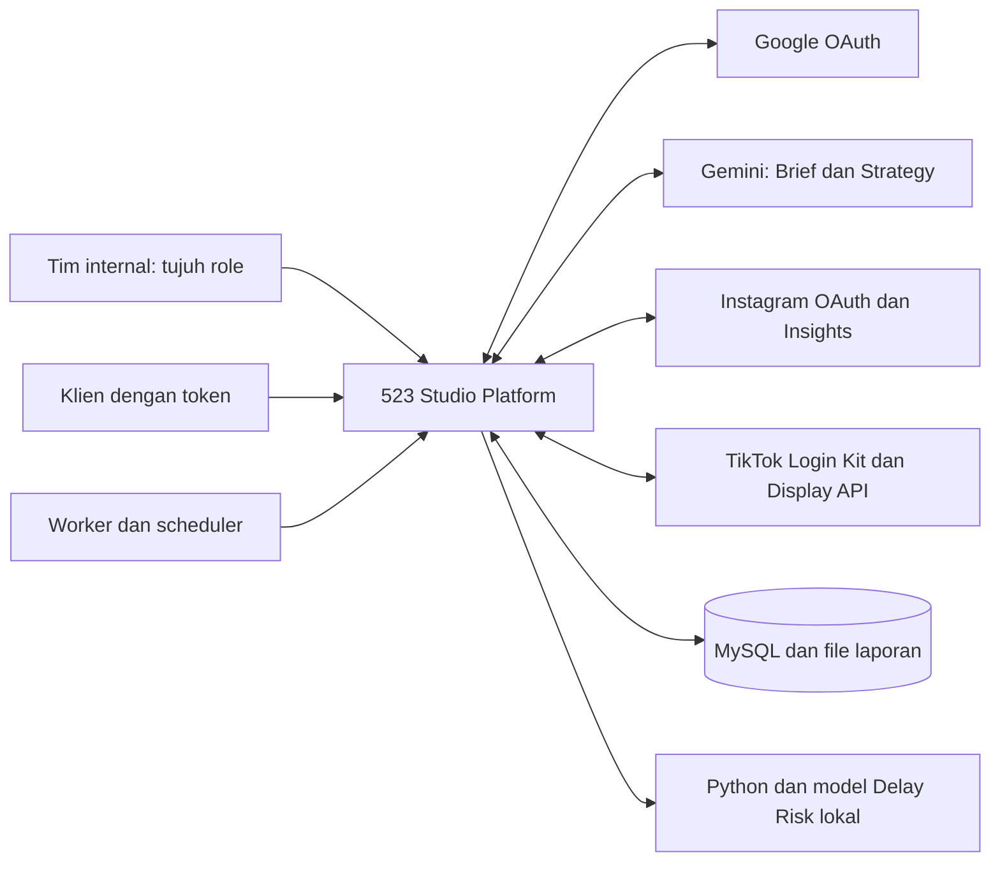

### 10.2 High-Level Use Case

Mermaid flowchart dipakai untuk representasi use case; bukan syntax UML usecase yang tidak didukung Mermaid.

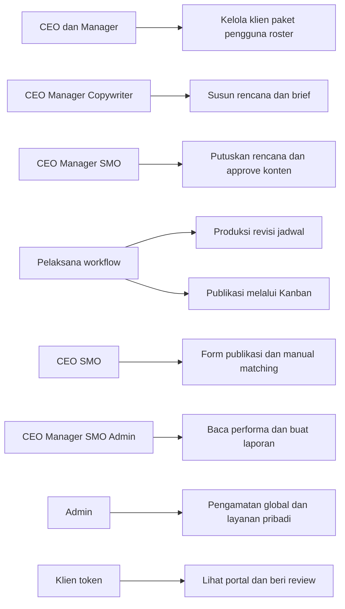

### 10.3 Content Planning Flow

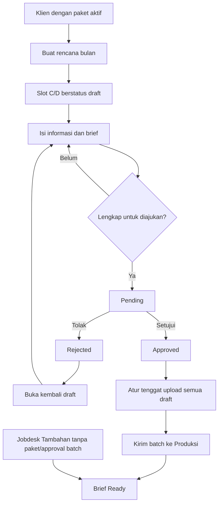

### 10.4 Client Approval vs Internal Approval

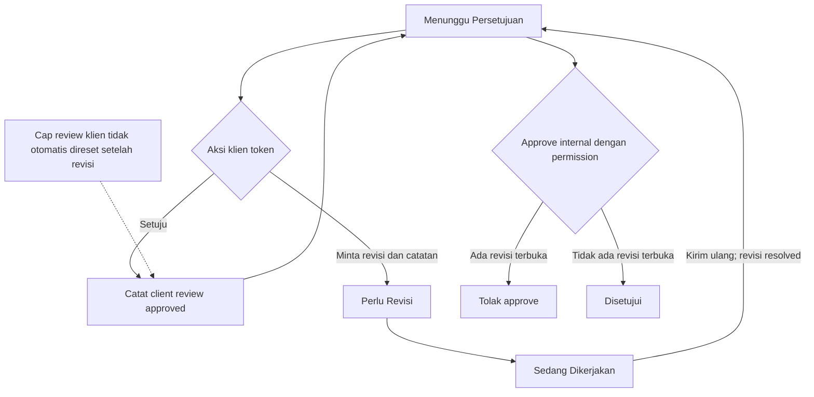

Internal approval tidak mensyaratkan Setuju klien. Loop Setuju kembali ke waiting_review adalah **status konten tetap**, bukan transisi log generik diri sendiri. Aksi Setuju ulang dengan cap review lama ditolak sesuai PORTAL-003.

### 10.5 Analytics Data Flow

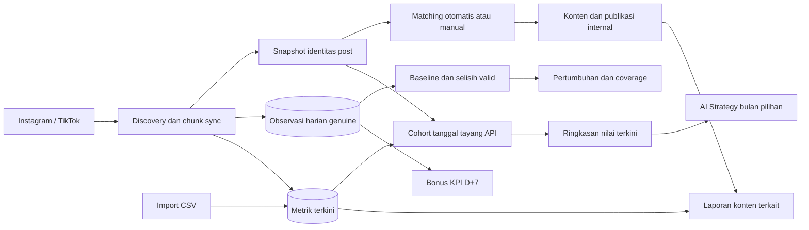

CSV memilih periode dari metric_date dan tidak membuat OBS. Panah matching tidak menyatakan seluruh backlink snapshot historis diubah. Laporan dan konsumen yang mensyaratkan item terkait tidak selalu memuat unmatched yang ada di Performa.

### 10.6 High-Level ERD

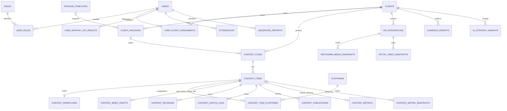

ERD ini sengaja tingkat tinggi; semua foreign key, nullable dan unique pada §7 lebih lengkap. Hubungan brief digambar banyak karena DB belum menjamin satu, walaupun controller memperlakukan satu brief per item. Workflow mempunyai unique item sehingga 0..1. Client portal token berada pada CLIENTS, bukan entitas akun klien baru.

## 11. Batas Verifikasi dan Keputusan Terbuka

| ID | Masalah | Temuan | Suggested Resolution | Evidence |
| --- | --- | --- | --- | --- |
| Q-01 | Batas Admin | Admin hanya menerima permission view, tetapi dapat membuat laporan, pin, absensi, preferensi dan status baca; akses halaman juga dapat mengantrekan KPI. | Tentukan apakah observer melarang perubahan data bisnis saja atau seluruh mutasi; pertahankan pengecualian eksplisit sampai diputuskan. | PUB-002/REP-001/CNT-003/ATT-001/SET-002; PermissionSeeder dan routes/web.php |
| Q-02 | Publikasi dan koreksi status | Form publikasi dibatasi CEO/SMO; Kanban workflow:update menerima payload publikasi bagi Manager/Content Creator/Graphic Designer. Koreksi CEO/Manager dapat melewati terminal/draft tanpa memperbaiki fakta turunan. | Tetapkan satu kebijakan publikasi dan invariant koreksi; perubahan implementasi adalah pekerjaan terpisah. | PUB-002, WF-002; ProductionWorkflowController dan WorkflowStatusService |
| Q-03 | Dua Apply AI Strategy dan Revert | Apply satu ide mengisi draft; bulk Apply masih membuat item brief_ready dan applied_at. Revert lama tidak memulihkan edit slot dan tidak mereset indeks ide. | Putuskan penghentian endpoint bulk atau dukungan eksplisitnya, dan definisikan undo serta perlindungan slot/bulan/tipe. | AISTRAT-002/003; AnalyticsController |
| Q-04 | Jaminan keunikan dan atomicity | Plan klien/bulan/tahun, integrasi klien/platform, satu brief/item dan round revisi belum seluruhnya dibatasi unique index; create plan/slot tidak satu transaksi. | Setujui apakah invariant perlu dikuatkan di database; lakukan uji konkurensi pada pekerjaan lanjutan. | PLAN-001; migrations dan constraints §7 SRS |
| Q-05 | Pencabutan sesi pengguna | Status/login_enabled diperiksa saat callback Google, tetapi middleware internal tidak memeriksa ulang dan deactivate tidak menginvalidasi seluruh sesi. | Tentukan apakah pencabutan akses harus berlaku seketika pada sesi yang sudah aktif. | AUTH-002, USR-002; EnsureInternalUser dan UserManagementController |
| Q-06 | Review ulang klien dan portal paused | Persetujuan klien tidak dibersihkan otomatis setelah revision loop; klien paused masih dapat membuka portal jika enabled. | Tentukan kapan cap review perlu direset dan apakah paused harus memutus token/portal. | PORTAL-001/003; Client/ApprovalController, ResolveClientPortal |
| Q-07 | Cakupan informasi lintas roster | Notifikasi plan/client approval tidak seluruhnya disaring roster; pencarian pengguna aktif global; ProfileController menyusun pekerjaan berdasarkan pengguna target tanpa scope penonton. | Tetapkan batas kolaborasi lintas klien untuk notifikasi/profil, lalu audit isi respons dengan role nyata. Jangan mengklaim seluruh informasi terisolasi sempurna. | USR-003, NOTIF-001, SEARCH-001, TEAM-001 |
| Q-08 | KPI lintas platform dan hasil basi | Seleksi snapshot D+7 memakai item/tanggal tanpa platform; kalkulasi tanpa kontribusi tidak otomatis menghapus KPI yang pernah tersimpan; tren dan daftar anggota dapat berbeda filter. | Konfirmasi isolasi platform, invalidasi hasil lama, serta populasi tren yang dikehendaki. | KPI-003/004, TEAM-001; TeamPerformanceKpiCalculator |
| Q-09 | Privasi file laporan | Riwayat hanya milik pembuat, tetapi file menggunakan public disk dan Storage::url. | Putuskan kebutuhan URL privat/bertanda tangan, masa simpan dan penghapusan berkas; jangan menyamakan histori privat dengan file privat. | REP-002; ReportController |
| Q-10 | Verifikasi layanan eksternal dan runtime ML | Google/Gemini/Meta/TikTok tersedia di kode; consent live, App Review, callback produksi, TLS dan model ML end-to-end tidak diuji. TikTok memakai challenge hex sedangkan dokumentasi lama menyebut base64url. | Lakukan verifikasi akun/konfigurasi provider yang berwenang dan evaluasi ML terpisah; jangan menyatakan keberhasilan live dari mock test. | INT-001..004, AUTH-001, BRF-001, AISTRAT-001, RISK-001/002 |
| Q-11 | Target mutu, retensi dan PIC akademik | Belum ada keputusan final target waktu respons, kapasitas, SLA/RPO/RTO/retensi snapshot, validasi akurasi ML maupun pengesahan pembagian PIC lintas kontribusi. | Pemilik produk dan pembimbing mengesahkan target serta lingkup kontribusi; benchmark/restore drill diperlukan sebelum klaim terpenuhi. | NFR-004/005/006/012/013/014; PRD §14 |
| Q-12 | Konfigurasi test yang konsisten | Suite default sync: 740 lulus, 2 failure, 3 error; database queue: 744 lulus, 1 failure backfill yang mengharapkan eksekusi langsung. | Perbaiki isolasi queue/HTTP per test dalam pekerjaan terpisah. Angka hasil alternatif tidak menggantikan baseline default yang gagal. | AnalyticsUxV2Test, AnalyticsSyncOrchestratorTest, ProgressiveSyncEngineTest, AnalyticsSyncV2Pass1BTest |

Hasil full suite dicatat lengkap dalam laporan rekonsiliasi, termasuk konfigurasi antrean alternatif dan failure yang tersisa. Tidak ada browser walkthrough/consent provider live, load test, restore drill atau validasi model end-to-end yang diklaim telah dilakukan. Keberadaan acceptance di atas adalah spesifikasi verifikasi, bukan catatan eksekusi otomatis seluruh skenario.

## 12. Mapping Kebutuhan Fungsional Lama

| Old ID | New ID / keputusan |
| --- | --- |
| KF101.a | CLI-001, CLI-003 |
| KF101.b | CLI-002, SET-002 |
| KF102.a | PLAN-001, PLAN-005 |
| KF102.b | CNT-001, BRF-001/002/003 |
| KF102.c | PLAN-004, PUB-001 |
| KF103.a | ANL-002, AISTRAT-001 |
| KF103.b | AISTRAT-001/002/003 |
| KF201.a | WF-001 |
| KF201.b | WF-001, WF-002 |
| KF201.c | WF-001, NFR-010 |
| KF202.a | REV-001, PORTAL-003 |
| KF202.b | PUB-001/002, ANL-006 |
| KF203.a | NOTIF-001; kanal WhatsApp removed |
| KF203.b | RISK-001/002 |
| KF301.a | AUTH-003 |
| KF301.b | ANL-002/003 |
| KF302.a | INT-001/002/003/004, ANL-005 |
| KF302.b | ANL-004, AUD-002 |
| KF401.a | PORTAL-002 |
| KF401.b | PORTAL-003, APR-001 |
| KF402 (uraian portal analytics) | PORTAL-002, AUD-001 |
