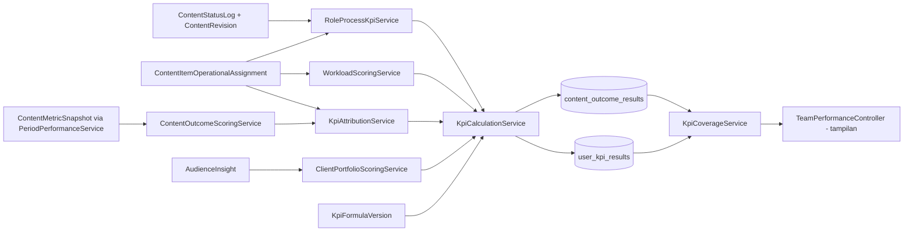

# KPI System - Implementation Plan (Fase 0: Audit & Architecture)

> **Dokumen historis.** Audit alur existing (bagian 1) di bawah tetap akurat. Rencana arsitektur yang mengusulkan tabel/role KPI khusus (`operational_roles`, `client_role_assignments`, `content_item_operational_assignments`, dst) di bagian selanjutnya **dibatalkan total** oleh koreksi produk 2026-09-02 - lihat `CHANGELOG.md` bagian "Koreksi Produk 2026-09-02" dan `DATA_MODEL.md` untuk arsitektur yang BENAR-BENAR berjalan sekarang (murni tabel EXISTING, tidak ada role/tabel assignment baru).

Status: **Fase 0 selesai**. Dokumen ini adalah audit repository + rencana arsitektur untuk perombakan Team Performance menjadi sistem KPI yang adil dan dapat diaudit, sesuai spesifikasi lengkap yang diberikan user (2026-09-02).

Prinsip kerja yang diikuti di seluruh dokumen ini dan implementasi berikutnya:
- **Tidak memakai isi database lokal sebagai acuan desain.** Data lokal akan dihapus - desain diturunkan dari *mekanisme* (schema, state machine, permission map), bukan dari baris data yang ada sekarang. Ini konsisten dengan keputusan desain sebelumnya untuk modul ini (lihat riwayat kerja Team Performance Agustus 2026 - dua kali diarahkan menjauh dari "data mining" pendekatan lama).
- Additive migration saja. Tidak ada `migrate:fresh`, tidak ada operasi destruktif.
- Data sintetis (factory/seeder testing) untuk seluruh pengujian.

---

## 1. Audit Alur Existing

### 1.1 Content Plan -> Brief -> Assignment

- `ContentPlan` (status: draft/pending/approved/rejected) berisi N `ContentItem` yang di-generate otomatis dari kuota paket klien (`ContentPlanItemGeneratorService`) saat plan dibuat.
- `ContentItem` mulai di status workflow **`draft`** (belum masuk produksi, tidak muncul di kanban). Field kunci: `client_id`, `content_pillar_id`, `content_type_id` (`Video`/`Desain`), `content_format`, `platform_id` (scalar lama) + relasi `platforms()` (pivot `content_item_platforms`, multi-platform baru), `deadline_at` (deadline produksi, dihitung otomatis = `upload_deadline_at - 2 hari`), `upload_deadline_at` (diisi SMO), `estimated_duration_seconds`, `estimated_slide_count`.
- `ContentBriefDraft` (1:1 ke `ContentItem`) - brief manual-first + AI-assist per field. `status`: draft/finalized. `isComplete()` adalah SATU-SATUNYA definisi "brief lengkap" (dipakai gate submit plan). `isLocked()` = `status === 'finalized'`. Field kompleksitas AKTUAL (`estimated_duration_seconds`, `slide_count`, `talent_count`, `location_count`, `complexity_level`) ada DI SINI, bukan disinkronkan balik ke `ContentItem` secara otomatis - **gap yang relevan untuk workload weighting** (lihat §3).
- Assignment PIC: `ContentItemAssignment` (`content_item_id`, `user_id`, `assignment_role` string bebas, default selalu `'primary'` di semua caller saat ini - tidak pernah diisi nilai lain). **Ini adalah gap arsitektur utama** yang harus diisi Fase 1: tidak ada operational role, tidak ada responsibility, tidak ada periode assignment.
- `releaseToProduction()` (SMO, batch per plan): SATU-SATUNYA jalan `draft -> brief_ready`, sekaligus mengunci brief (`finalized`).

### 1.2 Production Workflow, Approval, Revisi, Scheduling, Publication

- State machine tunggal: `app/Support/WorkflowTransitions.php` - `draft -> brief_ready -> in_progress -> waiting_review -> (approved|revision) -> approved -> scheduled -> uploaded`, dengan `cancelled` dari hampir semua state. `DONE_STATUSES = [uploaded, cancelled]`, `INACTIVE_STATUSES = [draft, uploaded, cancelled]` (dipakai di semua tempat yang menghitung beban kerja aktif).
- Satu-satunya pintu transisi: `WorkflowStatusService::transition()` - dipanggil baik dari tombol Status Management maupun drag kanban, sehingga **semua transisi tercatat di `ContentStatusLog`** (`content_item_id`, `changed_by_user_id` XOR `changed_by_client_id`, `from_status`, `to_status`, `approval_type` nullable, `changed_at`). Ini SATU-SATUNYA source of truth waktu/aktor perpindahan status - dipakai sebagai basis seluruh Process KPI.
- `correctStatus()` (Manager/CEO only) menandai `approval_type='correction'` - eksplisit didesain untuk **dikecualikan dari KPI individu** (sudah ada di komentar kode).
- Revisi: `ContentRevision` (`revision_round`, `status`: open/in_progress/resolved, `requested_by_user_id` XOR `requested_by_client_id`). **Client revision vs internal revision SUDAH terpisah secara struktural** di kolom `requested_by_*` - tinggal dipakai, tidak perlu skema baru.
- Publication: `ContentPublication` (per platform, `content_item_id`, `platform_id`, `published_by`, `published_at`, `post_url`, `thumbnail_url`, `external_post_id`, `api_integration_id`). Sudah mendukung 1 content item -> banyak publication (1 per platform) sejak redesign multi-platform (kemarin). **Tidak ada `is_paid`/`promotion_type`/`ad_spend` sama sekali** - gap yang harus ditambahkan (Fase 1).

### 1.3 Instagram/TikTok Sync, Analytics, Audience Insight

- `ContentMetric`: snapshot CURRENT/latest per content (API atau CSV manual). `content_item_id` NULLABLE (post API yang belum matched ke ContentItem lewat `ContentPublicationMatcher`/`HistoricalContentMatcher`).
- `ContentMetricSnapshot` (BARU, migration `2026_09_01_000001`): 1 baris = observasi cumulative pada 1 tanggal SYNC. Dipakai `PeriodPerformanceService` untuk menghitung delta antar snapshot per periode (7/30/90 hari) dengan disiplin coverage yang SANGAT matang: `ContentPeriodResult` (full/partial/unavailable), boundary rules eksplisit (baseline "terlalu tua", current "belum sampai period_end" -> partial bukan full), metric-reset detection per-field, engagement rate dihitung dari RAW DELTA (bukan average persentase), NULL != 0 didisiplinkan di setiap langkah.
  - **Temuan penting**: `PeriodPerformanceService::computeContentDelta(platformType, identityColumn, identityId, publishedAt, periodStart, periodEnd)` sudah PERSIS mekanisme yang dibutuhkan untuk window D+7/D+30 (`periodStart = published_at`, `periodEnd = published_at + N hari`) - hasilnya (`ContentPeriodResult`) sudah punya coverage status, delta per metric, dan deteksi "belum cukup umur" (`current_before_period_end` -> otomatis jadi kandidat status **provisional**). Engine KPI outcome (Fase 2) akan **reuse service ini**, bukan menulis ulang.
- `AudienceInsight`: snapshot follower/reach per client+platform+tanggal, sumber API/CSV/legacy. Dipakai untuk follower growth (client portfolio outcome).
- Tidak ada tabel/kolom penanda organic vs paid di manapun dalam rantai Instagram/TikTok sync maupun `ContentPublication`.

### 1.4 Team Performance & Attendance (existing)

- `TeamPerformanceController::index()`: query naive - `User::with(['roles','assignments.contentItem.workflow'])`, hitung `active_count`/`overdue_count`/`revision_count` per user TANPA pemisahan role, TANPA coverage, TANPA outcome konten/klien. Persis leaderboard sederhana yang harus diganti total.
  - `show(User $user)` ADA di controller tapi **TIDAK PUNYA ROUTE terdaftar** (dead code, aman dipakai ulang/diganti).
- `AttendanceService` (tab Kehadiran) - sudah terpisah rapi dari productivity, tidak disentuh scope-nya, cuma dipertahankan sebagai tab independen.
- Tidak ada test existing untuk `TeamPerformanceController` - bebas dibangun dari nol tanpa risiko regresi test lama.

### 1.5 Access Role vs Operational Role (masalah inti)

`Role` (tabel `roles`, pivot `user_roles`, many-to-many sejak migrasi RBAC Agustus) **melayani DUA fungsi sekaligus** hari ini, persis yang dilarang spesifikasi:
1. Authorization (`Role::hasPermission()`, dipakai middleware `permission:module,action`).
2. "Operational identity" (komentar eksplisit di `User::roles()`: *"dipakai langsung buat operational identity (jabatan) DAN authorization dashboard"*).

`UserRole` enum (`CEO, Manager, ContentCreator, DesainGrafis, SMO, Copywriter, Admin`) dipakai bercampur untuk kedua konteks di seluruh codebase (mis. `PicAssignmentService` mencari kandidat PIC lewat `whereHas('roles', fn($q) => $q->where('name', 'Content Creator'))` - access role dipakai sebagai proxy operational role).

**Riwayat penting**: sempat ada entity `team_members` terpisah (Agustus 2026) untuk operational role per klien, lalu **DIHAPUS TOTAL** ("satu orang = satu record", keputusan final user) dan di-backfill ke `User`. **Pelajaran untuk Fase 1: JANGAN membuat entity Person/TeamMember baru** - operational role harus berupa tabel referensi + pivot assignment yang menempel ke `User` yang sudah ada, bukan entity paralel.

`UserClientAssignment` (pivot `user_client_assignments`) hari ini HANYA `user_id + client_id`, tanpa role, tanpa periode (`valid_from`/`valid_until`). Ini sumber "siapa pegang klien apa" untuk PIC pooling (`PicAssignmentService`) dan scoping (`EnsureClientScope`) - **harus diperkaya**, bukan diganti (banyak caller bergantung pada bentuk pivot sederhana ini).

---

## 2. Source of Truth per KPI (ringkas)

| KPI/Data | Source of truth | Status |
|---|---|---|
| Waktu & aktor perpindahan status | `ContentStatusLog` | Ada, matang |
| Revisi internal vs client | `ContentRevision.requested_by_user_id` / `requested_by_client_id` | Ada, terpisah rapi |
| Koreksi status (bukan revisi) | `ContentStatusLog.approval_type='correction'` | Ada |
| Siapa PIC & role apa | `ContentItemAssignment` | Ada tabel, **kosong makna** (`assignment_role` selalu `'primary'`) |
| Siapa pegang klien apa & sejak kapan | `UserClientAssignment` | Ada tabel, **tidak ada role/periode** |
| Kompleksitas/effort konten | `ContentBriefDraft.slide_count/estimated_duration_seconds/talent_count/location_count` | Ada di brief, **tidak disinkron ke assignment/workload** |
| Performa mentah per publication | `ContentMetricSnapshot` (API) via `PeriodPerformanceService` | Ada, matang (coverage-aware) |
| Follower growth | `AudienceInsight` (type=follower/summary) | Ada |
| Organic vs paid | - | **Tidak ada sama sekali** |
| Formula/bobot KPI | - | **Tidak ada** (harus dibuat, versioned) |
| Hasil kalkulasi KPI (snapshot yang bisa diaudit) | - | **Tidak ada** (harus dibuat) |

## 3. Event/Timestamp yang Belum Tersedia (instrumentasi yang harus ditambah dulu)

Sesuai instruksi *"Jika event historis yang dibutuhkan belum tersedia, tambahkan instrumentation terlebih dahulu. Jangan membuat angka dari updated_at yang tidak memiliki arti domain yang jelas"*:

1. **Brief assignment time** - tidak ada timestamp eksplisit "brief ditugaskan ke Copywriter X". `ContentBriefDraft.created_at` cukup jelas maknanya (baris brief pertama dibuat) untuk dipakai sebagai proxy start-brief SELAMA baris dibuat oleh Copywriter yang sama yang menyelesaikannya (audit: `created_by` sudah ada). Cukup untuk "median waktu penyusunan brief" = `finalized_at - created_at` pada baris yang `created_by` sama dengan aktor yang me-lock (SEBAGIAN BESAR kasus manual-first). **Tidak butuh migration baru**, hanya query yang benar.
2. **First-pass acceptance brief** - butuh tahu apakah brief PERNAH dikembalikan sebelum di-lock. `ContentBriefDraft` tidak punya log revisi brief sendiri. Proxy yang valid secara domain: hitung dari `previous_snapshot` (sudah ada, diisi tiap kali brief diedit ulang setelah pernah "dianggap selesai" - **perlu dikonfirmasi maknanya** saat implementasi; jika `previous_snapshot` hanya untuk fitur "revert AI" dan bukan sinyal "brief dikembalikan", maka first-pass acceptance untuk brief ditandai **`unavailable`**, bukan diangka-angkakan dari proxy yang tidak jelas domainnya). Keputusan final: instrumentasi baru `content_brief_drafts.returned_count` (increment eksplisit tiap kali status balik dari `finalized` ke draft atau ada revision request terhadap brief) DITAMBAHKAN di Fase 1 sebagai kolom baru dengan default 0, diisi 0 untuk semua baris lama (tidak ada backfill dari histori yang tidak terekam - baris lama otomatis `unavailable`/`0 event tercatat`, BUKAN diklaim "tidak pernah revisi").
3. **First production handoff on time** - butuh "kapan PIC production pertama kali mulai kerja" vs "target". `ContentStatusLog` sudah punya `brief_ready -> in_progress` (waktu mulai) dan `deadline_at` (target produksi). Cukup, tidak perlu instrumentasi baru.
4. **Publication schedule adherence** - `scheduled_upload_at` (rencana) vs `ContentPublication.published_at` (aktual). Cukup, sudah ada.
5. **Unmatched publication/analytics rate** - `ContentPublication` yang tidak ada `ContentMetric`/`ContentMetricSnapshot` terkait (via `external_post_id`/API matching). Cukup, sudah ada, tinggal query.
6. **Decision turnaround Manager/CEO** - `waiting_review -> approved|revision` di `ContentStatusLog`, filter `changed_by_user_id` yang punya permission `workflow.approve`. Cukup.
7. **Item dilepas tanpa PIC** - `ContentItemAssignment` kosong untuk item yang sudah `brief_ready`+. Cukup dari data assignment yang ada (setelah Fase 1 memberi struktur assignment yang benar).
8. **Blocker yang diselesaikan** - **tidak ada konsep "blocker" eksplisit di sistem saat ini** (bukan field, bukan tabel). Opsi realistis untuk cakupan kerja ini: definisikan "blocker" secara operasional sebagai *item yang `is_overdue=true` ATAU revisi terbuka > N hari ATAU unmatched publication > N hari* (derived, bukan tabel baru) - dicatat sebagai `unavailable-until-defined` jika tim ingin blocker eksplisit (field manual "tandai blocker") di masa depan. Fase 2 mengimplementasikan definisi derived ini secara eksplisit dan terdokumentasi (bukan tabel `blockers` baru - di luar scope minimal, additive kalau dibutuhkan nanti).
9. **Paid/promoted flag** - tidak ada. Ditambahkan Fase 1 (`is_paid`, `promotion_type`, `ad_spend`, `campaign_reference` nullable di `content_publications`).
10. **Planned effort/complexity per assignment** - ada di `ContentBriefDraft` tapi tidak di `ContentItemAssignment`. Ditambahkan Fase 1 (`planned_effort_points`, dihitung dari kompleksitas brief saat assignment snapshot dibuat, bukan real-time recompute - snapshot untuk auditability).

## 4. Bagian Lama yang Harus Dipertahankan (compatibility)

- `ContentItemAssignment.assignment_role` (string) - kolom TETAP ADA, tetap diisi (`'primary'` default untuk jalur lama seperti `quickCreateUrgent`), tidak dihapus. Operational role BARU ditambahkan sebagai kolom/tabel terpisah di baris yang sama, additive.
- `ContentItem.platform_id` (scalar) - tetap disinkronkan, dipakai laporan/import lama.
- `WorkflowStatusService::transition()` payload lama (`platform_id`/`published_at` scalar, fallback ke `publications[]`) - tidak diubah.
- `UserRole` enum & `Role`-based permission - TIDAK diganti (access/authorization tetap lewat sini). Operational role adalah KONSEP BARU yang hidup berdampingan, tidak menggantikan RBAC.
- `AttendanceService`/tab Kehadiran - tidak disentuh logikanya sama sekali.
- `PicAssignmentService`/`PicResolver`/`UserContentResolver` - dipertahankan untuk fungsinya saat ini (pemilihan PIC otomatis, resolusi tampilan); Fase 3 MEMPERLUAS alur assignment (bisa pilih multi-PIC+role) tanpa mematikan jalur lama yang masih single-PIC (`quickCreateUrgent`, AI Strategy).

## 5. Struktur Final (ringkas - detail penuh di Fase 1/2)

### Tabel baru
1. `operational_roles` - lookup (Copywriter, Content Creator, Graphic Designer, SMO, Account Lead, Reviewer, Publisher, dst). Terpisah total dari `roles` (access role).
2. `client_role_assignments` - `user_id, client_id, operational_role_id, is_lead (bool, utk Manager/CEO leadership), valid_from, valid_until, assigned_by, timestamps`. Menggantikan KEBUTUHAN "role per klien" yang tidak bisa dipenuhi `user_client_assignments` polos - `user_client_assignments` TETAP ADA (dipakai luas), tabel baru ini melengkapi dengan role+periode.
3. `content_item_operational_assignments` - assignment PIC+role+responsibility bergranularitas penuh (`content_item_id, user_id, operational_role_id, responsibility_type, assigned_at, ended_at, assigned_by, planned_effort_points`). `ContentItemAssignment` LAMA tetap ada tak berubah (dipakai kode lama); tabel baru ini adalah yang dibaca KPI engine.
4. `content_publication_promotions` (atau kolom langsung di `content_publications` - keputusan: **kolom langsung**, lebih sederhana, tidak butuh join tambahan di query yang sudah banyak) - `is_paid, promotion_type, ad_spend, campaign_reference`.
5. `kpi_formula_versions` - config bobot + parameter ter-versi (JSON), `version, effective_from, notes, created_by`.
6. `kpi_calculation_runs` - jejak tiap eksekusi kalkulasi (`period_start, period_end, formula_version_id, status, started_at, finished_at, triggered_by`).
7. `content_outcome_results` - hasil scoring outcome per content+publication (raw metric, normalized score, peer baseline info, coverage, measurement window D+7/D+30), terikat ke `kpi_calculation_runs`.
8. `user_kpi_results` - hasil composite score per user+operational_role+client(optional)+period, breakdown process/direct/portfolio, sample size, coverage status, terikat ke `kpi_calculation_runs`.

### Model baru
`OperationalRole`, `ClientRoleAssignment`, `ContentItemOperationalAssignment`, `KpiFormulaVersion`, `KpiCalculationRun`, `ContentOutcomeResult`, `UserKpiResult`.

### Enum/Value Object baru
`ResponsibilityType` (owner/contributor/reviewer/publisher), `CoverageStatus` (full/partial/provisional/unavailable), `KpiTier`/`KpiStatusLabel` (Sehat/Perlu Perhatian/Sementara/Data Belum Cukup), DTO `ContentOutcomeScore`, `ProcessScoreBreakdown`, `CompositeKpiResult`.

## 6. ERD (Mermaid)

```mermaid
erDiagram
    USER ||--o{ USER_ROLES : "access role"
    USER ||--o{ USER_CLIENT_ASSIGNMENTS : "roster klien (existing)"
    USER ||--o{ CLIENT_ROLE_ASSIGNMENTS : "operational role per klien (baru)"
    OPERATIONAL_ROLE ||--o{ CLIENT_ROLE_ASSIGNMENTS : ""
    CLIENT ||--o{ CLIENT_ROLE_ASSIGNMENTS : ""

    CONTENT_ITEM ||--o{ CONTENT_ITEM_ASSIGNMENTS : "legacy, dipertahankan"
    CONTENT_ITEM ||--o{ CONTENT_ITEM_OPERATIONAL_ASSIGNMENTS : "baru - KPI engine baca ini"
    USER ||--o{ CONTENT_ITEM_OPERATIONAL_ASSIGNMENTS : ""
    OPERATIONAL_ROLE ||--o{ CONTENT_ITEM_OPERATIONAL_ASSIGNMENTS : ""

    CONTENT_ITEM ||--o{ CONTENT_ITEM_PLATFORMS : ""
    CONTENT_ITEM ||--o{ CONTENT_PUBLICATION : ""
    CONTENT_PUBLICATION }o--|| PLATFORM : ""
    CONTENT_PUBLICATION ||--o{ CONTENT_METRIC : "matched analytics"
    CONTENT_PUBLICATION ||--o{ CONTENT_METRIC_SNAPSHOT : "daily cumulative"

    CONTENT_ITEM ||--o{ CONTENT_STATUS_LOG : "source of truth waktu/aktor"
    CONTENT_ITEM ||--o{ CONTENT_REVISION : "internal vs client"
    CONTENT_ITEM ||--|| CONTENT_BRIEF_DRAFT : ""

    KPI_FORMULA_VERSION ||--o{ KPI_CALCULATION_RUN : ""
    KPI_CALCULATION_RUN ||--o{ CONTENT_OUTCOME_RESULT : ""
    KPI_CALCULATION_RUN ||--o{ USER_KPI_RESULT : ""
    CONTENT_ITEM ||--o{ CONTENT_OUTCOME_RESULT : ""
    USER ||--o{ USER_KPI_RESULT : ""
    OPERATIONAL_ROLE ||--o{ USER_KPI_RESULT : ""
    CLIENT ||--o{ USER_KPI_RESULT : "optional, utk portfolio breakdown"
```

## 7. Data Flow (ringkas)

## 8. Aturan Atribusi (ringkas eksekutif - detail lengkap di ATTRIBUTION_RULES.md Fase 7)

- Company/client aggregate: 1 content item = 1 observasi (dedup by `content_item_id`).
- Individual portfolio: setiap PIC eligible dapat FULL content outcome yang sama (tidak dibagi rata) - `KpiAttributionService` menghasilkan (user_id, content_item_id) pairs, bukan pecahan skor.
- Dedup multi-role: agregasi keseluruhan user = `DISTINCT (user_id, content_item_id)`, tapi tampilan per-role tetap menghitung baris per role.
- Eligibility client portfolio: harus ada `ClientRoleAssignment` aktif di periode ITU + minimal 1 event kontribusi (assignment/status change) di periode itu - bukan cuma `user_client_assignments` biasa.
- Proporsional bagi yang join/keluar mid-period: `valid_from`/`valid_until`/`ended_at` dipakai untuk menghitung porsi hari aktif dalam periode (dipakai sebagai pembagi denominator sampel, BUKAN mengalikan skor - skor tetap dari kontribusi nyata, bukan direduksi karena durasi pendek).

## 9. Formula (ringkasan - detail penuh + contoh angka di FORMULAS.md Fase 7)

Bobot composite (default, versioned di `kpi_formula_versions`):
- Copywriter/Content Creator/Graphic Designer: 70% process + 20% direct outcome + 10% portfolio.
- SMO/Account Lead: 60% process + 15% direct outcome + 25% portfolio.
- Manager/CEO (leadership): 70% leadership process + 30% portfolio.

Content outcome (video): 45% visibility + 35% meaningful engagement + 20% retention (redistribusi proporsional kalau retention unavailable).
Content outcome (desain): 40% reach percentile + 25% saves rate + 20% shares rate + 10% comments rate + 5% likes rate.
Client portfolio: 45% visibility growth (normalized) + 35% meaningful engagement + 20% follower growth (self-trend, bukan cross-client).

Semua di skala 0-100, robust normalization (winsorize 5-95, log1p, percentile rank, median), composite HANYA ditampilkan jika sample size + coverage cukup.

## 10. Daftar Risiko

| # | Risiko | Mitigasi |
|---|---|---|
| 1 | Data lokal akan dihapus - tidak ada baseline nyata untuk validasi "rasanya benar" | Uji lewat factory sintetis yang eksplisit merepresentasikan tiap aturan atribusi (lihat test matrix Fase 1/2/6) |
| 2 | `assignment_role` lama (`'primary'`) dan operational role baru bisa jadi dua sumber kebenaran yang divergen | KPI engine HANYA baca tabel assignment baru; `ContentItemAssignment` lama dibiarkan (backward-compat UI lama), didokumentasikan eksplisit di CUTOVER |
| 3 | Query KPI berpotensi N+1 / berat untuk periode besar | Query agregat (`selectRaw`+`groupBy`), eager load eksplisit, index pada kolom filter (period, user_id, content_item_id) |
| 4 | Bobot magic number tersebar | Semua bobot HANYA hidup di `kpi_formula_versions` (JSON) dibaca lewat 1 value object `KpiFormulaConfig` |
| 5 | View jadi leaderboard tanpa sadar | Larangan eksplisit di UI: tidak ada sorting/ranking lintas role, selalu breakdown, selalu coverage badge |
| 6 | Backfill data nyata nanti salah interpretasi (assignment_role lama semua `'primary'`) | Strategi cutover eksplisit: assignment_role lama TIDAK auto-mapped ke operational_role tunggal secara implisit; migrasi data nyata perlu keputusan manual per user (di luar scope kerja hari ini, didokumentasikan di ROLLOUT_AND_CUTOVER.md) |
| 7 | Definisi "blocker" tidak ada field eksplisit | Didefinisikan derived (lihat §3.8), didokumentasikan sebagai keterbatasan, terbuka untuk field eksplisit di masa depan |

## 11. Rencana Migrasi & Cutover (ringkas - detail Fase 7)

1. Semua migration Fase 1 bersifat ADDITIVE (tabel baru, kolom nullable baru) - aman dijalankan di database produksi kapan saja tanpa downtime.
2. Data lokal SAAT INI tidak dipakai untuk backfill apa pun. Instalasi baru (lihat kerja sebelumnya - `TeamClientSeeder`) mulai dari nol untuk operational assignment.
3. Cutover data nyata (nanti, di luar sesi ini): tim (Manager/CEO) perlu ISI ULANG operational role per user per klien secara manual lewat UI baru (Fase 3/4) - TIDAK ADA auto-derive dari `assignment_role='primary'` karena itu tidak membawa informasi role yang benar.
4. KPI baru mulai menghitung dari `kpi_cutover_date` (parameter formula version pertama) - data histori SEBELUM tanggal ini tidak dipaksa masuk kalkulasi kecuali domain history-nya lengkap (lih. aturan Data Coverage #7 di spesifikasi).

## 12. Keputusan Fase 0 -> Lanjut Otomatis ke Fase 1

Tidak ada blocker material yang menghentikan implementasi. Satu keputusan desain non-ambigu yang diambil (didokumentasikan, bukan ditanyakan karena tidak berisiko/tidak ambigu menurut audit di atas): "blocker" didefinisikan derived (bukan field baru) untuk cakupan Fase 1-6 ini; field blocker eksplisit adalah pengembangan lanjutan (dicatat di known limitations, Fase 7).

**Lanjut ke Fase 1.**
